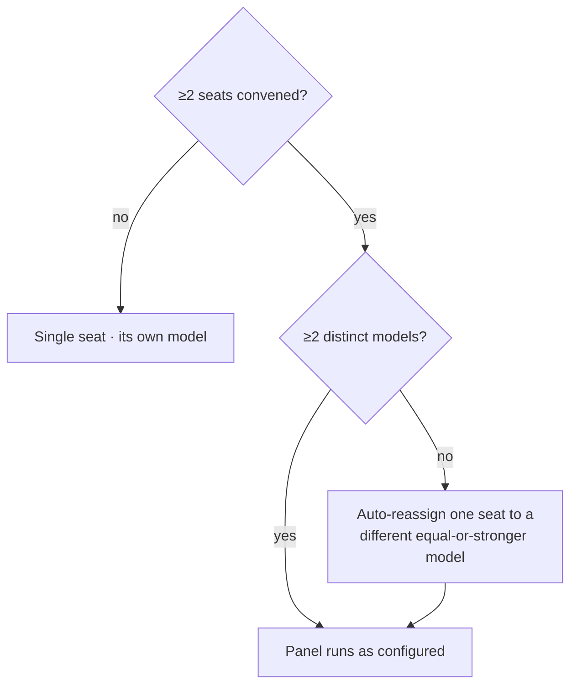
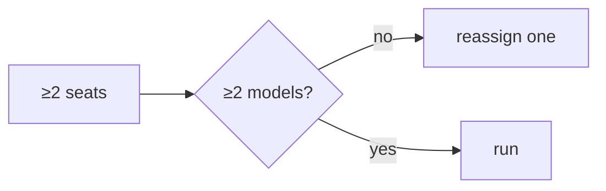

A panel of reviewers is only as strong as its diversity. If every seat runs on the same model, a single model's blind spot — a shared hallucination or a class of injection it doesn't catch — can pass the **whole** panel unnoticed. That's the **anti-correlated-hallucination** failure mode.

So the engine enforces a **model-diversity rule**: whenever **two or more seats convene, at least two distinct model backbones run**. If a `panel:` config override happens to collapse the seats onto one model, the engine **auto-reassigns one seat to a different, equal-or-stronger model** rather than letting a monoculture review the command. It's proven by Gate 22.

<!-- mini -->

