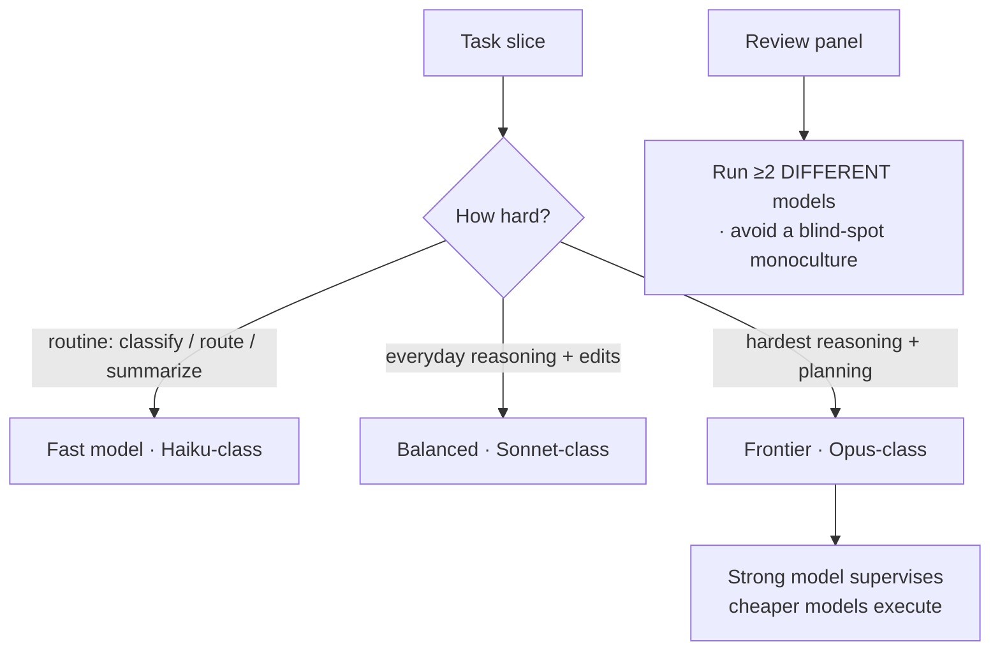
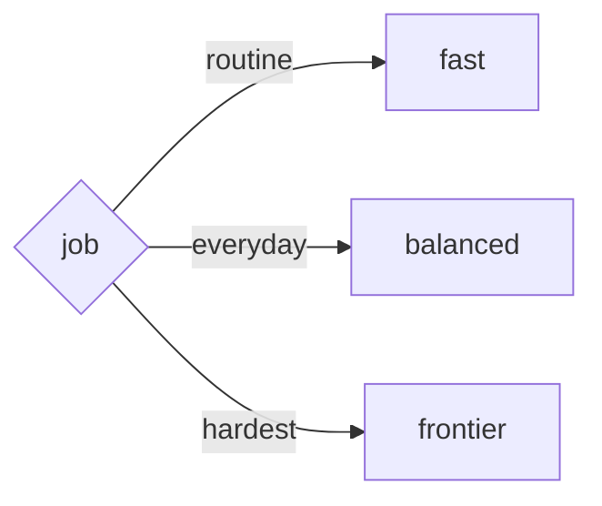

An agent isn't locked to one model, and the strongest model isn't always the right one. Picking a model is a **cost / latency / capability** trade, and the three tiers exist precisely so you can match the model to the work:

- **Frontier (e.g. Opus)** — deepest reasoning, hardest planning, gnarliest debugging. Slower and most expensive per token. Reach for it when the task genuinely needs it.
- **Balanced (e.g. Sonnet)** — the everyday workhorse: strong reasoning at much lower cost and latency. The sensible default for most agent work.
- **Fast (e.g. Haiku)** — quick, cheap, great for classification, routing, summarizing, and high-volume routine steps where frontier-grade reasoning is overkill.

Two ideas make this practical:

- **Mix models within one task.** A capable orchestrator can plan and supervise while dispatching the routine legwork to a faster, cheaper model — *strong model supervises, cheap models execute.* Subagents are the natural place to drop a tier: the lead reasons in Sonnet/Opus, the workers grind in Haiku.
- **Diversity is a safety property, not just a cost one.** When multiple agents *review* the same thing, running them all on the **same** model means one model's blind spot can pass the whole panel — the "anti-correlated hallucination" failure. Deliberately running ≥2 *different* backbones on a review panel catches what a monoculture would miss. (RavenClaude's command-review tribunal enforces exactly this.)

The wrong instinct is "always use the biggest model." The right instinct is "use the smallest model that reliably clears this specific bar," and let a stronger model check the cheaper ones' work.

