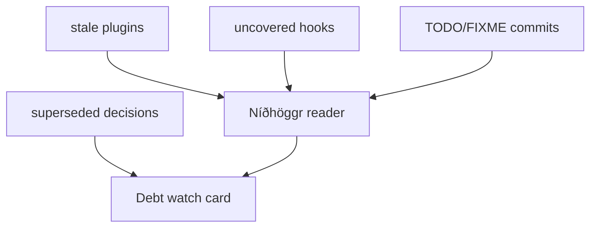

**Níðhöggr** is the dragon gnawing at the roots of the world-tree — and the "Debt watch" card surfaces exactly that: the slow, quiet decay that no perimeter alarm ever catches. It lives as a **card inside the Heimdall tab** (not its own tab), and it carries both labels: "Debt watch" primary, "Níðhöggr" parenthetical.

Four low-noise signals. **Stale plugins** — any plugin not version-bumped in 120+ days. **Uncovered hooks** — hooks referenced by neither a CI workflow nor the gate-audit harness; cross-checking *both* is what cuts the false positives down to the genuinely undercovered set. **Superseded decisions** — decision-log entries marked as superseded (none today). And **TODO/FIXME in commit subjects** — debt the team literally wrote into the history.

It reads **live** through a served endpoint rather than inlining at build time, because two of its signals are git-derived (commit dates, log history) and vary by clone depth — which would otherwise break the exact-match dashboard freshness gate, the same trap Norns navigates. Every source is guarded so a git failure yields an empty signal, never an error. It is a small card today; the plan is to promote it to a full tab only if the marketplace grows past roughly five plugins or the debt signals exceed about twenty entries.

