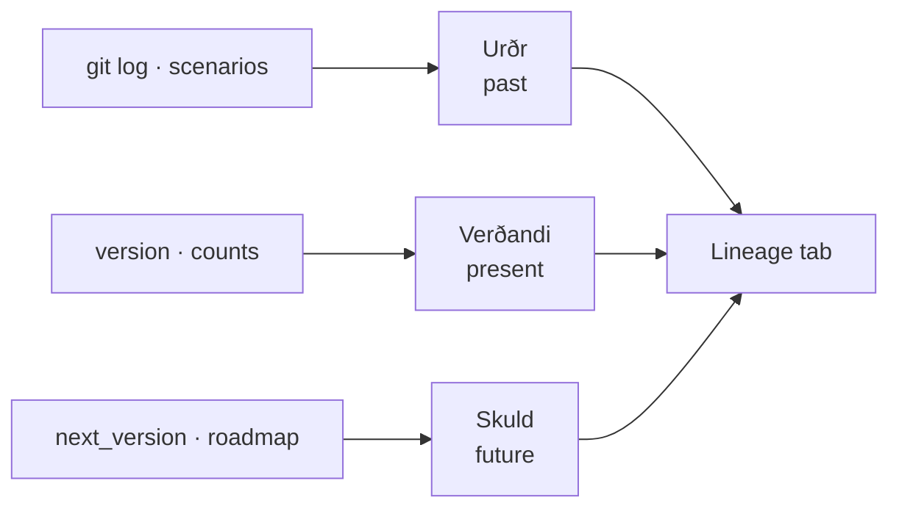

The **Norns** weave fate from what was, what is, and what shall be — and their tab is the **third and final reader** of the event substrate, completing the loop by reading the scenario-event stream. It shows a plugin's life as a **read-only three-column past/present/future view**.

**Urðr** (past) — "Lessons & history" — gathers the most recent scenario surfaces from the event log, any decision-log entries, and the last several commits. **Verðandi** (present) — "Current" — shows the live version, the active hook and rule counts, and the last release date. **Skuld** (future) — "Proposed" — shows the next version and roadmap plus open proposals naming the plugin; today most plugins declare no next version, so Skuld renders a gentle gated empty state until one does.

The load-bearing design choice: unlike Heimdall and Víðarr (which inline a small static slice), Norns inlines **nothing** at build time — *all* of its data is read live by a served endpoint. That is deliberate and non-negotiable, because the git-log and scenario data vary between a full local clone and CI's shallow checkout, and the dashboard is freshness-gated by exact byte match. Every source is guarded so a missing file or a git failure yields an empty section, never an error — and on a static host the columns degrade to an honest "open the served dashboard" prompt.

