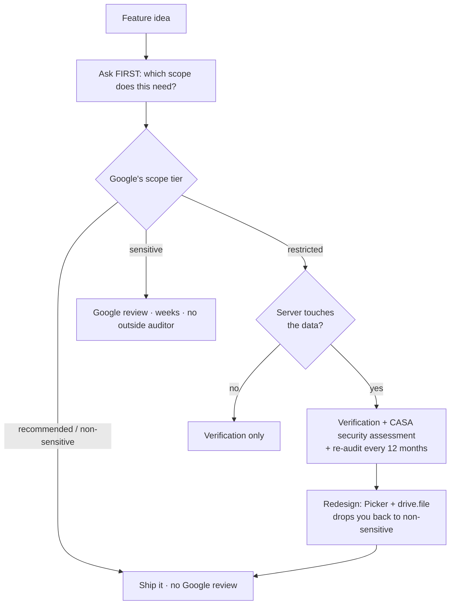
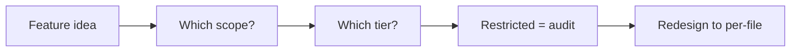
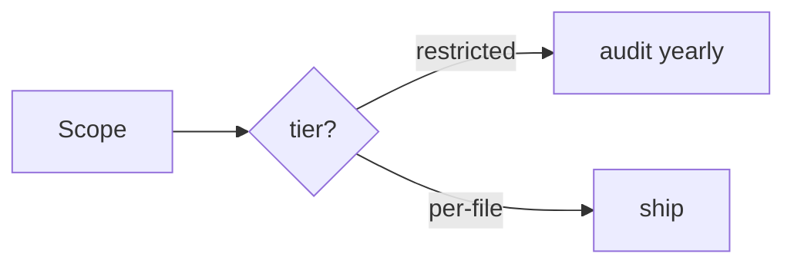

You sketch a feature: *"we'll make a folder in the customer's Google Drive, they drop files in, and we read them."* One sentence, one afternoon of work. It is, in fact, a multi-week compliance project with a recurring annual bill — and nothing in the code tells you that. The scope does.

**Check the scope before you design the feature.** The scope is not a checkbox you fill in at the end; it is the thing that decides whether the feature is cheap, expensive, or effectively off the table for a small team.

## Google's three tiers

Google sorts OAuth scopes into three buckets, and the bucket sets the price:

- **Recommended / non-sensitive** — narrow, per-item access. No Google review. Ship today.
- **Sensitive** — broader access to user data. *"Sensitive scopes require review by Google before any Google Account can grant access."* Weeks of back-and-forth, but no outside auditor.
- **Restricted** — the highest-risk data. Verification **plus** an independent security assessment.

The restricted tier is where the surprise lives. Google's own words: *"Every app that requests access to Google users' restricted data and has the ability to access data from or through a third-party server must go through a security assessment"* — standardised on the App Defense Alliance's **CASA** framework. And it does not end: *"apps must be reverified for compliance and complete a security assessment at least every 12 months after your assessor's Letter of Assessment (LOA) approval date."* Google warns that restricted-scope verification alone *"can potentially take several weeks to complete."*

Read the trigger carefully: it fires on **the ability to access restricted data from or through a server**. A purely client-side toy might dodge it. Anything with a backend — which is to say, anything real — does not.

## The Drive example, concretely

`drive.file` is **non-sensitive**. Google describes what it grants exactly:

> *"Create new Drive files, or modify existing files, that you open with an app or that the user shares with an app while using the Google Picker API or the app's file picker."*

That wording is per-file, and it names exactly two ways a file enters your grant: **your app created it**, or **the user handed it to you through a picker**. Nothing else.

So run the sketch through it. Your app creates the folder — fine, the app created that. The user then drags in twelve invoices. Your app did not create those files and the user never picked them, so they are simply not in the grant. There is no "the folder is mine, therefore its contents are mine" rule. The only way to enumerate whatever a user happens to put in a folder is a scope like `drive` or `drive.readonly` — and both are **restricted**. Your afternoon feature just bought you verification, a CASA assessment, and an annual re-audit forever.

The cheap redesign is usually right there: keep `drive.file` and put a Google Picker in the flow, so the user *hands you* the files instead of you going to find them. Same user outcome, one tier down, no auditor.

## Two honesty notes

**Providers differ, and I only checked one.** Google's tiering, the CASA assessment, and the 12-month recertification were verified against Google's own documentation for this concept. Microsoft, Slack, GitHub, Dropbox and the rest each have their own review regimes, their own definitions of "sensitive", and their own audit requirements — some lighter, some heavier. Do not carry Google's rules across; go read the provider you are actually integrating with. Nothing here is verified for any provider other than **Google**.

**This is engineering guidance, not legal or compliance advice.** The costs, timelines and audit terms are Google's published requirements as of the verification date, not a quote for your app.

<!-- step: Start from the feature, not the code: "we create a folder and read what they put in it." -->

<!-- step: Name the scope BEFORE the design is fixed — the scope is the cost driver, not the code. -->

<!-- step: Look up its tier: recommended / non-sensitive, sensitive, or restricted. The tier is the price. -->

<!-- step: Restricted + a server that can reach the data = CASA assessment, re-done every 12 months. -->

<!-- step: Redesign so the user HANDS you each file (Google Picker + drive.file) — same outcome, no auditor. -->

<!-- mini -->

