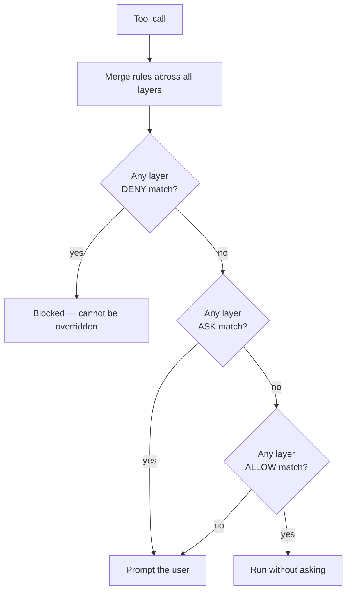
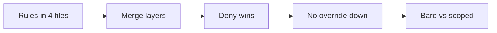
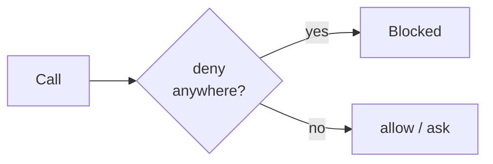

Permission rules live under `permissions.allow`, `permissions.ask`, and `permissions.deny` in any of the settings files. Each rule is either a bare tool name (`Bash`, `WebSearch`) or a tool plus a specifier (`Bash(git status:*)`, `Read(/etc/**)`).

**Within one file**, rules evaluate `deny → ask → allow` — the first match wins, so deny always beats ask and ask always beats allow.

**Across files**, the layers **merge** rather than override: a deny in *any* layer blocks the action regardless of allow rules elsewhere. You **cannot override down** — if your user-level settings deny `Bash(rm *)`, no project-level allow re-enables it. That's the safe behavior, but it surprises people who expect a later layer to win.

The most-surprising rule: a **bare-tool deny** (`deny: ["Bash"]`) removes the tool from Claude's context entirely — Claude never sees it. A **scoped deny** (`Bash(rm *)`) keeps the tool and blocks only matching calls.

<!-- step: Rules live in four settings files under permissions.allow / ask / deny. -->

<!-- step: Across files the layers MERGE rather than override. -->

<!-- step: A deny in ANY layer wins — and you can't override it down from a later layer. -->

<!-- step: Within one file the order is deny then ask then allow; first match wins. -->

<!-- step: A bare-tool deny hides the tool entirely; a scoped deny blocks only matching calls. -->

<!-- mini -->

