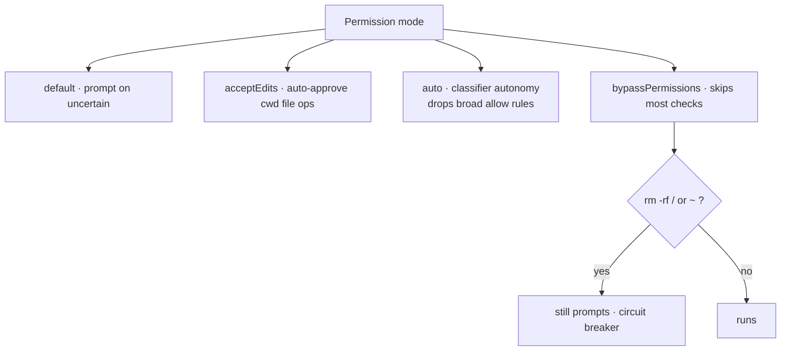
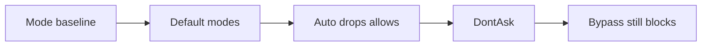
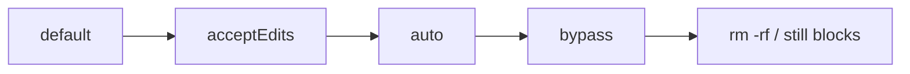

The permission **mode** sets the baseline posture on top of your allow/ask/deny rules. There are six: `default` (prompt when uncertain), `acceptEdits` (auto-approve common filesystem Bash inside the cwd), `plan` (read/think only — no writes), `auto` (research-preview classifier-driven autonomy), `dontAsk` (auto-deny anything not explicitly allowed — handy for CI), and `bypassPermissions` (skips most checks).

Two surprises bite. **`bypassPermissions` is not a total kill-switch:** `rm -rf /` and `rm -rf ~` *still* prompt as a circuit breaker, and a `PreToolUse` hook `deny` still blocks. **`auto` mode silently drops broad allow rules** — `Bash(*)`, wildcarded interpreters, `npm run *`, and all `Agent` allows are dropped while it's active (they restore when you leave), and `defaultMode: "auto"` is *ignored* in project settings — it must live in user-level `~/.claude/settings.json`.

<!-- step: The mode sets the baseline posture on top of your allow/ask/deny rules. -->

<!-- step: default prompts on uncertain; acceptEdits auto-approves cwd file ops; plan is read-only. -->

<!-- step: auto is classifier autonomy — but it silently DROPS broad allow rules like Bash star. -->

<!-- step: dontAsk auto-denies anything not explicitly allowed (handy for CI). -->

<!-- step: bypassPermissions skips most checks — but rm -rf / still prompts and a hook deny still blocks. -->

<!-- mini -->

