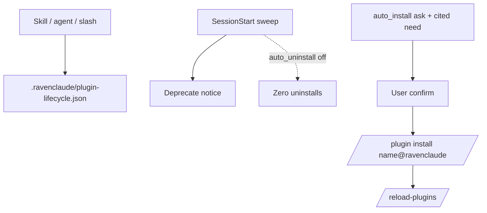

**Plugin lifecycle** is RavenClaude's per-project answer to "which installed plugins are actually used here?" It writes a local ledger at `.ravenclaude/plugin-lifecycle.json` (gitignored) and bumps `last_used_at` only when a **skill**, **agent**, or **slash** from that plugin is invoked. Mere SessionStart presence and opening the dashboard do **not** count as use — otherwise unused_days would never trip.

Defaults follow the Runes/Thing class: after P1, tracking is **ON** once a comfort-posture file exists; `auto_uninstall` and `auto_install` stay **OFF** unless the user opts in. Auto-install v1 is **ask-first** and **ravenclaude marketplace only** (`auto` mode is NO-SHIP). `ravenclaude-core@ravenclaude` is a hard pin and is never auto-removed under any posture.

The SessionStart sweep surfaces deprecate notices when tracking is on. It never shells the cache-reset disaster-recovery command, and it does not claim a freshly installed plugin usable until `/reload-plugins`. Host caveats: Copilot CLI under `-p` does not fire SessionStart; Cursor SessionStart is fail-open on malformed hook responses — do not claim slash-install parity there.

