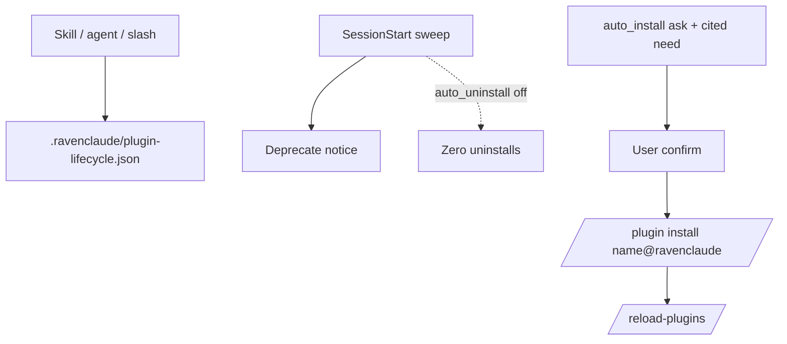

## What a reader would have assumed instead

A SessionStart sweep that uninstalls unused plugins by default, or an auto-install
path that quietly pulls marketplace packages without ask — and that presence in the
installed list counts as "used."

## The discriminator

control: `bash plugins/ravenclaude-core/hooks/tests/test-plugin-lifecycle.sh` (28 pass).
Measured 2026-09-15: with `auto_uninstall` OFF the sweep records a plan with
`executed: false` and zero uninstalls; `auto_install: auto` is coerced OFF; core is
hard-pinned (MF teeth: neutering `is_core_key` is what makes core uninstallable).

## Why it matters

Defaults OFF + plan-only uninstall keep the surface opt-in. Ask-first ravenclaude-only
install and `/reload-plugins` before usable close the empty-cited and cache-path
AppSec locks. Copilot `-p` and Cursor SessionStart caveats stay honest — no slash
parity claim.

Falsifier: sweep shells uninstall or cache-reset DR, `auto` installs without ask, or
core lands in `would_uninstall`.

Probe: `plugins/ravenclaude-core/hooks/tests/test-plugin-lifecycle.sh`.

