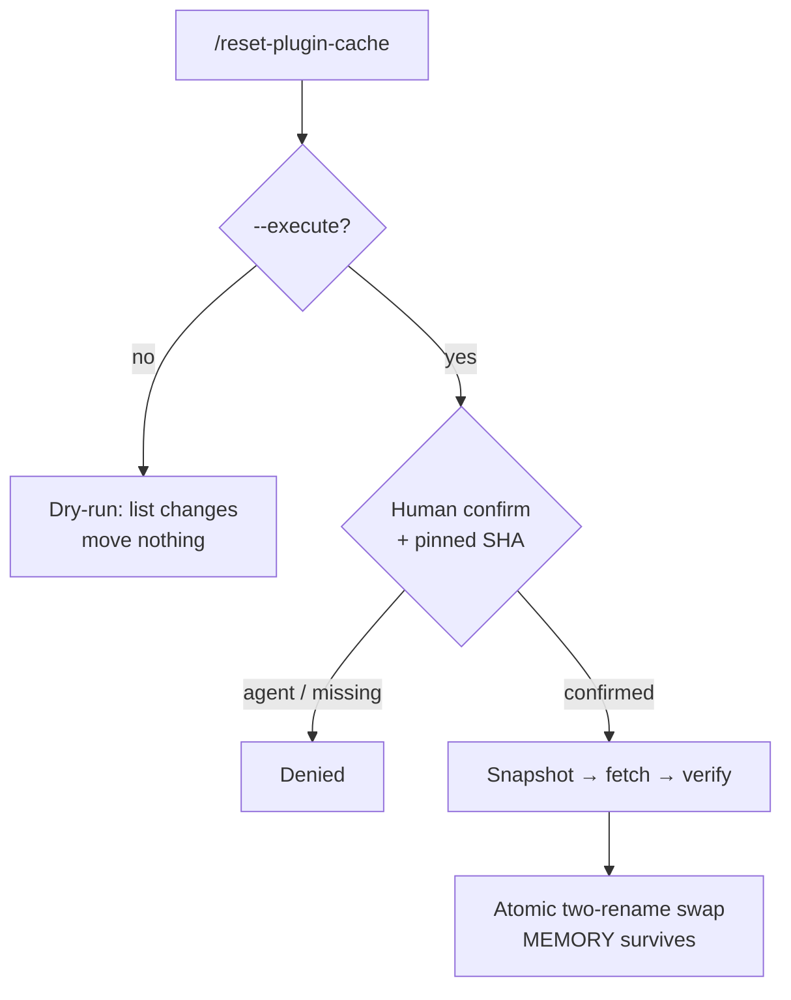
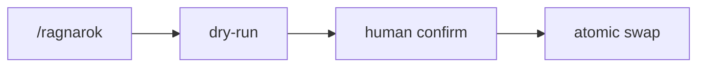

**`/reset-plugin-cache`** (themed alias **`/ragnarok`**) is the marketplace's one **high-blast-radius, cache-mutating** disaster-recovery command — it resets a genuinely-broken plugin cache. Because it can move a lot of files at once, it ships behind a deliberate safety envelope. By default it is **dry-run**: it enumerates exactly what *would* change and moves nothing. The destructive path requires `--execute`, a pinned marketplace SHA (no floating HEAD), and a typed interactive confirmation.

That confirmation is the human gate: **an agent cannot satisfy it.** An attempt to execute without a real human confirmation fails, and an agent that tries to bypass the command by shelling the underlying script directly is hard-denied — the command-review tribunal carries a self-protection concern that blocks the bypass before any model runs. So the only way the cache is actually reset is a person typing the confirmation.

The execute path is **atomic and reversible**: snapshot the current cache → fetch a fresh, pinned copy → verify it with the gate suite *before* touching the live cache (a failed verification aborts, leaving the original untouched) → perform a two-rename atomic swap (rolling back the first rename if the second fails) → write an audit record. The pre-reset snapshot is retained, and `MEMORY.md` always survives because the memory directory lives outside the cache the script operates on.

<!-- mini -->

