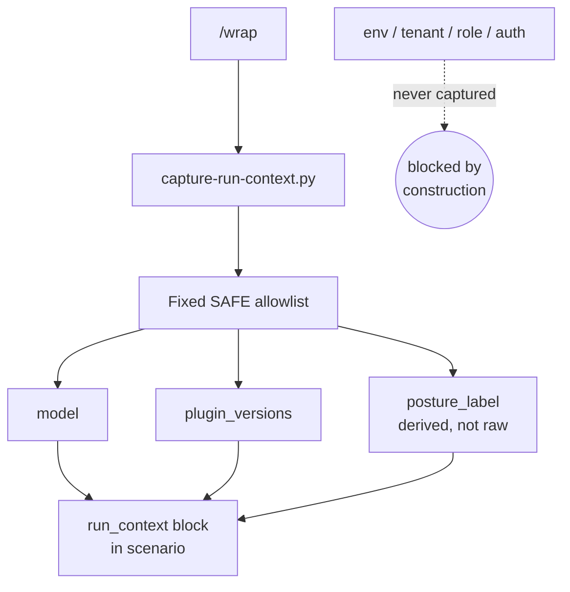
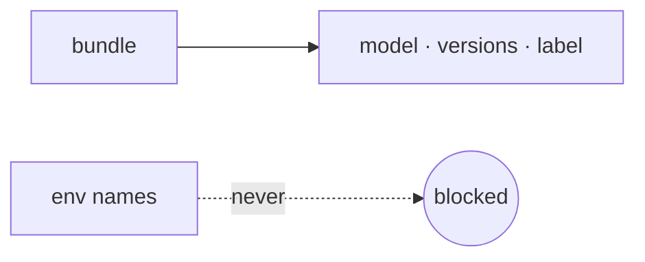

When `/wrap` writes a scenario, it can attach a **minimal, safe run-context bundle** so a future reader knows the few output-shaping variables that decide whether the lesson generalizes — instead of relying on the contributor's cold scope guess. The bundle holds exactly three things plus a status flag: the contributing session's **model**, the **plugin versions** in play, and a **derived posture label** (open / default / balanced / strict / unknown). The label is a *derivation* of the posture's global default, not the raw posture YAML — a label is not an environment name. A `capture_method` flag records whether any source was absent (`degraded`) versus a clean capture (`auto`).

The load-bearing constraint is **privacy by construction (R-PRIV)**. Scenario files ship to *every* installer, and an environment name — a tenant slug, a service-principal name, an auth-mechanism label — is itself a sensitive token once shipped. Banning such names by regex is unenforceable, because a scrubber catches secret *shapes*, not arbitrary slugs like `client-acme-prod`. So the bundler doesn't redact environment context — it **structurally never captures it**. A fixed `SAFE_FIELDS` allowlist is the entire universe of fields it can emit, and there is simply no code path that reads `environment-context.md` or any env / role / tenant / auth source. "Never-capture" beats "detect-and-ban" because the bundler is the only writer, and an audit gate asserts the allowlist contains zero environment fields.

The capture is fail-safe and stdlib-only: deterministic, no network, no subprocess, no dynamic import. Any missing source degrades gracefully — that field is omitted and `capture_method` flips to `degraded`; the script never raises on an absent or unreadable source. The result is a tiny, shippable provenance block that helps `scenario-retrieval` decide whether a lesson applies, without ever leaking what environment produced it.

<!-- mini -->

