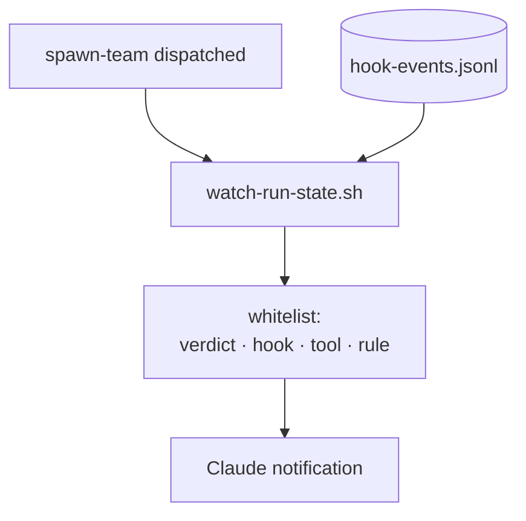

Heimdall, Víðarr, and Norns are **pull** surfaces — you open a tab and read what already happened. The **run-state monitor** is the **push** complement: it streams the same guardrail signals to Claude Code as **native notifications**, so the agent reacts to a deny or warn *as it lands* during a multi-agent run, without anyone asking it to go look. It is the marketplace's first member of a new component type, `monitors/`.

It is scoped **`on-skill-invoke:spawn-team`**, not `when: always` — it starts the first time the team-dispatch skill runs (exactly when multiple agents are live and guardrails matter most) and stays up for the rest of the session. That scoping is the **cost bound**: ordinary single-agent sessions never start it. It tails the newest session hook-event log and, for each new line, emits **one** notification built only from a whitelist of **derived labels** — verdict, hook name, tool, and rule. It **never** echoes the raw path or command field, because every monitor stdout line becomes a Claude notification, so the emit surface is an injection surface; the fixed label vocabulary is the defense, mirroring the capability-banner rule.

Two more invariants keep it safe and robust. It is **read-only** — it tails and summarizes, writing nothing and mutating no run state. And it is **fail-safe** against the empty-glob trap: rather than `tail -F` a bare glob (which would exit on no match and crash-loop), it resolves the single newest log itself and idle-polls to re-resolve when a log rotates. It is **Claude-Code-only** — plugin monitors are a Claude Code component with no Copilot equivalent, so under Copilot it simply doesn't load and the pull tabs remain the surface there.

