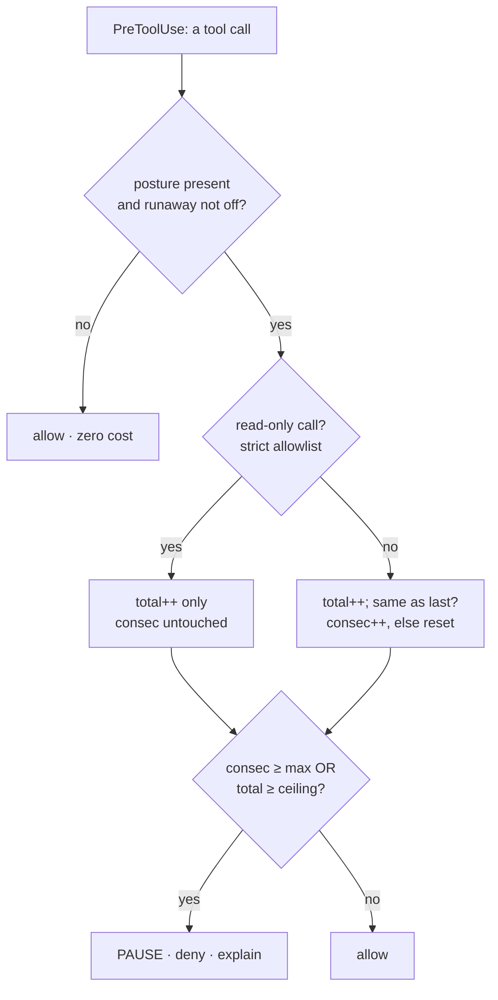
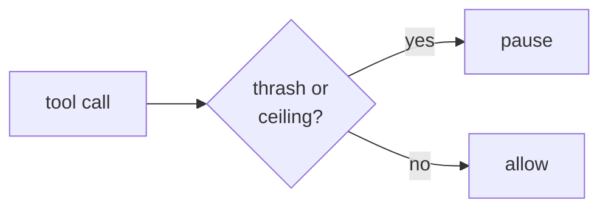

The **runaway brake** is the **depth guard**: it stops an agent from disappearing down a rabbit hole — looping on a fabricated error, or grinding through hundreds of calls without converging. It is a `PreToolUse` hook that runs *before every tool call*, counts the calls per session, and **pauses** (a deny) when one of two limits trips. It exists because Claude Code's native `auto`-mode brake (the 3-consecutive / 20-total block) is Anthropic-API-only, so it can't protect the model-agnostic GitHub Copilot CLI surface (Claude / ChatGPT / Grok). This hook is the portable, **model-free** equivalent — there is no LLM in the loop, just a counter.

Two limits, both tunable in `.ravenclaude/comfort-posture.yaml`. **`max_consecutive`** (default 8) trips when the agent makes the *same* tool call — byte-identical name and input — that many times in a row; that repetition is the "stuck in a loop" signal. **`max_total`** (default 1200) is a generous per-session ceiling on *all* calls, the backstop against a slow grind that never repeats exactly. State lives in a per-session counter file under `.ravenclaude/runs/thing/runaway/`, so a brand-new session always starts fresh. The whole hook is **opt-in and fail-safe**: with no posture file it exits immediately (one `stat`, zero cost), and `runaway: off` disables it entirely.

The load-bearing subtlety is the **read-only carve-out**. A legitimate startup burst of read-only calls — repeated `git log`, `ls`, `cat`, `grep` — is not a runaway, so it must not trip the consecutive-loop counter. A call counts as read-only when the tool is `Read`/`Grep`/`Glob`/`NotebookRead`, *or* it's a `Bash` command matching a **strict, anchored, fail-closed** allowlist of obviously-non-mutating programs. A read-only call is **transparent** to the loop counter (it neither increments nor resets the consecutive count) but **still increments the total** — so the session ceiling keeps bounding *every* call regardless of type. Any doubt fails closed: a shell metacharacter that could chain to a mutating command (`&&`, `;`, `|`, `>`, `` ` ``) or any mutating token anywhere in the string forces the call to count as a normal (non-read-only) call.

<!-- mini -->

