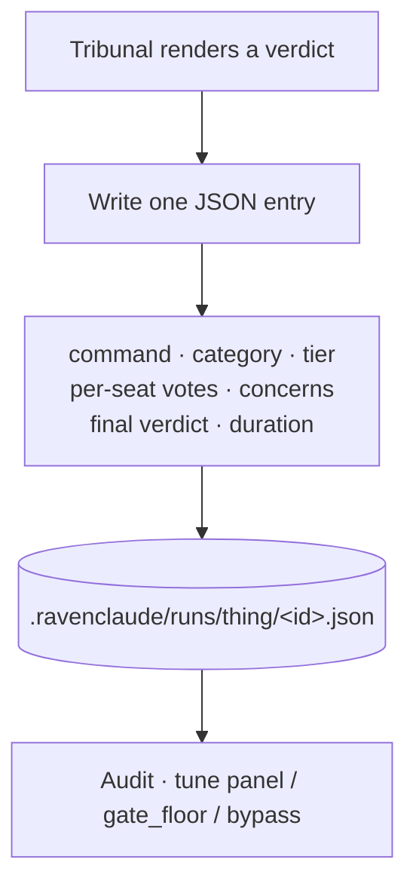
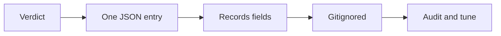
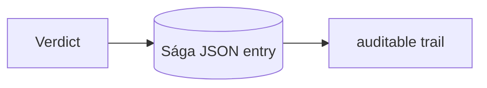

Every tribunal verdict — allow, edit, deny, or ask — writes exactly **one JSON entry** to `.ravenclaude/runs/thing/<id>.json`, the **Sága log**. The entry records the command, its category, the resolved tier, each seat's verdict, the concerns cited, the final verdict (and the revised command on an EDIT), and the duration.

This is the observability substrate: it turns an otherwise opaque "the panel decided" into an auditable trail you can read after the fact to tune the panel, the `gate_floor`, or the bypass patterns. It's **gitignored by default** — the log is local operational data, not something to commit.

<!-- step: The tribunal renders a verdict: allow / edit / deny / ask. -->

<!-- step: It writes exactly one JSON entry under .ravenclaude/runs/thing/. -->

<!-- step: The entry records command, category, tier, per-seat votes, concerns, verdict, duration. -->

<!-- step: Gitignored by default — local operational data, not committed. -->

<!-- step: It's the audit trail you read to tune the panel, gate_floor, or bypass patterns. -->

<!-- mini -->

