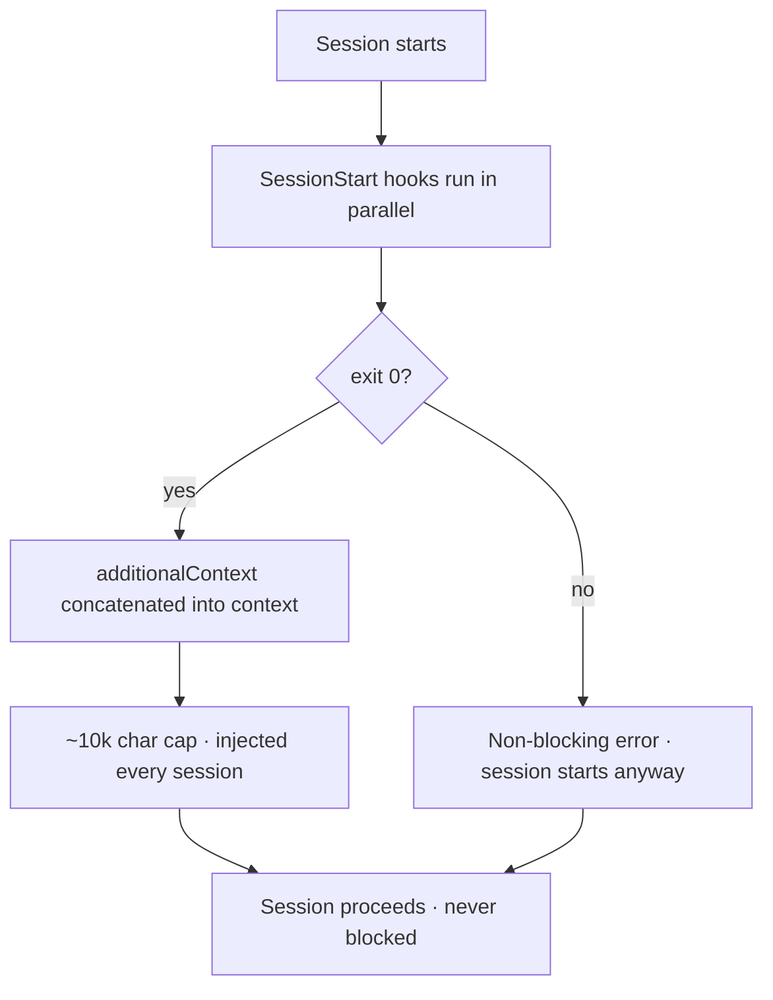
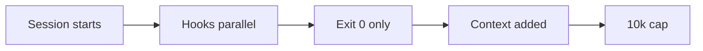
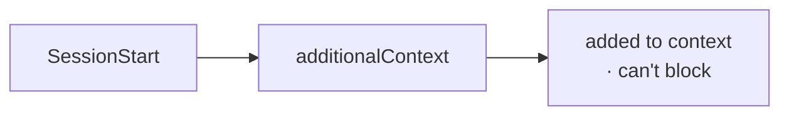

`PreToolUse` hooks gate tool calls; **`SessionStart` hooks can't gate anything.** Their job is to add text to the session via a different field — `hookSpecificOutput.additionalContext` — and nothing more. The output is read **only on exit 0**; a non-zero exit is a non-blocking error and the session still starts. A SessionStart hook can never block or delay a session; its output is purely additive.

Rules that bite: `additionalContext` is **capped near ~10,000 characters** (it's injected every session, so it's a recurring token cost — keep it tight); **multiple SessionStart hooks run in parallel and their outputs are concatenated**; the optional `matcher` is `startup` / `resume` / `clear` / `compact`; and like other hooks it **fails open** on timeout. This is the mechanism RavenClaude's capability banner rides on.

<!-- step: A session starts; SessionStart hooks run in parallel. -->

<!-- step: They can't gate anything — output is read only on exit 0. -->

<!-- step: A non-zero exit is a non-blocking error; the session starts anyway. -->

<!-- step: Each hook's additionalContext is concatenated into the session context. -->

<!-- step: Capped near 10k chars (injected every session); fails open on timeout. -->

<!-- mini -->

