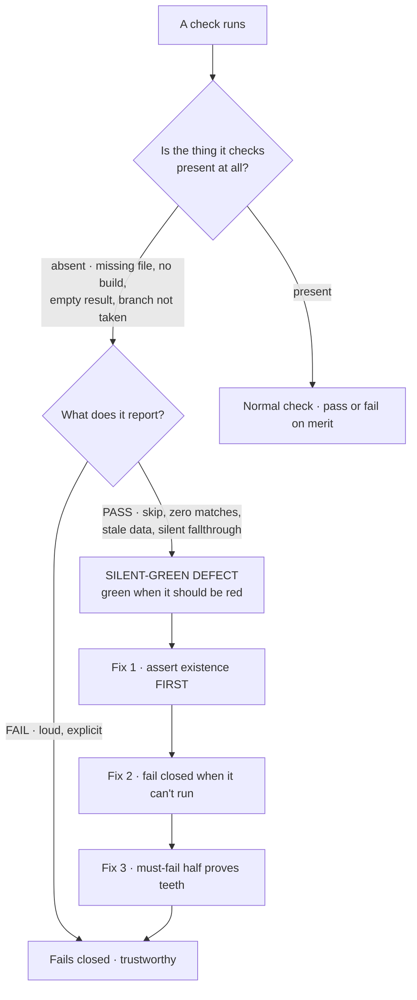
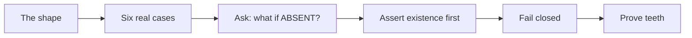
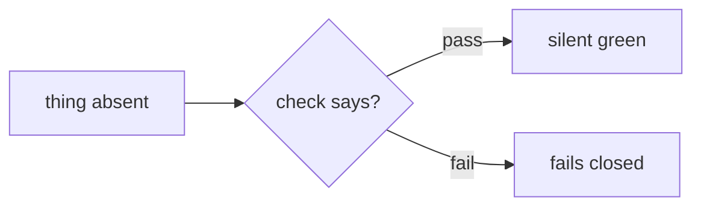

A **silent-green defect** is a check that **passes loudest exactly when it should fail**. Not a flaky test, not a check that misses an edge case — a check whose *failure mode is success*. The build is green, the suite is green, CI is green, and the thing being guarded is gone.

This is the worst class of bug in a codebase full of automation, because every signal you would normally use to find a bug is the thing that is lying to you. You cannot test your way out of it by running the tests harder. It survives review because the diff looks correct in isolation, and it survives CI because CI is the victim.

## Six real ones, all from a single project

1. **A test suite that skips itself when its build artifact is missing.** The suite opened with a `skipIf()` guarding against a missing `dist/` directory. A skipped suite reports **green**. So every local run without a prior build reported success while asserting *nothing at all* — and the one environment that did build (CI) was the only place the assertions ever ran.
2. **A grep-based gate over a file that no longer exists.** The gate ran a pattern over a source file and failed if the match count was wrong. Someone deleted the file. Zero matches. The gate **passed** — precisely, and only, because the thing it was guarding had been deleted.
3. **Assertions run against a stale build directory.** The tests read the last successful build's output, not the current source. They described markup that had been removed weeks earlier. Every assertion passed, honestly and confidently, about a page that no longer existed.
4. **A guard with no `else`.** `if (condition) { handle(); }` — and the unhandled case just falls through. No error, no log, no branch taken. The function returns as though it did its job.
5. **`LIMIT 1` with no `ORDER BY`.** The database is free to return any row it likes. In testing, against a small table, it always returns the one you expect. In production, against a large one, it doesn't — occasionally, and unreproducibly.
6. **Copy that promises behaviour no code implements.** A file-picker button, a nice upload affordance, a "your file has been received" message — with nothing behind it that uploads anything. Nothing failed, because nothing ran.

Different-looking bugs, one shape.

## The diagnostic that finds all six

Ask one question of every check you own:

> **What does this check do when the thing it checks is ABSENT?**

Absent means: the file was deleted, the build never ran, the fixture didn't load, the config key isn't set, the branch was never taken, the row set came back empty, the feature flag is off. If the honest answer is *"it passes"*, you have a silent-green defect — today, whether or not anything is broken yet.

Run it over each of the six and it lands every time: the skipped suite (no build → pass), the grep (no file → pass), the stale directory (no fresh build → pass), the missing `else` (no branch → pass), the `LIMIT 1` (no ordering → whatever, and "whatever" looks like a pass), the copy (no handler → pass).

## The fix pattern: assert existence first, fail closed

Two moves, in this order.

**Assert the subject exists before you assert anything about it.** A check must first prove it has something to check: the artifact is present, the file is where the gate expects it, the build is newer than the source, the query returned a row, the branch was taken. Make that a *hard* assertion, not a skip. "I couldn't find it" must be a failure, never an absence of failure.

**Fail closed.** When the check can't run — missing dependency, missing input, unhandled case — the outcome is a **failure**, not a pass. A tool that isn't installed makes the gate red, or at minimum shouts *"this is not a pass."* A guard with no matching branch raises. `LIMIT 1` gets an `ORDER BY` so "the row" is a defined thing rather than a coincidence.

**And prove the check has teeth.** This is what a *must-fail half* is for: run every gate against a known-bad fixture and require it to go **red**, alongside the known-good fixture that requires it to go green. A gate that has only ever been observed passing has never been observed working. Both halves, or you're trusting a colour.

<!-- step: A silent-green defect is a check that passes loudest exactly when it should fail. -->

<!-- step: Six from one project: skipped suite, grep over a deleted file, stale build dir, no else, LIMIT 1, empty copy. -->

<!-- step: The one diagnostic: what does this check do when the thing it checks is ABSENT? -->

<!-- step: Fix 1 — assert the subject exists before asserting anything about it. A skip is not a pass. -->

<!-- step: Fix 2 — when the check can't run, that is a failure. Never a quiet pass. -->

<!-- step: Fix 3 — a must-fail half: the gate must go RED on a known-bad fixture, or it has never been observed working. -->

<!-- mini -->

