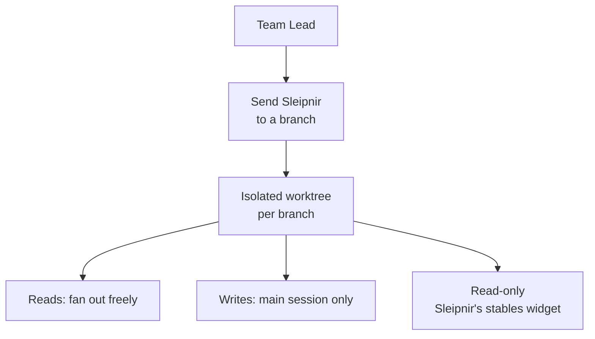
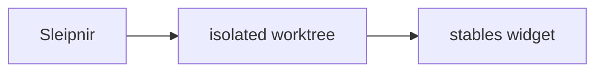

**Sleipnir** is the name for worktree traversal — Odin's eight-legged horse, the one mount that crosses realm boundaries safely. When the Team Lead fans work across several git branches in parallel, each branch gets its own **isolated worktree**, and in user-facing prose the agent prefers *"I'll send Sleipnir to that branch"* over narrating the raw worktree mechanics. The label anchors your intuition about what's happening (a safe crossing into a separate branch's working tree) while the underlying mechanism is unchanged.

This is **labeling only** — there is deliberately no `/sleipnir` slash command, no Sleipnir agent, and no new component. The convention surfaces in the worktree skills (new-worktree, cleanup-worktrees, spawn-team) and, on the dashboard's Activity tab, as a **read-only "Sleipnir's stables"** widget showing the current list and count of worktrees. The widget writes nothing; on a static host it shows an honest empty state rather than pretending to have live data.

The convention pairs with a load-bearing dispatch rule about worktrees: reading a branch needs no isolation and can be fanned out freely across sub-agents, but **writing** a branch (checkout / commit / push) needs an approval only the main interactive session can obtain — background sub-agents are auto-denied git writes. So Sleipnir carries reads out in parallel, while branch-mutating work stays in the main session, sequentially.

<!-- mini -->

