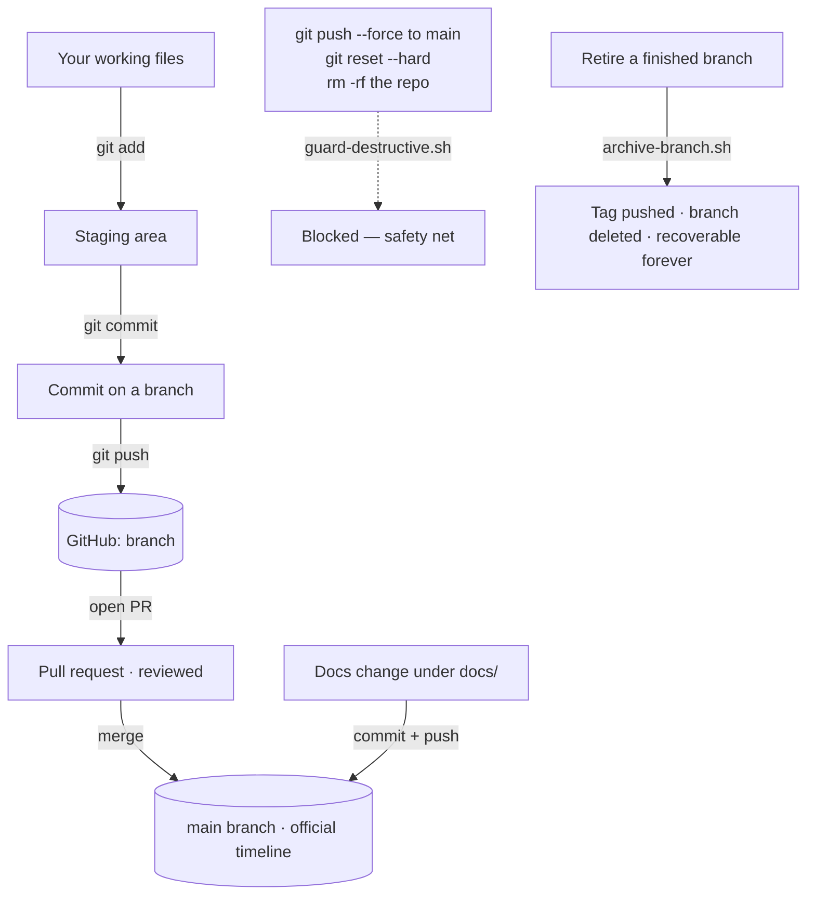
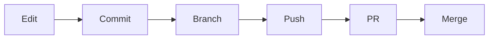
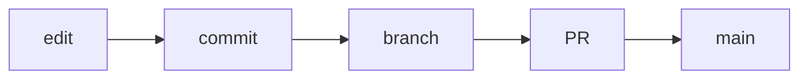

**Source control** (the tool is called **git**, the website is **GitHub**) is a time-machine for every file in a project: every change is saved as a labeled snapshot, and many people can work on the same project in parallel without overwriting each other. The load-bearing fact for you: **RavenClaude does almost all of the git work for you** — this page is the vocabulary so you understand what Claude Code is doing on your behalf, and can step in when something goes sideways.

**Four ideas cover almost everything you'll see:**

- **Commit** — one saved snapshot of your work, with a short message explaining _why_ (not what — the diff already shows what).
- **Branch** — a parallel timeline for a piece of work-in-progress, kept separate from the project's official timeline (the **main** branch).
- **Pull request (PR)** — a proposal that the work on a branch be merged back into main; it gets reviewed (by a person, by CI checks, sometimes by Claude) before anything moves.
- **Merge** — combining a branch's commits into main once the PR is approved.

**The minimum vocabulary** you'll see in commands and logs:

- `git status` — what's changed since the last snapshot
- `git add <file>` — stage a file for the next snapshot
- `git commit -m "why"` — take the snapshot
- `git push` — upload local commits to GitHub
- `git pull` — download new commits from GitHub
- `git log` — read the history

**Two patterns you'll actually encounter in this repo:**

1. **Docs commit straight to main, no PR.** Pure documentation under `docs/` (plans, designs, research notes, the rolling session log) commits direct to main because it can't break a consumer's `/plugin marketplace update`. Faster planning loop.
2. **Code, hooks, manifests, and CI go through a PR.** Claude Code creates the branch, makes the commits, opens the PR, and tells you the URL. You review in GitHub and click **Merge**.

**The safety nets** mean you can experiment without breaking things:

- The `guard-destructive.sh` hook blocks the truly destructive commands — **force-push to main**, `git reset --hard`, `git clean -f`, and `git branch -D` on a protected branch. It denies them before they run.
- The sanctioned way to retire a finished branch is `scripts/archive-branch.sh` — it **tags the branch tip** (so the work is recoverable forever on the tag), pushes the tag to GitHub, writes an audit log, then deletes the local branch. Work is never actually lost.

You will rarely type any of these commands yourself. The reason to learn the vocabulary is so that when Claude says _"I opened PR #238 on branch `feat/rc-hardener-followups`"_ or _"the guard denied a force-push"_, you know exactly what happened and what your next click is.

<!-- step: Edit your working files — your changes in progress. -->

<!-- step: git commit: save a labeled snapshot with a short 'why' message. -->

<!-- step: Branch: keep work in progress on its own timeline, separate from main. -->

<!-- step: git push: upload the branch's commits to GitHub. -->

<!-- step: Open a PR: propose merging the branch; reviewed by people, CI, sometimes Claude. -->

<!-- step: Merge into main once approved. RavenClaude does most of this for you. -->

<!-- mini -->

