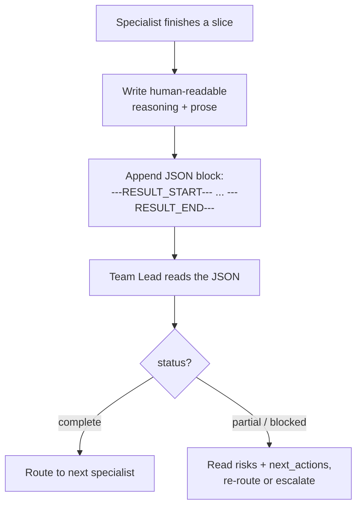
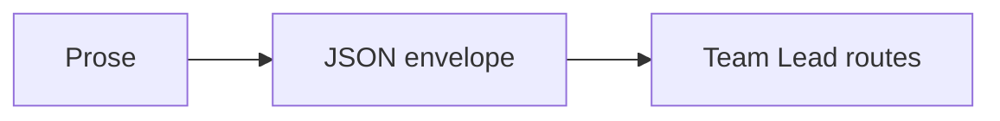

When one agent finishes a slice of work and hands it back to the Team Lead, two things have to travel together: the **reasoning** (so a human can read and trust it) and a **clean summary a program can parse** (so the orchestrator can decide what happens next without re-reading prose). Pure prose is unparseable; pure JSON throws away the "why." The Structured Output Protocol solves this by asking every specialist to emit **both** — prose first, then a small JSON block wrapped in a fixed envelope:

```
---RESULT_START---
{ "status": "complete", "summary": "...", "handoff_recommendation": {...}, "confidence": 0.9 }
---RESULT_END---
```

Those exact delimiters are the contract. The Team Lead reads only what's between them to drive routing — which specialist goes next, whether the work is `complete` / `partial` / `blocked`, and how confident the agent is. Because the markers are literal and unique, extraction is reliable even when the prose above them is long and freeform. Every handoff JSON carries the same load-bearing fields: a one-line summary of what was done, the recommended next specialist and why, any risks or open questions, and a numeric `confidence` (the float that rides agent-to-agent, the complement to the `[unverified]` markers humans see in chat — see [Claim Grounding](#/learn/claim-grounding)).

This is a **discipline, not a hook** — nothing mechanically forces the JSON to appear, so it lives in every agent's instructions and the Team Lead enforces it when it briefs them. It pairs naturally with [Last-Mile Completion](#/learn/last-mile-completion): when a `blocked` or `partial` status is honest, the protocol requires the agent to fill `risks` with the alternatives it ruled out and `next_actions` with the escalation path — exactly the [Capability Grounding](#/learn/capability-grounding-protocol) "what I tried" report, in machine-readable form. Casual chatter ("read the file," "tests ran") is exempt; the envelope is only for handoffs that another agent or a human will act on.



<!-- mini -->

