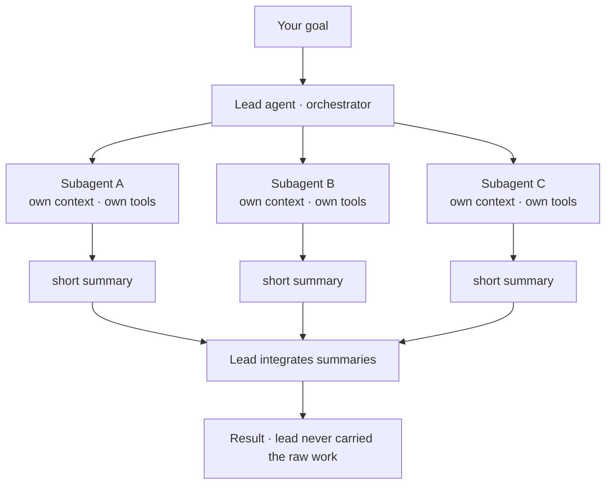
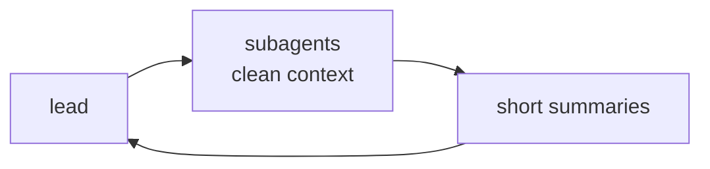

A single agent doing a sprawling task hits two walls: its **context window fills** with the noise of exploration, and a long linear chain has no parallelism. **Subagents** solve both. The lead agent (the *orchestrator*) hands a self-contained slice of work to a **subagent** — a fresh agent with its **own clean context window**, its own tools, and a focused brief. The subagent does the legwork and returns a **short summary** to the lead. The raw files it read and dead-ends it explored never touch the lead's context.

This is the **orchestrator–worker** pattern, and the load-bearing idea is *information hiding*: the lead pays only for the conclusion, not the investigation. A research subagent might read forty files and reply with a two-paragraph answer — forty files' worth of tokens spent in a context the lead never has to carry.

What it's good at, and where it bites:

- **Fan-out.** Independent slices run in parallel — three subagents searching three areas at once, returning three summaries. Big wall-clock win when the slices don't depend on each other.
- **Focus.** A narrowly-scoped subagent with the right tools beats one giant agent juggling everything, the same way a specialist beats a generalist.
- **The summary is the seam — and the risk.** The lead sees *only* what the subagent reports back. A subagent that summarizes badly, or drops a detail the lead needed, silently loses that information. Briefs should say what to return, not just what to do.
- **Subagents don't share memory with each other.** Each is isolated by design, so coordination happens through the lead, not sideways between workers.

RavenClaude's Team Lead is exactly this pattern with named specialists; the command-review tribunal's parallel reviewer seats are another instance — several focused agents, one aggregated verdict.

