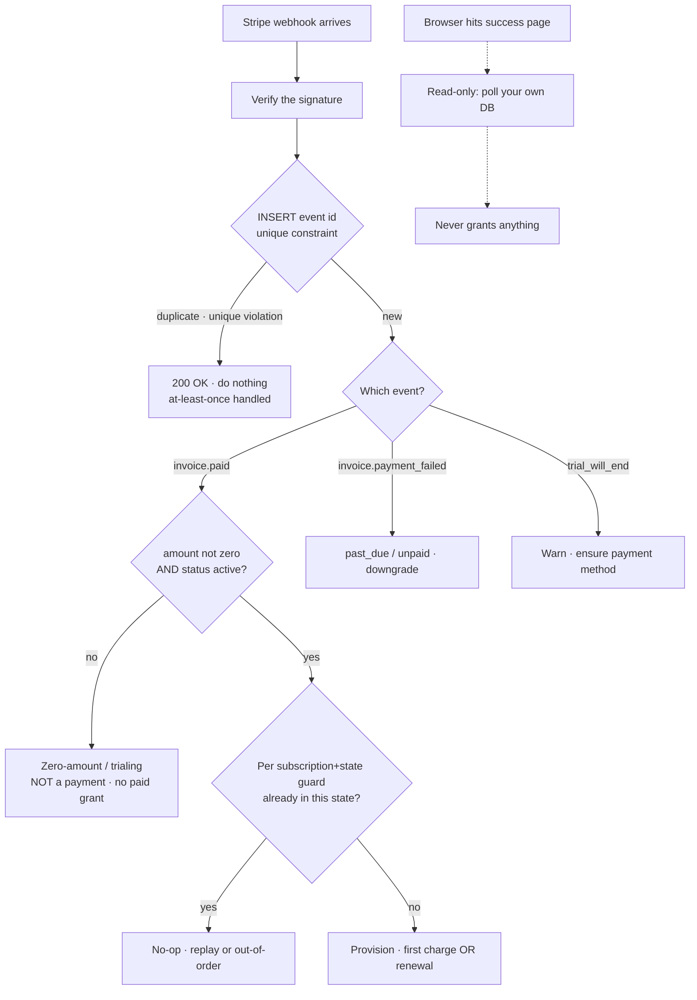
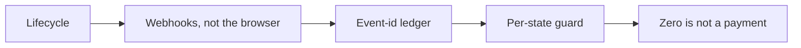
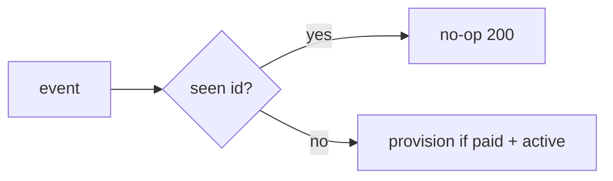

The failure you will actually meet is this: a customer paid, their browser died on the redirect, and they have no account. Or: they got billed once and provisioned three times. Or: someone on a free trial got the paid tier for free, forever, because a zero-amount invoice looked like a payment.

None of those are edge cases. They are the default behaviour of a subscription integration that was written as though the money path runs through the browser. It doesn't. It runs through webhooks, and webhooks have properties you have to design around.

## The lifecycle, in the order it happens

**Creation.** Stripe creates a Subscription. If payment is due immediately, it also creates an Invoice and a PaymentIntent, and the subscription starts as `incomplete` — it becomes `active` only after the customer pays that first invoice.

**Trial.** With a trial, the initial status is `trialing`, and Stripe *"automatically transitions to `active` when the trial ends and payment succeeds."* You get a heads-up first: `customer.subscription.trial_will_end` is *"Sent 3 days before the trial period ends."*

**First real charge.** *"When the trial ends, if the subscription `status` isn't `paused`, we generate an invoice and send an `invoice.created` event notification. Approximately 1 hour later, we attempt to charge that invoice."* On success you get `invoice.paid`, described as: *"Sent when the invoice is successfully paid. You can provision access to your product when you receive this event and the subscription `status` is `active`."*

**Renewal.** The subscription keeps generating an invoice every billing period, and the same `invoice.paid` / `invoice.payment_failed` pair keeps arriving. Renewal is not a special case in your code — it is the same handler as the first charge. If your first-charge path is a one-shot script, renewals will quietly not work.

**Failure.** `invoice.payment_failed` fires; the subscription lands in `past_due` or `unpaid` depending on your dashboard settings. Downgrade on that signal, not on a timer.

## Why the money path must be webhooks, not the success page

Stripe puts this in a callout headed **"Webhooks are required"**:

> *"You can't rely on triggering fulfillment only from your Checkout landing page, because your customers aren't guaranteed to visit that page. For example, someone can pay successfully in Checkout and then lose their connection to the internet before your landing page loads."*

The browser is a *courtesy* channel: it tells the customer something happened. The webhook is the *authoritative* channel: it tells your server something happened, and it retries. Grant entitlements from the webhook only. It is fine for the success page to show a spinner and poll your own database — it is not fine for the success page to be the thing that writes the row.

## At-least-once means you will get duplicates

> *"Webhook endpoints might occasionally receive the same event more than once."*

And Stripe is blunt that this is your problem to solve: *"Because of how this integration and the internet work, your `fulfill_checkout` function might be called multiple times, possibly concurrently, for the same Checkout Session."* Note **concurrently** — two deliveries can be in flight at once, so a read-then-write check ("have I seen this?" … "no" … "ok, provision") races itself and provisions twice.

Stripe's recommended defence is an **idempotency ledger**: *"You can guard against duplicated event receipts by logging the event IDs you've processed, and then not processing already-logged events."*

Build it **INSERT-first**, not check-first:

1. `INSERT` the event id into a table with a **unique constraint** on that id.
2. If the insert raises a uniqueness violation, this is a duplicate — **return 200 and do nothing**. Not an error; a no-op.
3. Only if the insert succeeded do you run the side effect.

The database's unique index is the lock. That is what makes it safe against concurrent deliveries, which an `if not exists` check is not. Return `200` on duplicates: a non-2xx makes Stripe retry, and retrying a duplicate forever is a self-inflicted outage.

Stripe also notes that in some cases *two separate Event objects* describe the same thing, and suggests keying on *"the ID of the object in `data.object` along with the `event.type`"* — worth doing if you see double-provisioning that the event-id ledger doesn't catch.

## Out-of-order means a replay must be a safe no-op

> *"Stripe doesn't guarantee the delivery of events in the order that they're generated."*
> *"Make sure that your event destination isn't dependent on receiving events in a specific order."*

A cancellation can land before the renewal that preceded it. So the event-id ledger is not enough on its own — it stops the *same* event running twice, but not an *older* event overwriting a newer state.

Add a **per-(subscription, state) guard**. Keep the subscription's current state in your own table, and make each handler a conditional transition: only move `subscription X` into state `active` if it isn't already there and the event isn't older than what you've recorded. Written that way, a replayed or late event finds the world already in the state it wanted and does nothing. That is the property you want: **every handler is safe to run at any time, in any order, any number of times.**

## The trap: a $0 invoice is not a payment

For a trial subscription, Stripe's free-trial documentation says plainly:

> *"When creating a subscription with a trial period, you don't need to add a payment method. An immediate invoice is still created, but the amount is 0 and the Invoice Line descriptions include 'Free trial' verbiage."*

So a zero-amount invoice exists, and it settles, and an invoice-settled event carrying **no money at all** can reach your handler. A handler that reads "invoice" and grants the paid tier gives away the product.

This is exactly why Stripe's provisioning rule is **two-part**, and both parts matter: provision *"when you receive this event **and** the subscription `status` is `active`."* During a free trial the status is `trialing`, not `active` — the status check is what stops the $0 invoice from being mistaken for a payment. Belt and braces: check the amount is greater than zero **and** the subscription status before you grant anything paid.

*(Verified this session: the $0 trial invoice is created, and the two-part provisioning rule is Stripe's own. The docs I checked do not state in one place that `invoice.paid` is emitted for that zero-amount invoice — so treat it as though it is. Coding for the conservative case costs nothing; assuming the event never arrives costs you the product.)*

Trials should be provisioned from the trial itself (`trialing` is a real, grantable state with its own entitlements), never inferred from a settled invoice.

<!-- step: Trial → first charge → renewal. Renewal is the SAME handler, not a special case. -->

<!-- step: The browser may never reach the success page. Grant entitlements from the webhook only. -->

<!-- step: Delivery is at-least-once and concurrent: INSERT the event id first, no-op on the unique violation. -->

<!-- step: Order is not guaranteed: a per-(subscription, state) guard makes a late or replayed event a safe no-op. -->

<!-- step: A trial creates a zero-amount invoice. Require amount > 0 AND status active before granting the paid tier. -->

<!-- mini -->

