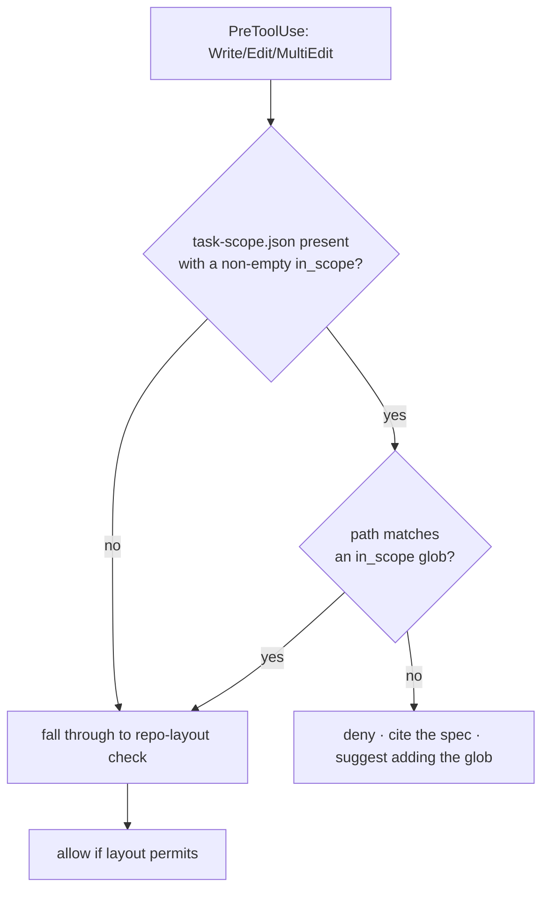
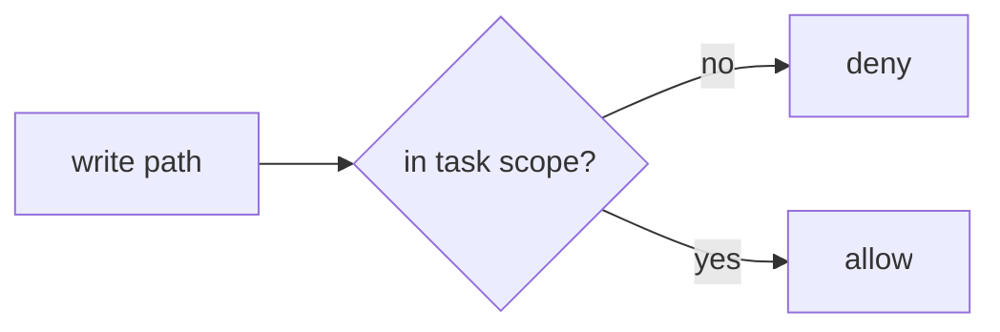

The **task-scope gate** is the **breadth guard**: where the runaway brake bounds how *deep* an agent goes and the definition-of-done gate bounds *correctness*, this bounds how *wide* it spreads. It answers "for the task at hand, which files is the agent allowed to touch?" You declare the current task's write blast radius in `.ravenclaude/task-scope.json` — `{"in_scope": [globs], "spec": "SPEC.md"}` — and any `Write`/`Edit`/`MultiEdit` to a path matching **none** of the `in_scope` globs is denied, with the spec named in the hint. You copy the file in per task and delete it when the task is done.

It rides on the **same** `PreToolUse` hook that enforces the repo layout (`enforce-layout.sh`), so it ships with **zero new wiring** — that hook was already registered on writes under both Claude Code and Copilot. But the two policies are **independent and composable**. The repo-layout policy (`.repo-layout.json`) is about repo *structure* — where any file may live, the marketplace's permanent discipline. Task-scope is about *this task's* radius — a temporary, much tighter fence. Either, both, or neither may be present; a write must satisfy whichever policies *are* configured. The task-scope check deliberately runs **first**, so it is never short-circuited by the layout policy's forbid-only early-exit.

The gate is **fail-safe** in every direction: an absent file, an empty `in_scope` list, or unparseable JSON is a silent no-op (the write is allowed). Glob matching uses bash pattern semantics — a single `*` matches across slashes — and a path containing `..` is refused up front as a path-traversal scrub. Every deny emits a structured line to the hook-event substrate (the same log the Heimdall and Víðarr dashboard tabs read), so a blocked write is observable after the fact, not just a wall-message.

<!-- mini -->

