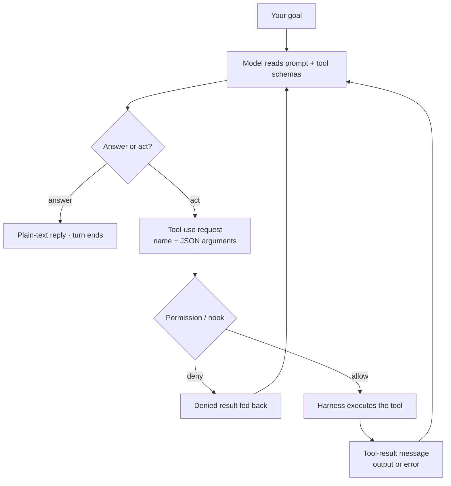
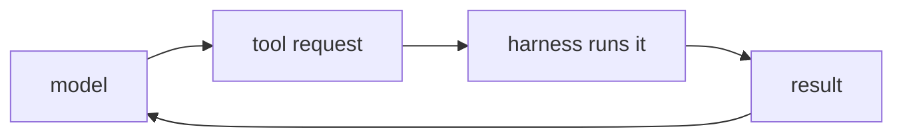

A language model only produces **text**. It can't read a file, run a command, or call an API by itself. **Tool use** (also called *function calling*) is the bridge: you describe the available tools — each with a name, a description, and a JSON schema for its inputs — and the model, instead of answering in prose, emits a structured **tool-use request** naming one tool and the arguments to call it with.

The model never runs anything. The **harness** (Claude Code, the Agent SDK, your own loop) executes the requested tool, captures the output, and feeds it back as a **tool-result** message. The model reads that result on the next turn and decides what to do next — call another tool, or answer. Every single thing an agent *does* — edit a file, run a test, open a PR — is one trip around this request → execute → result cycle.

Three details that bite:

- **The model picks the tool, not the harness.** You can constrain it (`tool_choice` can force a specific tool, force *any* tool, or leave it `auto`), but in normal operation the model chooses. A vague tool description is the most common reason it picks the wrong one or fills arguments badly.
- **Errors are data, not crashes.** A failed tool call should return its error *as a tool-result* so the model can read it and self-correct. Throwing away the loop on the first failure is the classic broken-agent bug.
- **Results re-enter the context window.** Tool output isn't free — a command that dumps 10k lines lands all of it back in the prompt. This is why focused tools that return *conclusions* beat raw firehoses.

A permission layer can sit between the request and the execution: the model may *ask* for a tool, but the harness (or a hook, or a tribunal) can still deny, edit, or gate the call before it runs.

