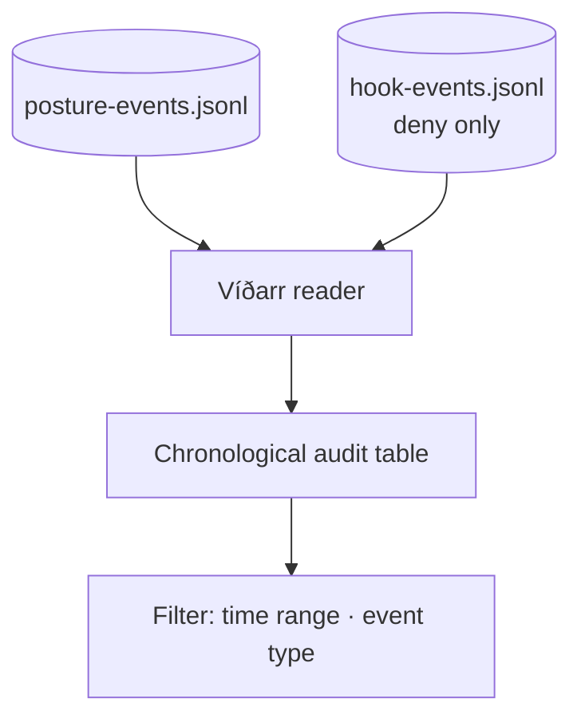

**Víðarr** is the silent, enduring god — and his tab is the **second reader** of the event substrate, reading the posture-event half. Where Heimdall answers the operational "what guardrail tripped just now?", Víðarr answers the audit question: *how did my security posture change over time, and what security-relevant denials happened?* It is a **read-only, filterable, chronological** audit log — no edit, no dismiss, no acknowledge.

It interleaves two sources into one newest-first table (columns: when / type / category / summary / source). **Posture changes** are every line of `posture-events.jsonl`, summarized as the permission-rule diff counts (e.g. "+1 deny, +15 override"). **Security-relevant hook denials** are the hook-event log filtered to **deny verdicts only** — warns are advisory and deliberately excluded (they live in Heimdall's grey tier, not the security audit). A single predicate is the one place that decides what counts as security-relevant.

Two filter controls narrow the view: a **time-range** select (24h / 7d / 30d / all, which re-fetches) and **event-type chips** (All / Posture changes / Security denials, applied client-side). Like Heimdall, both sources are per-consumer and git-ignored, so the data is **served-only** — a static host degrades to an honest empty state. When the perimeter has been quiet, the table says so plainly rather than pretending.

