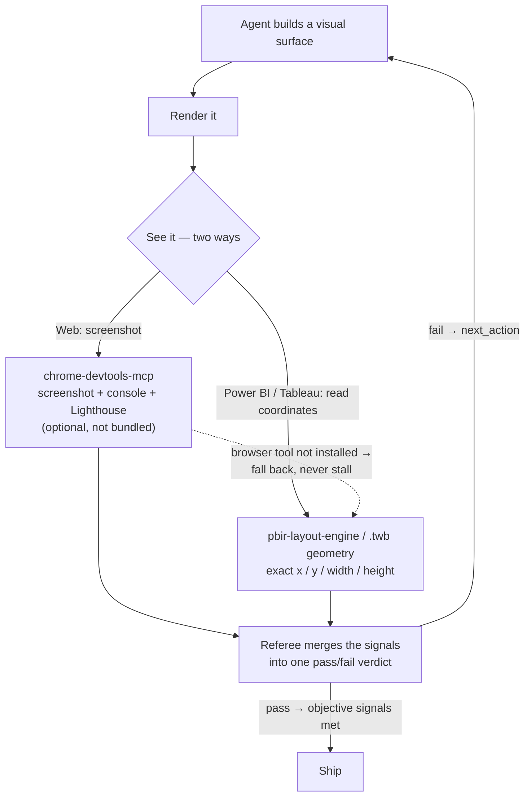
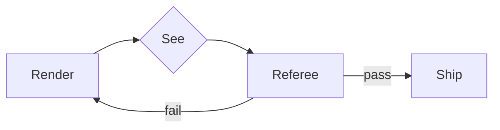

An agent that builds something visual — a web page, a dashboard, a Power BI or Tableau report — should not work blind. The discipline closes the [agent loop](#/learn/agent-harness-loop) one turn tighter: **render the output, _see_ it, critique it against the intent _and_ objective signals, edit, re-render — until the signals pass.** The part that makes it genuinely *improve* rather than wander is the stopping signal: the loop ends on **objective gates** (zero console errors, a Lighthouse accessibility score, no overlapping elements), never on a subjective "looks better."

There are two ways an agent "sees," and which one leads depends on the surface. For a **web** page it's **visual** — a real browser takes a screenshot the model can actually look at, plus the console errors and a Lighthouse audit. For **Power BI and Tableau** it's **structural** — the agent reads the report definition's *exact coordinates* (PBIR JSON `x/y/width/height`, a Tableau `.twb`'s zone geometry). Layout is just numbers there, so checking it with arithmetic beats eyeballing a picture — and a BI screenshot needs the report published or embedded and authenticated, which the agent often can't reach. So for reporting, **structural-only is a complete pass**, with a screenshot as the secondary check (did the theme apply, did conditional formatting fire). A small runnable **referee** merges whatever evidence was captured — the layout linter plus any screenshot/console/Lighthouse results — into one pass/fail verdict with a concrete `next_action`, and reads back **only numbers and fixed labels**, never the page's raw text (a hostile page can write fake "instructions" to the console).

**For consumers — one thing to know.** The *visual* (screenshot) half rides on an **optional, not-bundled** browser tool, the `chrome-devtools-mcp` server. It is **not installed by default** (and its adoption is security-reviewed, because it drives a live browser). When it's present, agents capture screenshots and run the full visual loop; when it's **absent, they fall back to the structural read and say so — they never stall.** So every visual-output agent works out of the box; installing `chrome-devtools-mcp` simply unlocks the richer, pixel-level half. The discipline composes with the rest of the honesty triad: the "see" step is a this-session [verification](#/learn/claim-grounding) to cite, and once the signals pass, [Last-Mile Completion](#/learn/last-mile-completion) carries the work the rest of the way.

<!-- mini -->

