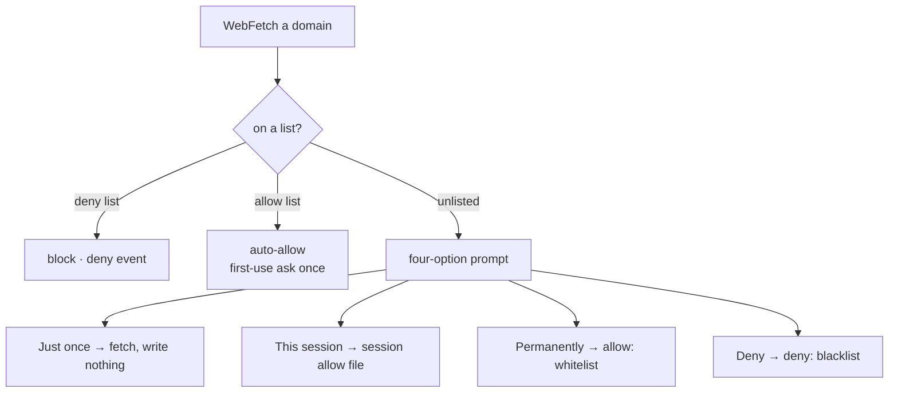
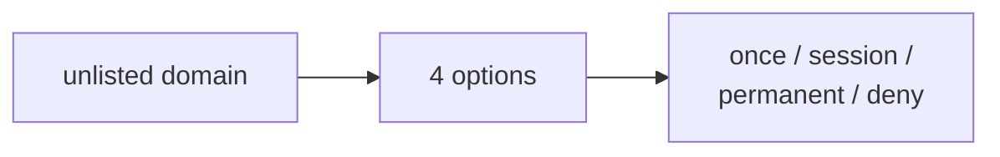

The **website-access guardrail** governs which sites an agent may fetch. It has two halves: a committed **allow/deny list** the agent honors, and a **four-option choice** it surfaces the first time it needs a domain that isn't on either list. The lists live in `.ravenclaude/web-access.yaml` as plain YAML (`allow: [domains]`, `deny: [domains]`), and a rule matches the domain **and all its subdomains**. Because they're a plain file, they work both for Claude Code (enforced by the hook) and for any *other* CLI tool that clones the repo and reads the same file — it's a cross-tool interop layer, not a Claude-only setting.

The deterministic backstop is the `guard-web-access.sh` `PreToolUse(WebFetch)` hook. A **whitelisted** domain auto-allows with no prompt; a **blacklisted** domain is **blocked** (and emits a deny event to the substrate); an **unlisted** domain falls through to the agent's normal per-domain prompt. It's fail-safe: absent config or a missing parser makes it a no-op (ask as normal). One refinement: even a whitelisted domain gets a *first-use* "allow this and subsequent fetches this session?" ask, so a hostile edit to the YAML can't silently turn on exfiltration — set `web_access.trusted: true` to skip that once you've reviewed the list. The hook can't replace Claude Code's built-in permission dialog (no hook can), but it is the deterministic floor beneath it.

The behavioral half is the **four-option menu**. When the agent is about to fetch an unlisted domain it hasn't already cleared this session, it surfaces exactly four choices and then records the answer in the right place. **Just once** fetches now and writes nothing. **This session** appends the domain to the per-session file `.ravenclaude/runs/<session>/web-allow.txt` (the hook auto-allows it for the rest of the session, then it's cleared). **Permanently** appends to the `allow:` whitelist (persists, and propagates to other tools). **Deny** appends to the `deny:` blacklist (blocked from now on). So a *deny* lands on the blacklist and a *permanent* allow lands on the whitelist, exactly as named.

<!-- mini -->

