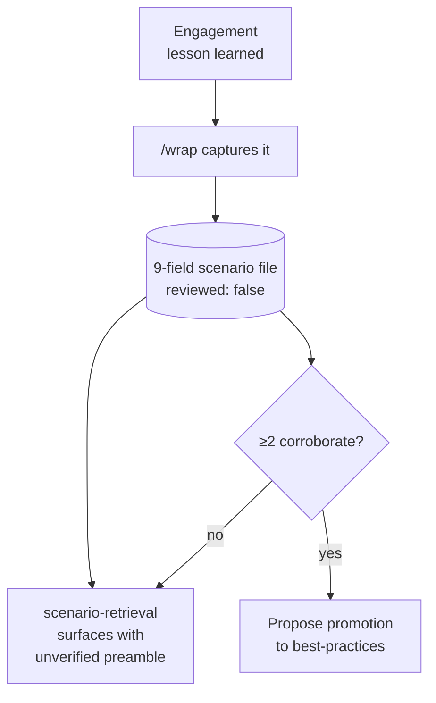
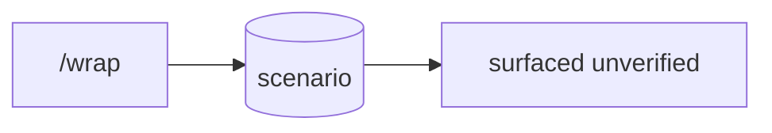

**`/wrap`** is the end-of-engagement step that turns a hard-won lesson into a re-readable file. It writes a **scenario** — a dated, scope-tagged narrative of *"we hit problem X, the context was Y, we tried A/B/C, D worked"* — into `plugins/<plugin>/scenarios/<date>-<slug>.md` with a **9-field YAML schema** (plugin, product, version, scope, tags, confidence, and so on). The flow drafts from the session transcript so the user isn't asked to "tell me about your engagement," asks only the four minimum questions, scrubs the draft for client-identifying info and secrets before writing, and confirms before committing. A scenario is deliberately **not** a canonical best-practice — it's raw field-note material, written `reviewed: false`.

Later, the **`scenario-retrieval`** skill surfaces these files. Before answering a plugin-domain question, an agent globs the scenarios directory, filters by tags / product / scope, ranks by recency and confidence, and surfaces at most the top 2-3 matches — always behind a **mandatory unverified-scenario preamble** (*"Based on N unverified scenarios from YYYY-MM tagged [scope] — verify in your environment"*). The preamble is non-negotiable: scenarios aren't reviewed, so a single contributor's mis-diagnosis must never silently read as canonical. Retrieval is plain file-system glob plus frontmatter parsing — no vector index — and treats scenarios as strictly **secondary** to the curated knowledge files.

The two banks are connected by a corroboration rule: when **≥2 independent scenarios** corroborate the same finding (from different contribution quarters), an agent eventually proposes **promotion** to the canonical `docs/best-practices/` bank, which carries human review. Until then a finding stays an unverified prior — surfaced, weighted by how often it has proven relevant, but never trusted on repetition alone.

<!-- mini -->

