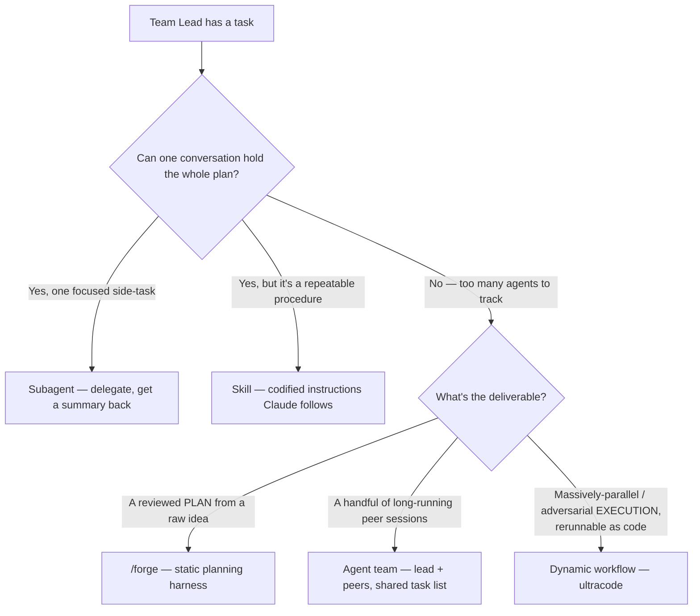

# Dynamic workflows in Claude Code — when to reach for one, and how RavenClaude uses them

**Last reviewed:** 2026-06-04 · **Confidence:** high (official docs + first-party article) · **Owner:** Team Lead (`spawn-team`)

> **What this file is for.** Claude Code shipped **dynamic workflows** (research preview) — Claude writes a JavaScript harness on the fly that orchestrates many subagents. RavenClaude pioneered this pattern locally before it was official (`.claude/workflows/rc-deep-research.js`, `two-panel-plan-review.js`). This file is the Team Lead's authoritative account: what the feature is, the runtime facts/limits, **when** to reach for a workflow versus a subagent / skill / agent-team / FORGE, and what RavenClaude already ships.
>
> Sources: [Orchestrate subagents at scale with dynamic workflows](https://code.claude.com/docs/en/workflows) and the article _"A harness for every task: dynamic workflows in Claude Code"_ (Thariq / @trq212, Claude blog) — both retrieved 2026-06-04. Research-preview facts (version gates, caps) carry that date per the Claim Grounding protocol; re-verify at use.

---

## What a dynamic workflow is

A dynamic workflow is a **JavaScript script that Claude writes** to orchestrate [subagents](../../ravenclaude-core/skills/spawn-team/SKILL.md) at scale. A runtime executes it in the background while your session stays responsive. The loop, the branching, and the intermediate results all live in **script variables** — so the orchestrator's context holds only the final answer, not a turn-by-turn transcript of dozens of agents. The script also chooses each agent's **model** and whether it runs in its own **worktree** (intelligence + isolation per stage). If interrupted (quit terminal, user stop), resuming the session **picks up where it left off** — completed agents return cached results.

> _[verified — official docs, 2026-06-04]_ The script coordinates agents; it does **not** itself touch the filesystem or shell — the agents do the IO.

## Why / when — the three failure modes a workflow structurally combats

The default Claude Code harness plans **and** executes in one context window. That's great for most coding, but it degrades on long-running, massively-parallel, or adversarial tasks because of three failure modes the article names:

| Failure mode | What it looks like | Why a workflow fixes it |
|---|---|---|
| **Agentic laziness** | Stops after partial progress and declares done — e.g. 20 of 50 security-review items. | Each item gets its own agent with its own focused goal; the deterministic loop, not the model's stamina, decides "done". |
| **Self-preferential bias** | Prefers (and over-rates) its own output when asked to verify or judge it. | The verifier is a **separate** agent with a clean context — it never saw the work being judged. |
| **Goal drift** | The original objective decays across turns, especially after compaction (edge cases, "don't do X" constraints get lost). | The objective lives in the script, re-issued verbatim to each agent; no lossy summarization between turns. |

If one conversation can still hold the whole plan in its head, you want a **subagent**, not a workflow. The line a workflow crosses is when you're coordinating more agents than the conversation can track, or you want the orchestration as **rerunnable code**.

## Dynamic vs static workflows — and where FORGE sits

- **Static workflow** — a hand-authored, generic harness run via the Claude Agent SDK or `claude -p`. It must cover all edge cases, so it stays generic. **RavenClaude's [`forge-pipeline`](skills/forge-pipeline/SKILL.md) is a static workflow** — a hand-built, depth-scaled planning harness the Team Lead runs.
- **Dynamic workflow** — Claude writes a custom harness *tailor-made for the task at hand* (Opus 4.8 is intelligent enough to do this on the fly).

They are complementary: FORGE is the durable, reviewed planning loop; a dynamic workflow is the native, throwaway-or-saved harness for a one-off massively-parallel job.

## The six composable patterns (article vocabulary)

Name these when prompting so the Team Lead (or Claude) can request a shape:

1. **Classify-and-act** — a classifier agent routes each item to different agents/behavior (also useful as a final output classifier, and for **model routing** — classify task complexity, then route to Sonnet vs Opus).
2. **Fan-out-and-synthesize** — split into many independent steps, run one agent each, then a **synthesize barrier** merges the structured outputs. Best when steps benefit from clean, non-cross-contaminating context.
3. **Adversarial verification** — for each spawned agent, a *separate* agent adversarially checks its output against a rubric (optionally a verifier-of-the-verifier for source quality).
4. **Generate-and-filter** — generate many candidates, filter by rubric/verification, dedupe, return only the highest-quality survivors.
5. **Tournament** — agents compete on the same task with different approaches; a judging agent picks winners **pairwise** (comparative judgment is more reliable than absolute scoring). Ideal for qualitative sorting/ranking that won't fit in one context.
6. **Loop-until-done** — for an unknown amount of work, keep spawning until a stop condition (no new findings, no errors left) instead of a fixed pass count.

RavenClaude's [`two-panel-plan-review`](../../.claude/workflows/two-panel-plan-review.js) workflow already _is_ fan-out-and-synthesize + adversarial verification.

## Choosing an orchestration shape

> **Format note:** this is a "when to use X vs Y" routing aid with shallow branching, so per [`docs/best-practices/decision-trees-in-knowledge-files.md`](../../../docs/best-practices/decision-trees-in-knowledge-files.md) the **tradeoffs table below is authoritative**. The flowchart is a visual companion (GitHub renders it natively); it is deliberately **not** a canonical `## Decision Tree:` section — that prefix triggers the `render-trees.py` SVG gate (needs the `mmdc`/Chromium toolchain). Promote it to a canonical tree + pre-rendered SVG later if it earns a Guidance-tab card.

**Tradeoffs (authoritative):**

| Shape | Who holds the plan | Scale | Repeatable unit | Interruption | Reach for it when |
|---|---|---|---|---|---|
| **Subagent** | Claude, turn by turn | a few per turn | the worker definition | restarts the turn | a side-task would flood the main context; you want a summary back |
| **Skill** | Claude, following the prompt | same as subagents | the instructions | restarts the turn | a repeatable multi-step procedure / reasoning pattern |
| **Agent team** | a lead agent, turn by turn | a handful of long-running peers | the team definition | teammates keep running | a few peers collaborating over a shared task list |
| **Dynamic workflow** | the script | dozens–hundreds per run | the orchestration itself | resumable in-session | massively-parallel or adversarial work you'll rerun; codified quality pattern |
| **FORGE (`/forge`)** | the gate pipeline (static) | the gates + per-gate subagents | the pipeline | per-gate checkpoint/resume (deep) | turning a raw idea into a divergently-reviewed, fact-grounded, routed **plan** |

**Rationale per leaf:**
- _Subagent_ — cheapest delegation; the worker reports a summary so verbose work stays out of the main context.
- _Skill_ — when the value is reusable *instructions/reasoning*, not parallelism.
- _Agent team_ — a small number of long-running peers coordinating; the lead still decides turn by turn.
- _Dynamic workflow_ — the only shape that moves the plan **into code** so it scales to dozens–hundreds of agents and applies a repeatable quality pattern (adversarial cross-check, tournament) — and is rerunnable.
- _FORGE_ — when the deliverable is a **plan** (not a multi-agent execution); FORGE adds scope/critic/fact-verification/tiebreak layers a bare workflow doesn't.

## Runtime facts & constraints

| Fact | Detail _(retrieved 2026-06-04; re-verify at use)_ |
|---|---|
| Availability | Research preview, Claude Code **v2.1.154+**, all paid plans + API/Bedrock/Vertex/Foundry. On Pro, enable in `/config`. |
| Save location | `.claude/workflows/` (project, shared on clone) **or** `~/.claude/workflows/` (personal). Project wins a name clash with personal. Becomes a `/<name>` command. |
| Input | The script reads a global named `args` (structured data; `undefined` if omitted). |
| Triggers | `ultracode` keyword in a prompt (was `workflow` before **v2.1.160**), `/effort ultracode` (whole session), or natural language ("use a workflow"). |
| Management | `/workflows` lists running/done runs; drill in for per-phase agent counts/tokens; press `s` to **save** a run's script as a command. |
| Concurrency cap | **≤16 concurrent agents** (fewer on low-CPU machines). |
| Total cap | **1,000 agents per run** (runaway guard). |
| No mid-run input | Only agent permission prompts can pause a run. For sign-off between stages, run each stage as its own workflow. |
| Isolation | The script has **no direct filesystem/shell access** — agents do the IO; the script coordinates. |
| Resume | Resumable **within the same session**; exiting Claude Code restarts a running workflow fresh next session. |
| Model routing | Each agent uses the session model unless the script routes a stage to another; ask for a smaller model on stages that don't need the strongest. |
| Disable | `/config` toggle, `"disableWorkflows": true` in settings, or `CLAUDE_CODE_DISABLE_WORKFLOWS=1`. |

## Operating tips

- **Token cost is real.** A workflow spawns many agents and can use far more tokens than doing the task in conversation. Most ordinary coding tasks do **not** need a panel of five reviewers — ask "does this really need more compute?" first. Gauge spend on a small slice (one directory, one narrow question) before a big run.
- **Token budgets** — you can cap a run by prompting a budget, e.g. _"use 10k tokens"_.
- **`/goal` + `/loop`** — pair a repeatable workflow (triage, research, verification) with `/loop` to run on an interval, and `/goal` to set a hard completion requirement.
- **Quarantine pattern (security)** — in triage/ingestion workflows, **bar the agents that read untrusted public content from taking high-privilege actions**; route those actions to separate acting agents. This is the same trust-boundary RavenClaude's [tribunal](skills/decision-review/SKILL.md) and comfort-posture security floor enforce — keep it when a workflow ingests untrusted input.

## Distribution — three homes for a workflow

1. **Project** — `.claude/workflows/*.js` (shared with everyone who clones the repo). _This is where RavenClaude's workflows live today._
2. **Personal** — `~/.claude/workflows/*.js` (every project, only you).
3. **Bundled in a skill** — put the `.js` files in a skill folder and reference them from `SKILL.md`; prompt Claude to treat them as a **template**, not a verbatim script. _Forward path: this is how RavenClaude could ship workflows **inside the plugin** so consumers get them on install — out of scope for the current change, flagged for a later one._

## What RavenClaude already ships

| Workflow | Patterns | Notes |
|---|---|---|
| [`rc-deep-research`](../../.claude/workflows/rc-deep-research.js) | fan-out-and-synthesize + adversarial verification | Renamed from `deep-research` (2026-06-04) because Claude Code now ships a **bundled `/deep-research`** skill-workflow. The docs confirm project>personal precedence on a name clash but are **silent on bundled-vs-project** — so "ours shadows the bundled one" is `[unverified]`; the rename removes the dependency on that unknown. Carries the substrate adapter (`adaptive-run-classifier` / `.ravenclaude/run-config.json`) for per-phase model-tier routing. |
| [`two-panel-plan-review`](../../.claude/workflows/two-panel-plan-review.js) | fan-out-and-synthesize + adversarial verification | Two independent expert panels review a strategic plan then a build plan; shares its lens/severity/routing rubric with FORGE. |
| [`/forge`](commands/forge.md) (static) | classify-and-act + adversarial verification + tournament-style tiebreak | The gated **planning** pipeline — a *static* harness, not a dynamic workflow. Reaches for the two-panel rubric as a shared constant. |

## Sources

- [Orchestrate subagents at scale with dynamic workflows](https://code.claude.com/docs/en/workflows) — Claude Code docs (retrieved 2026-06-04).
- _"A harness for every task: dynamic workflows in Claude Code"_ — Thariq / @trq212, Claude blog (retrieved 2026-06-04).
- In-repo worked examples: [`.claude/workflows/rc-deep-research.js`](../../.claude/workflows/rc-deep-research.js), [`.claude/workflows/two-panel-plan-review.js`](../../.claude/workflows/two-panel-plan-review.js), [`skills/forge-pipeline/SKILL.md`](skills/forge-pipeline/SKILL.md).
