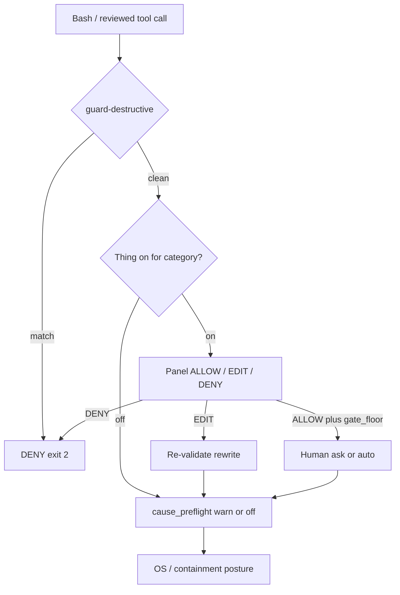

# Guard stack — floors that do not weaken each other

**Last reviewed:** 2026-09-16 · **Owner:** AppSec + PE.  
**Claim:** four layers answer different questions. This diagram is **not** permission to merge or weaken any floor.

## Stack

| Layer | Path | Behavior | Soften? |
|---|---|---|---|
| **1. Deterministic hard block** | `hooks/guard-destructive.sh` | `exit 2` on destructive Bash variants | **KEEP** |
| **2. Opt-in tribunal** | Thing + `concerns-catalog.md` | ALLOW / EDIT / DENY; `gate_floor` human ask | **KEEP** floors |
| **3. Cause preflight** | `scripts/preflight-command-review.sh` | `cause_preflight: warn\|off` advisory | advisory |
| **4. OS containment** | containment-posture | below model layer | orthogonal |

## Locks

- No Thing / `gate_floor` / `guard-destructive` / always_screen / pre_llm_deny weaken.  
- No BMA. Docs-only (0.323.12 Phase C).
