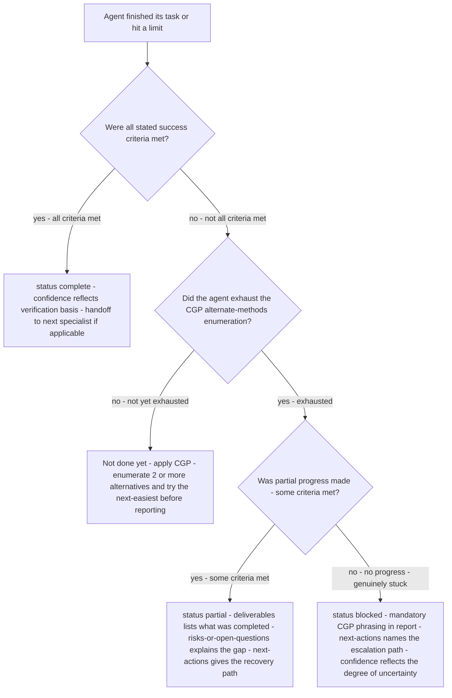
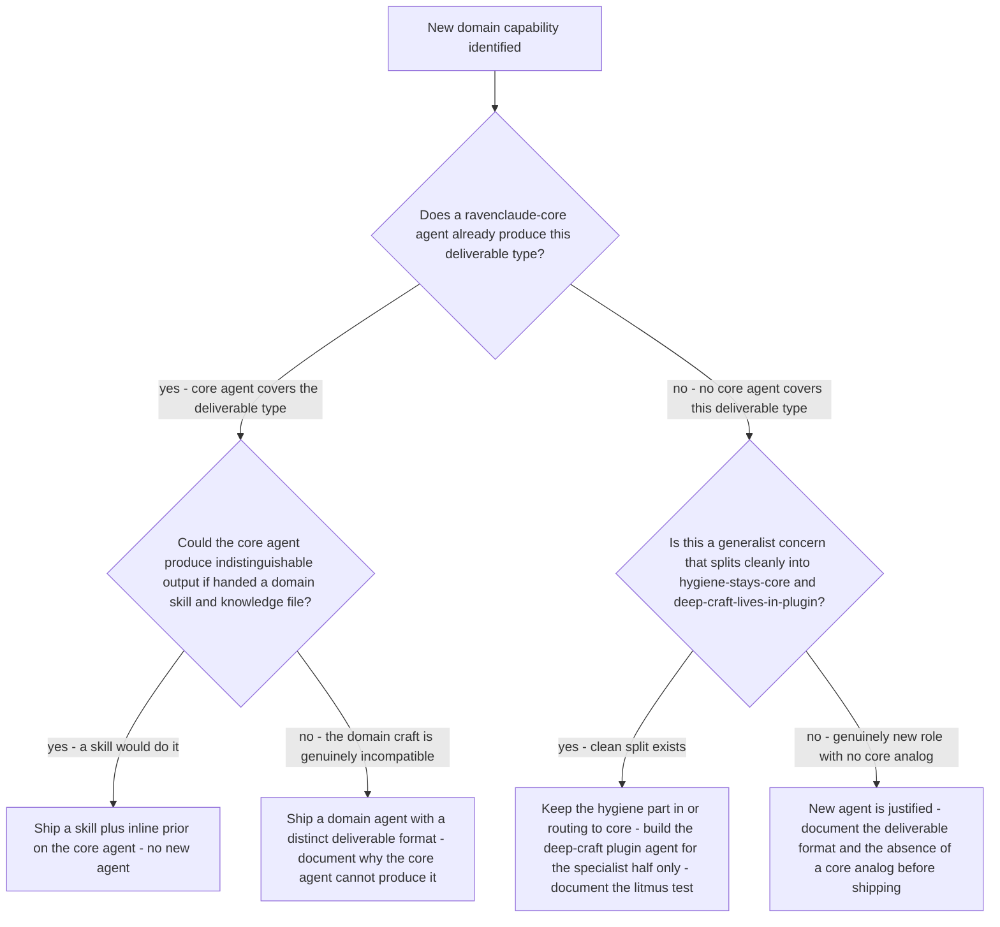
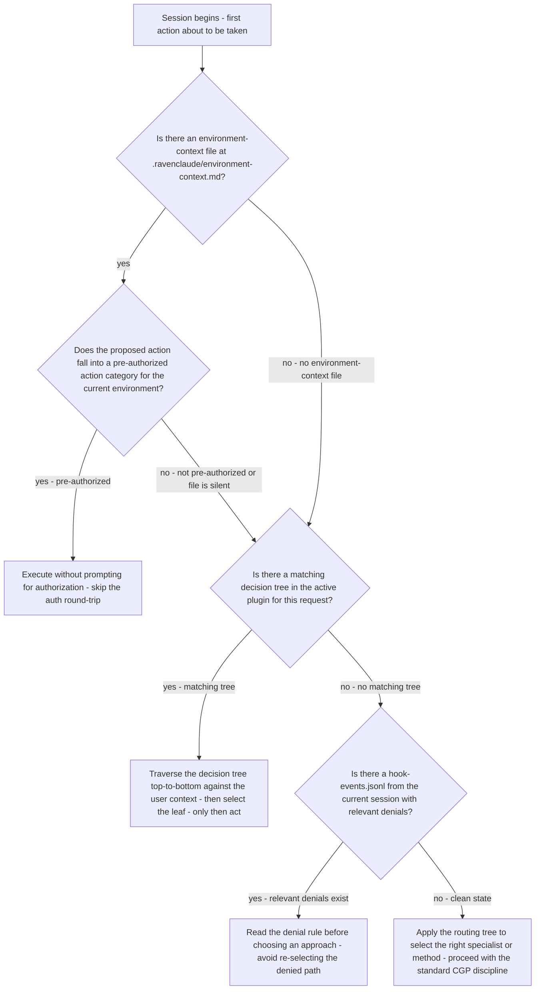

# Orchestration decision trees

Agent routing, delegation, and error-handling decisions — traverse top-to-bottom before picking a method. Last reviewed: 2026-06-05.

## Decision Tree: Agent Output — Which Status to Report

**When this applies:** A specialist agent has finished its work (or reached a limit) and must populate the `status` field in the Structured Output Protocol block. The wrong status misroutes the Team Lead — a `complete` on partial work hides a gap; a `blocked` on recoverable work abandons automatable progress.

**Last verified:** 2026-06-05 against the Structured Output Protocol specification and Capability Grounding Protocol requirements.

**Rationale per leaf:**
- *complete* — all success criteria met; the confidence float should reflect whether the criteria were verified against this-session evidence (0.9+) or domain knowledge (0.7–0.9).
- *not done yet* — a premature "blocked" that skips CGP is the protocol's most-flagged anti-pattern; apply the alternate-methods rule before reporting any non-complete status.
- *partial* — partial progress is the correct honest status when some work is done; it keeps the Team Lead informed without declaring a false completion.
- *blocked* — only valid after CGP is exhausted; the mandatory-phrasing block in the Markdown report is required (what was tried, what failed, what remains).

**Tradeoffs summary:**

| Status | When valid | Risk if mis-used |
|---|---|---|
| complete | All criteria met, verified | Hides gaps if criteria were not actually checked |
| partial | Some criteria met, some not | Team Lead may under-prioritize re-engagement |
| blocked | CGP exhausted, no progress | Wastes a round-trip if CGP was not actually applied |

## Decision Tree: Plugin Capability Gap — Skill vs New Agent vs Core Agent

**When this applies:** A domain plugin team has identified a new capability need. The question is whether to add a skill file, add a domain-specific agent, or point at an existing core agent. Getting this wrong creates dispatch ambiguity or unused agents.

**Last verified:** 2026-06-05 against the "domain plugins extend core via skills and knowledge" house rule and the project-management carve-out precedent.

**Rationale per leaf:**
- *Skill + inline prior* — the default; covers the vast majority of domain-specific needs without creating dispatch ambiguity.
- *Domain agent (incompatible craft)* — justified only when the core agent genuinely cannot produce the output; cite the specific incompatibility in the agent's CLAUDE.md.
- *Hygiene/deep-craft split* — the project-management carve-out pattern; applies only when the split is clean and the deep craft carries a recognized body (PMBOK, AGILE canon, etc.).
- *New agent (no core analog)* — justified; document what distinguishes it from any core role.

**Tradeoffs summary:**

| Method | Dispatch risk | Maintenance cost | Use when |
|---|---|---|---|
| Skill + inline prior | None | Low - lives in the domain plugin | Core agent type matches, domain adds craft |
| Domain agent (incompatible) | Medium - Team Lead must distinguish | High - rubric must stay current | Genuinely incompatible deliverable format |
| Hygiene/deep-craft split | Low if litmus is enforced | Medium - two surfaces to maintain | Clean split, recognized specialist canon |
| New agent (no analog) | Low - no core to confuse | High | No core analog at all |

## Decision Tree: Session Start — What to Check Before the First Action

**When this applies:** A new session begins — the agent is about to take its first action. The question is which checks to run before acting to avoid the most common session-start failure modes: acting blind to existing state, re-proposing something already done, or picking the wrong method because the routing tree was not traversed.

**Last verified:** 2026-06-05 against the session-start capability hook, environment-context check, and decision-tree pre-action traversal requirements.

**Rationale per leaf:**
- *Execute pre-authorized* — the environment-context check closes the "did you try X?" round-trip for actions the agent is already authorized to take.
- *Traverse decision tree first* — the pre-action traversal closes the "wrong branch from the start" failure mode; the tree is the proactive half of dispatch discipline.
- *Read denials before choosing* — a session where a guardrail already fired on an approach is telling the agent something; re-selecting the denied path wastes a call.
- *Routing tree + CGP* — the default path when no special conditions apply; route first, act with CGP discipline, apply alternate-methods if needed.

**Tradeoffs summary:**

| Check | Cost | Failure prevented | Skip when |
|---|---|---|---|
| Environment-context check | One file read | Unnecessary auth round-trip | File does not exist |
| Decision-tree traversal | 30 seconds of reasoning | Wrong method on first try | No matching tree in the plugin |
| Hook-events read | One glob + read | Re-selecting a denied approach | Clean session or no relevant denials |
| Routing tree | Reasoning only | Wrong specialist selected | Team Lead handles directly (trivial task) |
