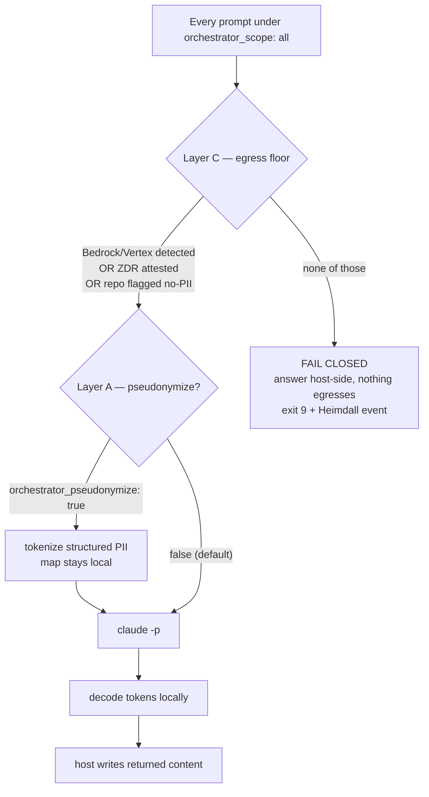

# Orchestrator relay-all — data egress & PII governance

This file is the authoritative reference for the data-governance guards on the
**relay-all** orchestrator scope (`orchestrator_scope: all`). It explains *why* the
guards exist, the cited provider facts behind them, and the two layers (C floor + A
pseudonymization) that protect client PII when every prompt is relayed to Claude.

Audience: the Team Lead, the dashboard, and anyone deciding whether to turn on
relay-all for a repo that holds client data.

## The one thing to understand first

**`orchestrator_scope: all` introduces a SECOND processor.** Routing every Copilot
prompt through `claude -p` sends the brief (the user's request + the files it
references) to whatever the Claude CLI is authenticated against — your **own**
Claude / Bedrock / Vertex account. That is a *different* data path and a *different*
contract than GitHub Copilot's. "All my prompt data stays within the Copilot tenant"
does **not** automatically extend to the nested Claude call.

The team-only scope (`orchestrator_scope: team`, the default) invokes Claude rarely
and deliberately — only on a team-of-agents dispatch. Relay-all invokes it on
**every** turn, which is why relay-all (and only relay-all) carries these guards.

## Cited provider facts (verified 2026-06-11)

> Mark of provenance: the claims below were verified against primary vendor docs on
> 2026-06-11. Re-verify if acting on them later — vendor data policies change.

**GitHub Copilot (Business / Enterprise)** — the protection is *contractual
non-retention + no-training*, **not** data residency:

- Copilot prompts leave to GitHub/Microsoft and onward to the model provider hosting
  the selected model; only Microsoft-hosted models stay in GitHub's Azure tenant.
  Source: <https://docs.github.com/en/copilot/reference/ai-models/model-hosting>.
- GitHub does **not** train on Business/Enterprise data; the Apr-24-2026
  train-by-default change applies to Free/Pro/Pro+ only.
  Source: <https://github.blog/news-insights/company-news/updates-to-github-copilot-interaction-data-usage-policy/>.
- "Outside the IDE" surfaces (CLI, mobile, agentic) retain prompts ~28 days vs.
  near-zero in the IDE. `[medium-confidence — corroborated via community sources; the canonical docs permalink 404'd at verification]`.

**Anthropic Claude API / Claude Code (commercial terms):**

- Commercial API / Claude Code does **not** train on your inputs (unless you opt in,
  e.g. the Development Partner Program). Default retention **30 days**.
  Source: <https://code.claude.com/docs/en/data-usage>.
- **Zero-data-retention (ZDR)** is available to qualified Commercial-API / Claude
  Enterprise accounts, enabled **per-organization** and **OFF by default**. Some
  models (e.g. Fable 5 / Mythos 5) force 30-day retention and cannot run under ZDR.
  Source: <https://platform.claude.com/docs/en/manage-claude/api-and-data-retention>.

**Amazon Bedrock / Google Vertex AI:**

- The **cloud provider is the data processor**; the call runs inside your own AWS/GCP
  account boundary (your keys/region, CMEK available). Anthropic-the-company is **not**
  added as a new processor. This is the only path that keeps inference in-tenant.
  Sources: the two Anthropic docs above.

**Local caveat (independent of the API path):** Claude Code caches transcripts in
**plaintext** under `~/.claude/projects/` for ~30 days (`cleanupPeriodDays`). For a
PII repo, set that low or wipe the cache.

## The two-layer guard (A on top of C)

### Layer C — deterministic egress floor (always on for relay-all; the real protection)

Enforced in [`scripts/claude-orchestrate.sh`](../scripts/claude-orchestrate.sh) when
invoked with `RAVENCLAUDE_ORCH_SCOPE=all`. The brief egresses **only** if at least one
holds:

| Condition | How it's read | Why it's safe |
|---|---|---|
| Claude on **Bedrock** | `CLAUDE_CODE_USE_BEDROCK` env | inference stays in your AWS account |
| Claude on **Vertex** | `CLAUDE_CODE_USE_VERTEX` env | inference stays in your GCP account |
| **ZDR attested** | `orchestrator_zdr_confirmed: true` | you assert ZDR is on for your Anthropic org (it's off by default; not programmatically verifiable, hence an attestation) |
| **Repo has no PII** | `orchestrator_repo_pii: false` | nothing sensitive to protect |

Otherwise it **fails closed** (exit 9 → the host answers directly, nothing egresses)
and logs an `egress-floor-blocked` event to the hook-event substrate (visible in the
Heimdall/Víðarr tabs). **Default assumes the repo HAS PII** — safe for client work.

### Layer A — pseudonymize structured PII before egress (optional; never the sole guard)

Enabled with `orchestrator_pseudonymize: true`. Runs
[`scripts/pseudonymize-brief.py`](../scripts/pseudonymize-brief.py) to replace
structured PII (email, US SSN, Luhn-valid card, IBAN, formatted phone, plus any
consumer-supplied regexes) with opaque tokens before egress; the token→value map
stays only in the trap-cleaned scratch dir and the returned content is de-tokenized
locally before the host writes it.

**Honest limit — this is why A sits on TOP of C and is never the only guard:** pattern
detection does **not** reliably catch free-text names, addresses, or bare account
numbers. A miss leaks the real value. A reduces exposure; C is the deterministic floor
that actually bounds it.

## Recommendations for a PII / financial-services repo

1. **Prefer Bedrock/Vertex** for the `claude -p` destination — keeps inference in your
   own cloud boundary, no new company-processor, passes the floor automatically.
2. **If on the direct Anthropic API**, do not enable relay-all until **ZDR is confirmed
   on your org** and the relayed model is ZDR-eligible (not Fable 5 / Mythos 5). Set
   `orchestrator_zdr_confirmed: true` only after confirming.
3. **Turn on Layer A** as defense-in-depth, understanding it is not a guarantee.
4. **Lower `cleanupPeriodDays`** / wipe `~/.claude/projects/` to bound the local
   plaintext transcript cache.
5. **When in doubt, stay on `orchestrator_scope: team`** — it routes far less data and
   is the pre-existing, security-reviewed path.

## What is NOT guarded here (scope boundary)

- **Team-dispatch egress** (`orchestrator_scope: team`) is the pre-existing v0.152.0
  path and is intentionally unchanged — these guards are scoped to the every-prompt
  relay, where the egress volume and PII risk are highest.
- These guards cannot inspect what GitHub Copilot itself sends on its own data path —
  they govern only the *second* hop (the nested `claude -p` call).
