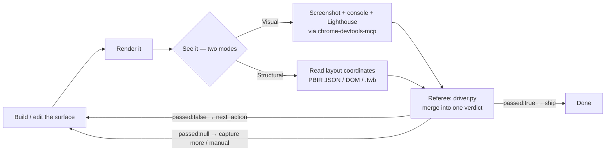

# Visual feedback loop — see your own output and iterate

**Last reviewed:** 2026-06-09 · **Confidence:** high (the loop mechanics + the security controls are grounded in this marketplace's own tools — `chrome-devtools-mcp`, the `pbir-layout-engine` linter, the webfetch-hardening + containment posture; the chrome-devtools-mcp tool surface is `[verify-at-use]` against the installed server version).
**Owner:** `frontend-coder` + `designer` (web) · `power-bi-engineer` + `tableau-viz-engineer` (reporting) · the future `data-viz-designer` inherits this.

A visual-output agent should not work blind. The discipline: **render the output,
*see* it, critique it against the intent AND objective signals, edit, re-render —
until the signals pass.** The runnable referee is
[`../skills/visual-feedback-loop/SKILL.md`](../skills/visual-feedback-loop/SKILL.md);
this file is the canon.

## The two ways to "see"

| Mode | Mechanism | Catches |
|---|---|---|
| **Visual** (pixels) | A real browser via `chrome-devtools-mcp` → `take_screenshot` (the model sees the render), `list_console_messages`, `lighthouse_audit` | "Looks wrong" — broken layout, overflow, ugly spacing, theme not applied, console errors, failed asset loads |
| **Structural** (coordinates) | Read the layout definition's exact numbers — PBIR JSON `x/y/width/height` via [`pbir-layout-engine`](../skills/pbir-layout-engine/SKILL.md); the DOM / accessibility tree for web; the `.twb` XML for Tableau | "Is wrong" — overlap, off-canvas, unequal gaps, misaligned columns, missing bindings — as exact arithmetic, not a judgment |

Use **both** where you can: vision tells you it *looks* wrong, the structural read
tells you *why*, as a fact. The structural read is also what makes the loop
**converge** — it's an objective signal, not subjective taste.

## Surface → mechanism (which "seeing" is primary)

| Surface | Primary | Fallback / complement | Why |
|---|---|---|---|
| **Web page / app** | Visual (screenshot + console + Lighthouse) | Structural (DOM / a11y tree) | It renders in Chrome; the agent can see it directly |
| **Web dashboard** (Evidence / Superset / Cube+React / Power BI Embedded) | Visual | Structural (layout JSON where one exists) | Renders in a browser; embed is reachable |
| **Power BI / Fabric report (PBIR)** | **Structural** — `pbir-layout-engine` over the page JSON | Visual, *only when* the report is published/embedded + authed (Desktop export, or Service embed) | Layout is exact coordinates → arithmetic beats vision; a screenshot needs infrastructure the agent often lacks |
| **Tableau** | **Structural** — read `.twb` XML positions | Visual via Tableau image export (`tabcmd` / REST), when a server + auth exist | Same as PBIR — the workbook is inspectable; rendering needs a server |

**The reframe for BI:** "pixel-perfect Power BI/Tableau" is achieved *more reliably*
by the coordinate read than by screenshots, because layout is literally numbers. The
screenshot is the secondary check for what coordinates can't show (theme actually
applied, conditional formatting fired, overlap-once-data-loads). Structural-only is a
**complete pass** for BI, not a degraded one.

## Objective stopping signals (so the loop converges, not wanders)

Anchor the loop on these, not on "looks better":

- **Layout linter clean** (no overlap, within-canvas, equal gaps, aligned columns) — `pbir-layout-engine` exit 0.
- **Structural parity** with a known-good exemplar of the same kind — no render-blocking divergence (wrong query role / unknown object key / missing `$id`) — `driver.py` `parity` gate exit 0. *(This catches the failure the layout linter can't: a perfectly-placed visual that renders **blank**.)*
- **Zero console errors** (or your declared `max_console_errors`).
- **Lighthouse accessibility ≥ threshold** (default 90), and performance/best-practices ≥ their thresholds.
- **No element overflows the declared viewport.**
- **Contrast passes** WCAG 2.2 SC 1.4.3 / 1.4.11 (for web — pair with the `accessibility-auditor`).

The referee (`driver.py`) merges the layout linter + the parity gate +
agent-captured console + Lighthouse evidence into one `passed` / `next_action`.
`next_action` is the loop's instruction; `passed: null` means "nothing determinate
yet — capture more evidence or do the named manual review", which is **not** a failure.

## Parity — diff against a known-good exemplar (the blank-but-well-placed gap)

The layout linter answers *"is the geometry valid?"* It cannot answer *"will this
visual actually render?"* — a visual can sit at perfect coordinates and still come
back **blank** because its *structure* is subtly wrong for its type. So when a
render fails mysteriously (blank tile, missing content, no error toast), the
highest-leverage move is **not** to guess-and-deploy — it is to **open a confirmed-working
visual of the same kind and diff your render skeleton against it.** Replicate the
exemplar, don't reinvent.

The referee runs this as the **`parity` gate**: point it at a `candidate` and a
`reference` `visual.json` of the **same `visualType`**, and it flags only
render-blocking divergences — a wrong **query role** (`Values` vs `Data` vs
`Indicator`), a **candidate-only object key** (e.g. `calloutValue` on a legacy
`card` whose working twin uses `labels`), or a **missing `$id`**. A *different*
`visualType` is "not comparable" (`not_captured`), never a false fail. It echoes
only allowlist-sanitized schema tokens — never raw `visual.json` content — so a
hostile spec can't launder instructions into the verdict.

This **generalizes to any declarative-viz format** — the runnable differ is PBIR
`visual.json` today (where the field evidence and the `pbir-*` tooling live), but
the discipline applies to Vega-Lite specs, Tableau `.twb` XML, or any format where
a working exemplar of the same chart kind exists: *compare against the nearest
thing that renders before you iterate.*

**Field case (the lesson this came from).** A Fabric/PBIR build had every count/score
tile rendering invisible across repeated deploys. Four deploy-and-eyeball cycles
burned guessing at `kpi` / `cardVisual` variants; the fix arrived only when the
agent **diffed the failing tile against the confirmed-working `card` exemplar** and
replicated it exactly (`card` + `Values` role + `labels`/`categoryLabels`). The
parity gate makes that diff a one-step determinate check instead of a deploy cycle.
The PBIR-specific facts (the card-family role matrix, `cardVisual` renders blank
when authored programmatically, the `calloutValue`-on-`card` trap) live in
power-platform `knowledge/pbir-enhanced-reference.md` — consult it *first*; the gate
is the backstop for when a render still surprises you.

## Graceful degradation (the loop must not stall for consumers)

`chrome-devtools-mcp` and `pbix-mcp` (Power BI editor) are **optional, externally
installed** servers — most consumers won't have them on a fresh install. The agent
**must degrade, not stall**:

- The render-loop priors on agents are **conditional**: *if* the browser/BI MCP tools
  respond, capture evidence and run the visual loop; *else* fall back to the
  structural read (Read/Grep the layout definition, run `pbir-layout-engine`) and tell
  the user the one optional install that would unlock the visual half.
- An **absent tool is `passed: null` + `next_action: manual-visual-review`, exit 0** —
  never a failed gate. Absence of evidence is not evidence of failure.

## Security rules (load-bearing — render loops touch untrusted output)

A render loop drives a live browser over content that may be attacker-influenced (an
untrusted dashboard, a URL from a prompt-injected source) and then feeds the captured
output back to the model. The controls:

1. **Path safety.** Every evidence/config path the referee reads is resolved
   `..`-free and inside the repo root (same rule as the layout linter; Gate 100
   asserts parity).
2. **No-echo of untrusted evidence.** The verdict carries only driver-derived
   primitives (booleans, counts, scores, fixed strings) — **never** raw console text,
   Lighthouse titles, or page content. A malicious page can write fake "instructions"
   to the console; laundering them through a trusted verdict is the injection risk.
   Read *numbers* out of evidence, never prose.
3. **Size bound.** Cap evidence files before parse (the referee enforces 5 MiB) — a
   hostile page can make `console.json` unbounded.
4. **MCP adoption gate.** `chrome-devtools-mcp` controls a live, side-effecting
   browser; adoption is **`security-reviewer`-gated** (it is recommended-not-bundled,
   already documented in `web-design`/`frontend-engineering` CLAUDE.md). Do **not**
   point a credentialed or networked render loop at attacker-influenced URLs — render
   untrusted dashboards against synthetic/fixture data, or in an isolated profile with
   no credentials and no egress. Launch with `--no-usage-statistics`. This is the only
   real control at the markdown+stdlib layer; there is no network sandbox here.
5. **Screenshot handling.** Screenshots/evidence go to **`.ravenclaude/runs/<session>/visual-evidence/`**
   — already covered by the repo's `.gitignore` (`.ravenclaude/runs/`) — and are **never
   committed**: a dashboard renders real PII/secrets. Capture against synthetic data
   where live secrets would otherwise appear.

## Cost & honest caveats

- **Screenshots cost vision tokens.** Don't screenshot every tiny tweak — batch
  edits, *then* look. The structural linter is free; lean on it between visual checks.
- **The model's visual taste is good, not perfect.** It reliably catches broken
  layouts and obvious ugliness; it's weaker on subtle brand polish. That's exactly why
  the loop is anchored on the *objective* signals, with vision as the complement.
- **BI screenshots need infrastructure.** A Power BI/Fabric report must be
  published/embedded + authenticated to screenshot; absent that, the structural read
  is the whole loop — and a complete one.

## See also

- [`../skills/visual-feedback-loop/SKILL.md`](../skills/visual-feedback-loop/SKILL.md) — the runnable referee + its contract
- [`../skills/pbir-layout-engine/SKILL.md`](../skills/pbir-layout-engine/SKILL.md) — the structural layout linter for PBIR/web-dashboard pages
- [`webfetch-hardening`](../skills/webfetch-hardening/SKILL.md) / the containment-posture milestone in this plugin's CLAUDE.md — the trust-boundary discipline a render loop inherits
