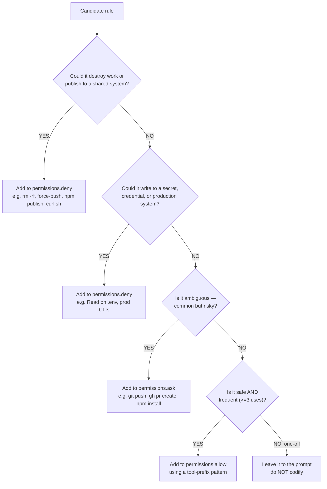

# Skill: permission-hygiene

Permission rules in Claude Code are infrastructure. They decide what Claude can do without asking, what asks first, and what's outright refused. Getting them wrong creates two opposite pain shapes: **too few rules** and Claude pesters you for `git status` every time; **too many rules** (or too broad) and you've defeated the safety the prompts were giving you. This skill is the design discipline for landing in the middle.

It composes with the Claude Code core `/fewer-permission-prompts` skill — that skill is the data-driven sweep (scan transcripts, propose allowlist entries). This skill is the higher-level "should we even allowlist that?" decision.

## Future direction: the per-plugin dashboard (post-v0.1.0)

The canonical way to set permission posture is moving to the per-plugin dashboard (see [`docs/proposals/2026-05-22-003-per-plugin-dashboard.md`](../../../../docs/proposals/2026-05-22-003-per-plugin-dashboard.md)). The dashboard's Settings tab edits a `comfort-posture.yaml` ([proposal 002](../../../../docs/proposals/2026-05-22-002-comfort-posture-mechanism.md)) which generates `.claude/settings.json` from a small set of categorical buckets. **Until the dashboard ships, the hand-edit workflow below is the path.** When the dashboard ships, the workflow below becomes the "manual override" fallback for cases the dashboard doesn't cover.

## When to invoke

- `.claude/settings.local.json` has grown past ~20 rules — likely bloated with one-shot exact-argument approvals that will never re-match.
- Agents hit the same approval prompt repeatedly for similar commands and you want to consolidate.
- About to share a `.claude/settings.json` with a team — sanity-check before propagating.
- Adding a new tool (CLI, MCP server) to the project and need to decide its default permission posture.

## The decision tree

For any candidate command or path, ask in order:

**One-off rules are noise, not policy.** A rule like `Bash(gh pr comment 15 --body '...exact text...')` will never match again. Don't accept "yes, don't ask again" prompts for commands with literal arguments — accept "yes once" and let the rule decay.

## Anti-patterns to delete on sight

- **`Bash(*)`** — defeats the prompt's purpose entirely. Silently dropped in `auto` mode anyway, so the bet doesn't compose forward.
- **`Bash(curl http://... *)` argument-constraint patterns** — documented as bypassed by options-first (`curl -X GET http://...`), protocol swap (`https://`), redirects (`bit.ly`), variables (`URL=...; curl $URL`), or extra whitespace. **Use `WebFetch(domain:...)` instead, or a PreToolUse hook.**
- **`Bash(devbox run *)`, `Bash(npx *)`, `Bash(docker exec *)`** — wrapper-stripping in Claude Code is fixed to `timeout`, `time`, `nice`, `nohup`, `stdbuf`, bare `xargs`. Anything else acts as a free pass for the inner command: `Bash(devbox run *)` allows `devbox run rm -rf .`.
- **`Bash(python3 *)`, `Bash(python3 -)`, `Bash(python3 -c ' *)`** — arbitrary code execution. Same for `node`, `bash`, `npx`, `bunx`, `uvx`, `ssh`, `eval`, `exec`.
- **One-shot rules with literal arguments** in `settings.local.json` — e.g. `Bash(gh pr comment 15 --body '...specific text...')`, `Bash(mkdir -p /home/codespace/...)`, `Bash(chmod +x plugins/<plugin>/hooks/<exact-script>.sh)`. Delete or generalize.
- **Duplicated narrow rules** that differ only in one path arg — e.g. nine separate `Bash(python3 -m json.tool <each-plugin-json>)` entries. Abstract to one `Bash(python3 -m json.tool:*)`.
- **Rules that grant write-via-shell** when the goal was read-only — e.g. `Bash(sed -i ...)`, `Bash(npx prettier --write *)`. Keep these prompting.
- **`Bash(gh pr *)`, `Bash(gh run *)`, `Bash(gh auth *)`, `Bash(gh api *)`** — broad `gh` patterns let mutating subcommands through. The read variants (`view`, `list`, `diff`, `checks`) are auto-allowed by Claude Code already; the mutating variants should keep prompting.

## When to reach for a hook instead of a rule

The official escape valve: allow a tool broadly, add a **PreToolUse hook** that rejects the bad cases.

Use a hook when:

- The rule shape can't express what you want (e.g., constrain Bash arguments reliably — see the curl example above).
- You need conditional logic (deny only if inside a protected dir; deny only on `main` branch).
- The rule list would balloon.

RavenClaude already uses this pattern in `plugins/ravenclaude-core/hooks/guard-destructive.sh` — broad Bash allowed, narrow destructive shapes blocked.

## The periodic cleanup ritual

Once per month, or before a release:

1. **Read `.claude/settings.local.json`.** Count rules.
2. **Search for one-shot patterns** — rules containing literal quoted strings, specific PR numbers, specific file paths that won't recur. Delete.
3. **Find duplicates that share a prefix** (e.g. multiple `python3 -m json.tool <path>`). Abstract up to a tool-prefix `*` pattern in `.claude/settings.json` (the team-shared file), not the local file.
4. **Promote durable patterns** from `.claude/settings.local.json` up to `.claude/settings.json` so the team benefits.
5. **Run `/fewer-permission-prompts`** to surface any patterns you missed.
6. **Re-run a representative workflow** (commit + push + open PR). Confirm prompt rate dropped.
7. **Delete `.claude/settings.local.json.bak`** once step 6 passes — the backup has served its purpose. Leaving stale `.bak` files around accumulates clutter and may confuse future cleanups about which file is current.

Back up to `settings.local.json.bak` before any destructive edit — the file is gitignored, so there's no `git checkout` to recover from. Delete the backup after step 6 confirms no regressions.

## On the "clearer detail in prompts" half of the problem

A common companion complaint: "I want the prompt itself to show me more about *why* Claude wants to run this." As of 2026-05, there is **no documented Claude Code setting that increases prompt verbosity** — no `skipAutoPermissionPrompt` config, no Bash `description`-renders-in-prompt knob. The actual levers:

1. **Pre-tool narration** — instruct agents (via CLAUDE.md) to state in one sentence what the upcoming command will do and why, immediately before the tool call. The narration text appears above the prompt in the transcript.
2. **PreToolUse hooks that print to stderr** — text printed by a hook surfaces in the transcript next to the prompt. The `guard-destructive.sh` pattern is one example.
3. **Convention, not config** — group rules in `settings.json` by topic with a JSON-comment-free convention (e.g., a marker key like `"_section": "git read"` per logical group), so reviewers can scan.

If a future Claude Code release adds a real verbosity knob, this skill should be refreshed.

## See also

- `plugins/ravenclaude-core/knowledge/claude-code-permissions.md` — long-form "why these patterns" with full citations to Anthropic docs and the documented failure modes.
- `plugins/ravenclaude-core/hooks/guard-destructive.sh` — reference implementation of the "allow broad, hook narrow" pattern.
- Claude Code core skill `/fewer-permission-prompts` — the companion data-driven sweep.
- `docs/proposals/2026-05-22-001-environment-context-permission-posture.md` — the sibling concept of *role* posture for remote environments (this skill is about *local* tool gating).
