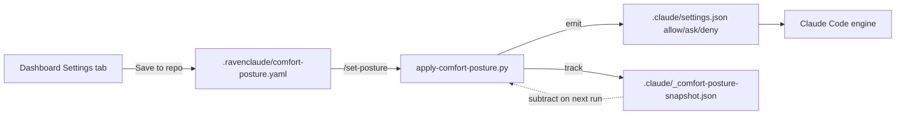

# Skill: set-posture

This skill is the canonical reference for **how comfort-posture YAML maps to Claude Code permission rules**. The slash command `/set-posture` invokes a Python script that implements this mapping; this file documents the design and is the place to extend it (new categories, new buckets, time-boxed elevations, MCP per-server trust).

## The translation pipeline

The skill owns the translation step. The dashboard owns the input. The script owns the file I/O.

## Level → bucket (v0.1.0)

Five levels collapse to three buckets:

| YAML level | settings.json bucket |
|---|---|
| `deny` | `permissions.deny` |
| `always-ask` | `permissions.ask` |
| `mostly-ask` | `permissions.ask` |
| `mostly-allow` | `permissions.allow` |
| `autopilot` | `permissions.allow` |

v0.1.0 makes `always-ask` ≡ `mostly-ask` and `mostly-allow` ≡ `autopilot`. The user sees five levels in the dashboard, but the engine sees three buckets. **This is a known v0.1.0 simplification.**

## Level → bucket (v0.2.0+ planned)

To make `always-ask` ≠ `mostly-ask` and `mostly-allow` ≠ `autopilot` actually distinct in the engine, each Bash category gets split into `safe_patterns` and `risky_patterns`:

| YAML level | Safe patterns | Risky patterns |
|---|---|---|
| `deny` | deny | deny |
| `always-ask` | ask | ask |
| `mostly-ask` | ask | ask |
| `mostly-allow` | allow | ask |
| `autopilot` | allow | allow (except hard-deny circuit breakers) |

Example for `shell_local_mutate`:
- safe: `mkdir`, `mv`, `cp`, `touch`, `ln`, `git stash`, `git checkout`
- risky: `rm`, `rm -rf`, `git reset --hard`, `git clean -fd`

`mostly-allow` then means "create folders without asking, but pause before `rm`." Currently both shapes are bucketed identically.

The architect's resolution in proposal 003 §10.5 deferred this split to v0.2.0; the gap is documented here for the next iteration.

## Category → patterns (v0.1.0)

Each category emits a flat list of narrow Bash patterns plus the relevant file/network/MCP shapes. The full list lives in `apply-comfort-posture.py` `EMISSIONS` constant. The patterns chosen for v0.1.0 are reproduced below for review.

### File categories

| Category | Patterns |
|---|---|
| `file_read_project` | `Read(**)` |
| `file_edit_project` | `Edit(**)`, `Write(**)`, `MultiEdit(**)` |
| `file_read_global` | `Read(~/**)`, `Read(//**)` |
| `file_edit_global` | `Edit(~/**)`, `Write(~/**)`, `Edit(//**)`, `Write(//**)` |

The path anchors follow Claude Code's documented gitignore-style anchors (see `knowledge/claude-code-permissions.md` §"Read/Edit path anchors"). `/path` anchors at project root, `~/path` at home, `//abs/path` at filesystem root, bare paths default to cwd.

### Shell categories

Each shell category is a curated list of narrow command-prefix patterns. Narrow is essential — broad patterns like `Bash(*)` get silently dropped by auto-mode. See `apply-comfort-posture.py` for the exhaustive lists.

Highlights:
- `shell_readonly` — 30+ patterns covering ls/cat/head/tail/grep/find/git-read/gh-read
- `shell_local_mutate` — mkdir/touch/cp/mv/rm/chmod plus git-local (commit, checkout, stash, restore, reset, merge, rebase)
- `shell_remote_mutate` — git push/fetch/pull + gh pr/issue mutations + npm publish
- `shell_code_exec` — interpreter commands (python, python3, node, deno, bash -c, sh -c, eval, ruby, perl)
- `shell_package_install` — npm/pnpm/yarn/pip/uv/brew/apt/cargo/go install variants

### Network categories

| Category | Patterns |
|---|---|
| `network_read` | `WebFetch`, `Bash(curl:*)`, `Bash(wget:*)` |
| `network_write` | `Bash(curl -X POST:*)`, `Bash(curl -X PUT:*)`, `Bash(curl -X DELETE:*)`, `Bash(curl -X PATCH:*)`, `Bash(gh api PATCH:*)`, `Bash(gh api POST:*)`, `Bash(gh api DELETE:*)`, `Bash(gh api PUT:*)` |

### MCP tools (deferred)

`mcp_tools` is intentionally empty in v0.1.0's `EMISSIONS`. Per-MCP-server trust is configured in Claude Code's user settings (`~/.claude/settings.json`); comfort-posture's `mcp_tools` is a global default that doesn't have a direct one-to-one rule mapping. v0.2.0 should map this to per-server rules once the marketplace has a stable list of MCP servers consumers connect.

## Snapshot-based non-destructive merge

The script tracks every rule it ever emits in `.claude/_comfort-posture-snapshot.json`. On the next run, it removes exactly those rules from `.claude/settings.json` before adding the new emission. **Hand-added rules in `settings.json` survive re-application** because the script only touches rules it owns.

Implications:
- The snapshot is gitignored (it reflects local state, not team policy).
- If the snapshot is missing or corrupt, the script falls back to "subtract nothing" — the user may end up with stale rules; safe to delete `.claude/settings.json`'s `permissions.{allow,ask,deny}` lists and re-run.
- If the user manually edits a comfort-posture-owned rule, the next `/set-posture` run will revert it. Use `.claude/settings.local.json` for personal overrides (Claude Code merges that on top of `settings.json`).

## Session-mode interactions

Critical context to communicate to users in every run. The script prints this footer:

> Note: comfort-posture works best with session mode at 'default'.
>   - Plan mode and Accept-edits compose fine.
>   - Auto-mode silently drops broad allow rules by design. The rules
>     this script emits are narrow, so most categories survive auto-mode —
>     but expect shell_code_exec and shell_package_install to be partially
>     overridden when auto-mode is on.
>   - bypassPermissions bypasses these rules entirely (use sparingly).

See `knowledge/claude-code-permissions.md` "Permission modes" for the full table.

## When to extend this skill

- **New category** in `dashboard-schema.json` → add an entry to `EMISSIONS` in the Python script AND a row in this skill's category-patterns section.
- **New level** in the YAML schema → update `level_to_bucket()` in the Python script.
- **Time-boxed elevations** (proposal 002 §6.2) → add an `elevations:` block parser to the Python script; remember to expire.
- **Per-MCP-server trust** → add a new section to `EMISSIONS` and to the dashboard schema; emit `mcp__<server>__*` rules.

Each extension should:
1. Update the Python script's `EMISSIONS` table.
2. Update this skill's tables to match.
3. Add a row to the dashboard's category list if user-visible.
4. Test by hand (`--dry-run` on a sample YAML).

## See also

- `commands/set-posture.md` — the slash-command entry that invokes the script.
- `scripts/apply-comfort-posture.py` — the implementation.
- `dashboard-schema.json` — the YAML shape this consumes.
- `knowledge/claude-code-permissions.md` — the permission model these rules feed into.
- `docs/proposals/2026-05-22-002-comfort-posture-mechanism.md` — the design proposal that motivated this skill.
