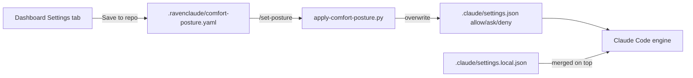

# Skill: set-posture

This skill is the canonical reference for **how comfort-posture YAML maps to Claude Code permission rules**. The slash command `/set-posture` invokes a Python script that implements this mapping; this file documents the design and is the place to extend it (new categories, new buckets, time-boxed elevations, MCP per-server trust).

## The translation pipeline



The skill owns the translation step. The dashboard owns the input. The script owns the file I/O. v0.17.0 switched from snapshot-merge to clean overwrite: the posture YAML is the single source of truth for `permissions.{allow,ask,deny}`. Personal overrides belong in `.claude/settings.local.json`, which Claude Code merges on top.

## Level → bucket (v0.1.0)

Five levels collapse to three buckets:

| YAML level | settings.json bucket |
|---|---|
| `deny` | `permissions.deny` |
| `always-ask` | `permissions.ask` |
| `mostly-ask` | `permissions.ask` |
| `mostly-allow` | `permissions.allow` |
| `autopilot` | `permissions.allow` |

v0.1.0 makes `always-ask` ≡ `mostly-ask` and `mostly-allow` ≡ `autopilot`. The user sees five levels in the dashboard, but the engine sees three buckets. **This is a known v0.1.0 simplification.**

## Level → bucket (v0.2.0+ planned)

To make `always-ask` ≠ `mostly-ask` and `mostly-allow` ≠ `autopilot` actually distinct in the engine, each Bash category gets split into `safe_patterns` and `risky_patterns`:

| YAML level | Safe patterns | Risky patterns |
|---|---|---|
| `deny` | deny | deny |
| `always-ask` | ask | ask |
| `mostly-ask` | ask | ask |
| `mostly-allow` | allow | ask |
| `autopilot` | allow | allow (except hard-deny circuit breakers) |

Example for `shell_local_mutate`:
- safe: `mkdir`, `mv`, `cp`, `touch`, `ln`, `git stash`, `git checkout`
- risky: `rm`, `rm -rf`, `git reset --hard`, `git clean -fd`

`mostly-allow` then means "create folders without asking, but pause before `rm`." Currently both shapes are bucketed identically.

The architect's resolution in proposal 003 §10.5 deferred this split to v0.2.0; the gap is documented here for the next iteration.

## Category → patterns (v0.1.0)

Each category emits a flat list of narrow Bash patterns plus the relevant file/network/MCP shapes. The full list lives in `apply-comfort-posture.py` `EMISSIONS` constant. The patterns chosen for v0.1.0 are reproduced below for review.

### File categories

| Category | Patterns |
|---|---|
| `file_read_project` | `Read(**)` |
| `file_edit_project` | `Edit(**)`, `Write(**)`, `MultiEdit(**)` |
| `file_read_global` | `Read(~/**)`, `Read(//**)` † |
| `file_edit_global` | `Edit(~/**)`, `Write(~/**)`, `Edit(//**)` †, `Write(//**)` † |

The path anchors follow Claude Code's documented gitignore-style anchors (see `knowledge/claude-code-permissions.md` §"Read/Edit path anchors"). `/path` anchors at project root, `~/path` at home, `//abs/path` at filesystem root, bare paths default to cwd.

**† Filesystem-root catch-alls are suppressed in the `ask` bucket.** `//**` is anchored at the filesystem root, so it also matches *project-internal* paths. Because Claude Code resolves overlaps as deny > ask > allow, an `ask`-bucket `Read(//**)` would beat the project category's `Read(**)` allow rule and prompt on **every in-project read** (and likewise for edits) — silently defeating `file_read_project: autopilot`. So when `file_read_global` / `file_edit_global` resolve to an ask level (`always-ask` / `mostly-ask`), the generator drops the `//**` patterns and lets Claude Code's built-in "ask on any unmatched path" handle genuinely-external reads. The `//**` patterns are still emitted for `allow` levels (where you *want* to auto-approve the whole tree) and `deny` levels. The home anchor `~/**` is kept in all buckets — it doesn't overlap the project. Implemented as `FS_ROOT_CATCHALLS` in `apply-comfort-posture.py`'s `compute_emission()`.

### Shell categories

Each shell category is a curated list of narrow command-prefix patterns. Narrow is essential — broad patterns like `Bash(*)` get silently dropped by auto-mode. See `apply-comfort-posture.py` for the exhaustive lists.

Highlights:
- `shell_readonly` — 30+ patterns covering ls/cat/head/tail/grep/find/git-read/gh-read
- `shell_local_mutate` — mkdir/touch/cp/mv/rm/chmod plus git-local (commit, checkout, stash, restore, reset, merge, rebase)
- `shell_remote_mutate` — git push/fetch/pull + gh pr/issue mutations + npm publish
- `shell_code_exec` — interpreter commands (python, python3, node, deno, bash -c, sh -c, eval, ruby, perl)
- `shell_package_install` — npm/pnpm/yarn/pip/uv/brew/apt/cargo/go install variants

### Network categories

| Category | Patterns |
|---|---|
| `network_read` | `WebFetch`, `Bash(curl:*)`, `Bash(wget:*)` |
| `network_write` | `Bash(curl -X POST:*)`, `Bash(curl -X PUT:*)`, `Bash(curl -X DELETE:*)`, `Bash(curl -X PATCH:*)`, `Bash(gh api PATCH:*)`, `Bash(gh api POST:*)`, `Bash(gh api DELETE:*)`, `Bash(gh api PUT:*)` |

### MCP tools (deferred)

`mcp_tools` is intentionally empty in v0.1.0's `EMISSIONS`. Per-MCP-server trust is configured in Claude Code's user settings (`~/.claude/settings.json`); comfort-posture's `mcp_tools` is a global default that doesn't have a direct one-to-one rule mapping. v0.2.0 should map this to per-server rules once the marketplace has a stable list of MCP servers consumers connect.

## Overwrite semantics (v0.17.0+)

The script **overwrites** `permissions.allow`, `permissions.ask`, and `permissions.deny` in `.claude/settings.json` with the resolved emission. Non-posture fields (`$schema`, `model`, `env`, `hooks`, `permissions.additionalDirectories`) are untouched.

Why overwrite instead of merge: v0.16.0 used a snapshot-based merge that preserved hand-added rules. In practice that produced **bucket collisions** — the same pattern landing in both `allow` (hand-added) and `ask` (posture). Per Claude Code's precedence (deny > ask > allow), the rule effectively becomes `ask`, silently downgrading the user's intended workflow. Overwrite removes that footgun: the YAML is authoritative; you see what you set.

Implications:
- **Personal overrides go in `.claude/settings.local.json`.** Claude Code merges that file on top of `settings.json`, so anything you put there survives every `/set-posture` run.
- **Hand-edits to `settings.json`'s `permissions.{allow,ask,deny}` are wiped.** If you find yourself wanting to add a rule there, ask whether it belongs in the posture YAML (so the dashboard reflects it) or in `settings.local.json` (personal-only).
- **Stale snapshot files are cleaned up.** If a v0.16.0 `.claude/_comfort-posture-snapshot.json` is present, the script deletes it on first v0.17.0 run.

## Schema v5 — per-layer authoring (v0.18.0+)

v5 lets each category carry **separate levels for the three settings layers** Claude Code merges at runtime. The dashboard's expandable per-layer cards author this; `apply-comfort-posture.py`'s `run_v5()` emits one settings file per active layer.

```yaml
schema_version: 5
security_deny: [ ... ] # floor (unchanged)
categories:
  shell_local_mutate:
    user: allow # one of: allow | ask | deny | inherit
    local: ask
    project: inherit # inherit = emit nothing at this layer
```

| Layer | Settings file | Audience |
|---|---|---|
| `user` | `~/.claude/settings.json` | this machine, all projects (ephemeral in a Codespace) |
| `local` | `.claude/settings.local.json` | this project, just me (gitignored; auto-added to `.gitignore`) |
| `project` | `.claude/settings.json` | the whole team (committed); **always carries the `security_deny` floor** |

Resolution: **deny > ask > allow** across the merged set — the strictest layer wins, so a personal `allow` cannot loosen a team `ask`/`deny` (this is also why putting personal preferences at `project` scope is a footgun the dashboard warns about). The per-layer value vocabulary is the 4-value `allow | ask | deny | inherit`; the `//**`-in-ask suppression (above) applies per layer.

Mechanics:

- **`--scope {user,local,project,all}`** (default `all`) chooses which layer(s) to write; the dashboard's "Save & apply all layers" uses `all`.
- **`--preview-merge`** reads the three files, computes the merged effective posture, and prints it (deny/ask/allow) — the CLI counterpart to the dashboard's effective badges.
- **Per-scope side-cars** (`.claude/.comfort-posture-applied.{local,project}.json`, `~/.claude/.comfort-posture-applied.user.json`) record what we wrote, so emptying a layer in the YAML clears that layer's posture rules on the next apply instead of orphaning them.
- The `security_deny` floor is emitted into the **project** layer only — deny is absolute under the merge, so one copy protects every layer and keeps the shared safety baseline in the shared file.
- **Back-compat:** v3/v4 single-layer postures still run the original single-file `compute_emission` path (project layer only). Only `schema_version: 5` triggers `run_v5()`.
- **Migration note:** there is intentionally NO blocking migration banner — it would halt the dashboard's auto-apply flow. The dashboard handles v4→v5 migration on load (existing levels land on the Local layer).

## Always-on security deny

`security_deny:` is a top-level list in the posture YAML carrying patterns that are **always denied regardless of category levels**. The default list covers `.env` / `.pem` / `credentials*` reads and the most common destructive shell commands (`rm -rf`, `git push --force`, `git reset --hard`, `curl | sh`). Under schema v5 it is emitted into the **project** layer (the committed, always-present floor).

- Add patterns to tighten your security floor.
- Remove patterns only if you have a specific reason — these are the marketplace's recommended security baseline.
- The patterns survive every preset (Recommended, Always-Ask, Autopilot, etc.) because they live outside `categories:`.

## Per-pattern overrides (v0.17.0+)

Each `categories.<name>` value can be either a plain string (level applied to every pattern in the category) or an object with per-pattern overrides:

```yaml
categories:
  shell_readonly: mostly-allow      # all patterns: mostly-allow
  shell_local_mutate:               # mixed
    default: mostly-allow
    overrides:
      "Bash(rm:*)": always-ask
      "Bash(git reset:*)": always-ask
```

Resolution precedence (highest wins): per-pattern override > category default > top-level `global_default`. Use overrides to tighten or relax specific patterns within a category without splitting the category itself.

The pattern strings must match exactly what `EMISSIONS` in `apply-comfort-posture.py` declares — copy them from the dashboard's per-category list rather than typing freehand.

## Session-mode interactions

Critical context to communicate to users in every run. The script prints this footer:

> Note: comfort-posture works best with session mode at 'default'.
>   - Plan mode and Accept-edits compose fine.
>   - Auto-mode silently drops broad allow rules by design. The rules
>     this script emits are narrow, so most categories survive auto-mode —
>     but expect shell_code_exec and shell_package_install to be partially
>     overridden when auto-mode is on.
>   - bypassPermissions bypasses these rules entirely (use sparingly).

See `knowledge/claude-code-permissions.md` "Permission modes" for the full table.

## When to extend this skill

- **New category** in `dashboard-schema.json` → add an entry to `EMISSIONS` in the Python script AND a row in this skill's category-patterns section.
- **New level** in the YAML schema → update `level_to_bucket()` in the Python script.
- **Time-boxed elevations** (proposal 002 §6.2) → add an `elevations:` block parser to the Python script; remember to expire.
- **Per-MCP-server trust** → add a new section to `EMISSIONS` and to the dashboard schema; emit `mcp__<server>__*` rules.

Each extension should:
1. Update the Python script's `EMISSIONS` table.
2. Update this skill's tables to match.
3. Add a row to the dashboard's category list if user-visible.
4. Test by hand (`--dry-run` on a sample YAML).

## See also

- `commands/set-posture.md` — the slash-command entry that invokes the script.
- `scripts/apply-comfort-posture.py` — the implementation.
- `dashboard-schema.json` — the YAML shape this consumes.
- `knowledge/claude-code-permissions.md` — the permission model these rules feed into.
- `docs/proposals/2026-05-22-002-comfort-posture-mechanism.md` — the design proposal that motivated this skill.
