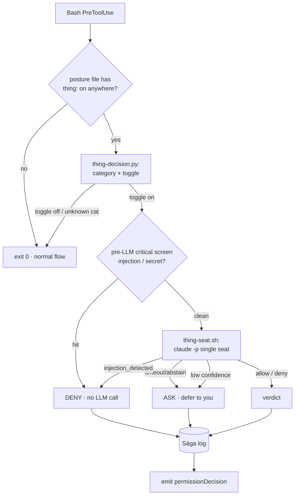

# Skill: command review (the Thing)

**Command review** — technical noun *the tribunal*, Norse codename *the Thing (Þing)* — is an opt-in panel of reviewer agents that adjudicates shell commands instead of interrupting you. It sits **on top of** the comfort-posture system: comfort-posture decides the policy (allow / ask / deny per category); the tribunal is the adjudicator you can switch on for a category so that, instead of stopping to ask you, a reviewer renders a verdict in seconds.

The authoritative design is [`docs/tribunal-review-feature-design.md`](../../../../docs/tribunal-review-feature-design.md); the concern catalog the tribunal cites is [`knowledge/concerns-catalog.md`](../../knowledge/concerns-catalog.md). This skill documents **what actually ships today** and how to operate it.

## What ships in T2 (this release)

T2 is the **load-bearing first working version** — deliberately the smallest slice that proves the orchestrator + hook substrate end-to-end:

| Dimension | T2 reality | Arrives later |
| --- | --- | --- |
| Seats | **One** (the "Mímir" / code-reviewer-shaped seat) | 3 seats + Thor tie-breaker (T3) |
| Verdicts | **ALLOW / DENY** (+ fail-closed ASK) | EDIT — propose a safer rewrite (T3) |
| Categories | **`shell_readonly`** proven end-to-end | `shell_remote_mutate`, `shell_code_exec`, file edits (T3+) |
| Injection defense | Pre-LLM regex screen + the seat's own check | Full adversarial-content envelope + AlignmentCheck seat (T4) |
| Default | **OFF for every category** | unchanged — always opt-in |

## Turning it on

The on/off toggle is a **per-category `thing:` field in `.ravenclaude/comfort-posture.yaml`**, set from the dashboard's **Command review** toggle on the Settings tab (the toggle is live for `shell_readonly` in T2; the others remain Preview). Turning it on writes:

```yaml
categories:
  shell_readonly:
    user: allow
    local: allow
    project: inherit
    thing: on # ← command review for this category
```

The extra `thing:` key is ignored by `apply-comfort-posture.py` (it only reads the layer keys), so it never disturbs the permission translation.

> **Cost & latency, stated plainly.** `shell_readonly` is the highest-frequency category (`ls`, `cat`, `grep`, `git status`). With the toggle ON, **every** such command pays a `claude -p` round-trip — ~10–15 s and real credits per command. That is impractical for daily work, and that is fine: T2 picks `shell_readonly` because a wrong verdict on `ls` is harmless, making it the safe place to validate the machinery. The categories where review is actually *valuable* (remote/exec) come in T3. Treat the `shell_readonly` toggle as a **validation switch**, not a daily setting.

## How a reviewed command flows



Components (all under the plugin):

- `hooks/thing-orchestrator.sh` — the **Lawspeaker**. PreToolUse(Bash) hook. Short-circuits with a single `grep` when no toggle is set; otherwise classifies, screens, convenes the seat, logs, and emits the verdict.
- `scripts/thing-decision.py` — classifies a command into a comfort-posture category (reusing the EMISSIONS table — one source of truth) and reads the toggle + seat config.
- `scripts/thing-seat.sh` — invokes the single reviewer via `claude -p` and returns its verdict JSON. Has a `THING_SEAT_MOCK_VERDICT` test hook so CI/gate-audit never calls a live model.
- `templates/thing.yaml` — optional seat config (model, timeout, audit dir). Absent ⇒ defaults.

## Verdict semantics & fail-closed rules

| Situation | Verdict emitted |
| --- | --- |
| Seat votes allow, confidence ≥ 0.5 | `allow` (the command runs) |
| Seat votes deny, or any critical concern | `deny` (blocked — beats `--dangerously-skip-permissions`) |
| Pre-LLM injection/secret regex hit | `deny` immediately, no LLM call |
| Seat reports `injection_detected: true` | `deny` (unilateral) |
| Seat allow but confidence < 0.5 | `ask` (defer to you) |
| Seat timeout / abstain / malformed | `ask` |
| `thing.yaml` present but malformed | `ask` |
| `jq` missing | block (exit 2) — detect-and-deny |

The platform **fails open** on hook timeout, so the orchestrator enforces its own deadline (`internal_timeout_seconds`, default 18 s, under the 30 s hook timeout) and emits an explicit `ask` rather than letting the tool slip through.

Every verdict writes one JSON entry to `.ravenclaude/runs/thing/<id>.json` (the Sága log) — command, category, seat, concerns cited, final verdict, duration. Gitignored by default.

## Known T2 limitations (so they don't surprise you)

- **Compound / control-flow commands classify by their leading segment.** `ls | grep x` reviews as `shell_readonly`; a bare `for …; do …; done` classifies as nothing and is **not** reviewed (falls through to normal flow).
- **One seat, no debate.** A single reviewer is more susceptible to position bias and injection than the T3 three-seat panel; the pre-LLM screen + the seat's own injection check are the T2 mitigations.
- **No EDIT.** The seat can only allow or deny; it cannot propose a safer rewrite yet.

## Auth note

On a Claude **subscription / OAuth** login the seat uses plain `claude -p` (default) — `claude -p --bare` is faster/cleaner but refuses OAuth and demands `ANTHROPIC_API_KEY`, so it is opt-in via `THING_SEAT_BARE=1` for API-key users. The seat runs from a scratch directory so the consumer's project `CLAUDE.md` is never auto-loaded into the review (keeps it fast, cheap, deterministic).
