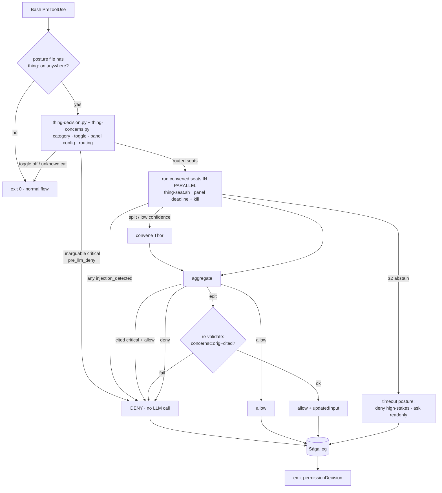

# Skill: command review (the Thing)

**Command review** — technical noun *the tribunal*, Norse codename *the Thing (Þing)* — is an opt-in panel of reviewer agents that adjudicates shell commands instead of interrupting you. It sits **on top of** the comfort-posture system: comfort-posture decides the policy (allow / ask / deny per category); the tribunal is the adjudicator you can switch on for a category so that, instead of stopping to ask you, a reviewer renders a verdict in seconds.

The authoritative design is [`docs/tribunal-review-feature-design.md`](../../../../docs/tribunal-review-feature-design.md); the concern catalog the tribunal cites is [`knowledge/concerns-catalog.md`](../../knowledge/concerns-catalog.md). This skill documents **what actually ships today** and how to operate it.

## What ships in T3 (this release)

T3 turns the tribunal into a real **panel**: up to three reviewer seats run in parallel, a tie-breaker is convened only when they disagree, and a seat may **rewrite** a risky command (the rewrite is re-validated against the concern catalog before it runs).

| Dimension | T3 reality | Arrives later |
| --- | --- | --- |
| Seats | **Up to 3** — Forseti (security-reviewer), Mímir (code-reviewer), Heimdall (prompt-engineer) — **+ Thor** (architect) convened only on a split or low-confidence panel | Domain specialist seats (T7) |
| Verdicts | **ALLOW / EDIT / DENY** (+ fail-closed ASK or DENY) | — |
| Categories | **`shell_readonly`, `shell_remote_mutate`, `shell_code_exec`** | `file_edit_project` (Edit/Write tool shape) |
| Routing | Deterministic `concerns(cmd)` evaluator picks seats by severity: low/none → 1 seat, high → 3, unarguable critical → pre-LLM DENY | — |
| Injection defense | Pre-LLM `triggers` screen (catalog-driven) + each seat's own check | Full AlignmentCheck hardening + adversarial envelope (T4) |
| Panel config | Per-seat model + confidence threshold, **set from the dashboard** | — |
| Default | **OFF for every category** | unchanged — always opt-in |

## Turning it on

The on/off toggle is a **per-category `thing:` field in `.ravenclaude/comfort-posture.yaml`**, set from the dashboard's **Command review** toggle on the Settings tab (live for `shell_readonly`, `shell_remote_mutate`, and `shell_code_exec` in T3; the rest remain Preview). The dashboard's **Command-review panel** section sets the per-seat models + confidence threshold, serialized as a top-level `command_review:` block. Turning a category on writes:

```yaml
categories:
  shell_readonly:
    user: allow
    local: allow
    project: inherit
    thing: on # ← command review for this category
```

The extra `thing:` key is ignored by `apply-comfort-posture.py` (it only reads the layer keys), so it never disturbs the permission translation.

> **Cost & latency, stated plainly.** Each reviewed command convenes one to three `claude -p` seats **in parallel**, so a verdict lands in roughly the time of the slowest seat (seconds), not the sum — but it still spends real credits on every reviewed command. `shell_readonly` is the highest-frequency category (`ls`, `cat`, `grep`, `git status`); leaving its toggle ON taxes daily work and is best used as a **validation switch**. The categories where review actually earns its cost are `shell_remote_mutate` (push / publish / PR mutations) and `shell_code_exec` (python/node/bash -c/eval) — turn those on for high-stakes sessions. All toggles are **off by default**.

## How a reviewed command flows



Components (all under the plugin):

- `hooks/thing-orchestrator.sh` — the **Lawspeaker**. PreToolUse(Bash) hook. Short-circuits with a single `grep` when no toggle is set; otherwise calls thing-decision, fans the routed seats out in parallel under a panel deadline, runs the aggregation state machine, re-validates EDITs, logs, and emits the verdict.
- `scripts/thing-decision.py` — classifies a command into a comfort-posture category (reusing the EMISSIONS table — one source of truth), reads the toggle, resolves the panel config (precedence: `comfort-posture.yaml command_review:` > `thing.yaml` > defaults), and merges in routing from thing-concerns — all in one call.
- `scripts/thing-concerns.py` — the **deterministic concern evaluator**. Reads the catalog's machine-readable `triggers` to return matched concerns + max severity + which seats to convene, and enforces the **EDIT-safety invariant** (`concerns(revised) ⊆ concerns(original) − {cited}`). No live model — reproducible + CI-testable.
- `scripts/thing-seat.sh` — invokes ONE reviewer seat (role via `THING_SEAT_ROLE`) via `claude -p` and returns its verdict JSON (now including `edited_command`). A role-aware `THING_SEAT_MOCK_VERDICT` test hook lets CI/gate-audit exercise the whole panel with no live model.
- `templates/thing.yaml` — optional advanced config (panel models, confidence threshold, seat/panel timers, per-category timeout posture, audit dir); `schema_version: 2`. Absent ⇒ defaults; legacy `seat:` maps to Mímir.

## Verdict semantics & fail-closed rules

| Situation | Verdict emitted |
| --- | --- |
| Panel agrees allow, all seats' confidence ≥ threshold, no critical cited | `allow` (the command runs) |
| Panel votes deny, or a critical concern is cited | `deny` (blocked — beats `--dangerously-skip-permissions`) |
| A seat proposes EDIT and the revision passes the safety invariant | `allow` + `updatedInput:{command:<revised>}` (the rewrite runs) |
| EDIT revision fails the invariant (new concern / cited not removed) | `deny` |
| Pre-LLM unarguable-critical `triggers` hit (`pre_llm_deny`) | `deny` immediately, no LLM call |
| Any seat reports `injection_detected: true` | `deny` (unilateral) |
| Seats split or a seat's confidence < threshold | Thor convened; Thor's verdict decides |
| ≥2 convened seats (or the whole panel) abstain | per-category **timeout posture** — `deny` for `shell_remote_mutate`/`shell_code_exec`, `ask` for `shell_readonly` |
| `thing.yaml` present but malformed | `ask` |
| `jq` missing | block (exit 2) — detect-and-deny |

The platform **fails open** on hook timeout, so the orchestrator enforces its own **panel deadline** (`panel_deadline_seconds`, default 75 s, under the 90 s hook timeout), killing straggler seats, and emits an explicit fail-closed verdict rather than letting the tool slip through. Each seat additionally has a soft cap (`seat_timeout_seconds`, default 45 s — parallel `claude -p` cold-starts run ~24-29 s, well over the original 18 s, which abstained the whole panel on modest machines; raise it if your parallel seat latency is higher).

Every verdict writes one JSON entry to `.ravenclaude/runs/thing/<id>.json` (the Sága log) — command, category, `phase`, per-seat verdicts, concerns cited, final verdict, the revised command on EDIT, and duration. Gitignored by default.

## Known T3 limitations (so they don't surprise you)

- **Compound / control-flow commands classify by their leading segment.** `ls | grep x` reviews as `shell_readonly`; a bare `for …; do …; done` classifies as nothing and is **not** reviewed (falls through to normal flow).
- **Deterministic routing is regex-based.** `triggers` are added for the cross-cutting concerns + the two newly-live categories only; concerns without `triggers` (and the not-yet-live categories) rely on the seats' own judgment, not the pre-LLM screen.
- **EDIT only when deterministically verifiable.** An EDIT is accepted only if the cited concern has `triggers` (so the invariant can confirm removal); otherwise it fails closed to DENY.
- **No file-edit review.** Only Bash is reviewed; `file_edit_project` (Edit/Write tool shape) is deferred.

## Auth note

On a Claude **subscription / OAuth** login the seat uses plain `claude -p` (default) — `claude -p --bare` is faster/cleaner but refuses OAuth and demands `ANTHROPIC_API_KEY`, so it is opt-in via `THING_SEAT_BARE=1` for API-key users. The seat runs from a scratch directory so the consumer's project `CLAUDE.md` is never auto-loaded into the review (keeps it fast, cheap, deterministic).
