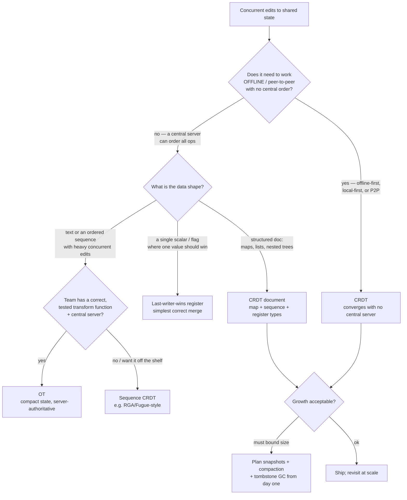
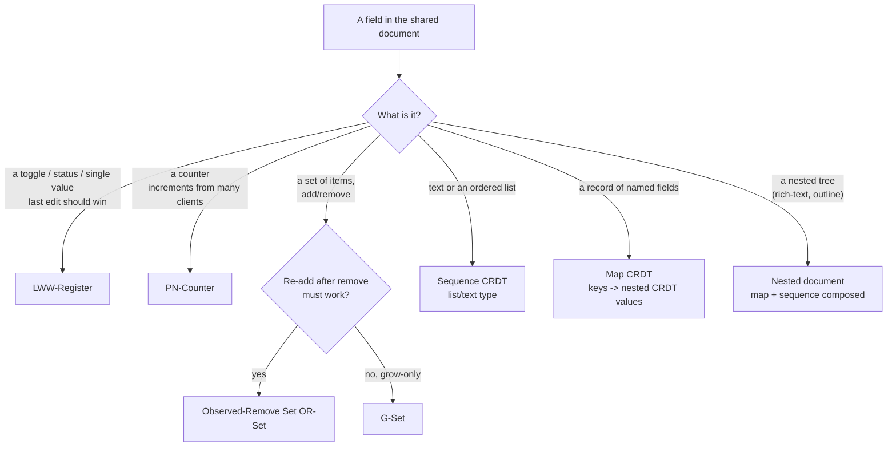

# Realtime Collaboration — CRDT vs OT Decision Tree

> Reference decision tree for the `realtime-collaboration-engineering` team. Agents **traverse the relevant tree top-to-bottom before deciding** (the proactive complement to the Capability Grounding Protocol). Each `## Decision Tree` section is a Mermaid graph plus the rule it encodes.
>
> **Engineering craft, not legal or product advice.** Anything naming a specific library, version, or guarantee is `[verify-at-use]` — confirm against the current library docs before it drives a dependency. Durable concepts live in [`consistency-and-merge-concepts.md`](consistency-and-merge-concepts.md); the dated library map in [`realtime-collab-tooling-2026.md`](realtime-collab-tooling-2026.md).
>
> _Last reviewed: 2026-06-24 by `claude`. The principles are durable; the named libraries are dated._

---

## Decision Tree: CRDT vs OT vs last-writer-wins?

**Rule:** the choice is driven by **(1) whether the system must converge without a central order** (offline / local-first / P2P → CRDT) and **(2) the data shape**. A CRDT buys decentralization and offline-first at the cost of metadata growth (tombstones, op history) you must plan to bound. OT buys compact state and fine-grained server control at the cost of a **central server** and a **correct transform function** that is notoriously hard to get right across operation pairs. Last-writer-wins is a real, correct merge for a scalar that should have one winner — use it deliberately, never on prose. Whenever a CRDT is chosen, the snapshot/compaction/tombstone-GC plan is part of the decision, not a later chore.

---

## Decision Tree: which CRDT type per field?

**Rule:** merge behavior is a **property of the type you pick per field**, not of the library as a whole. Choose the type for the conflict you want: LWW-Register for a flag, a counter type for tallies, an OR-Set when re-adding a removed item must work, a sequence type for text/lists, and a map of nested CRDTs for records. Getting this mapping right is what makes the merged result match user intention rather than merely converge. The field-level reasoning lives in the `design-the-document-model` skill.

---

## See also

- [`transport-and-topology-decision-tree.md`](transport-and-topology-decision-tree.md) — the wire and topology decision.
- [`consistency-and-merge-concepts.md`](consistency-and-merge-concepts.md) — causal order, clocks, tombstones, strong eventual consistency, intention preservation.
- Skill: [`../skills/choose-crdt-or-ot/SKILL.md`](../skills/choose-crdt-or-ot/SKILL.md), [`../skills/design-the-document-model/SKILL.md`](../skills/design-the-document-model/SKILL.md).
