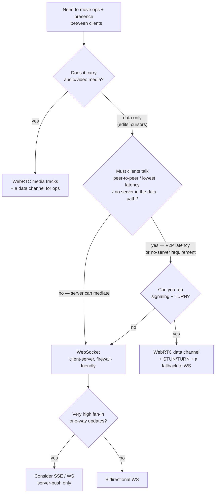
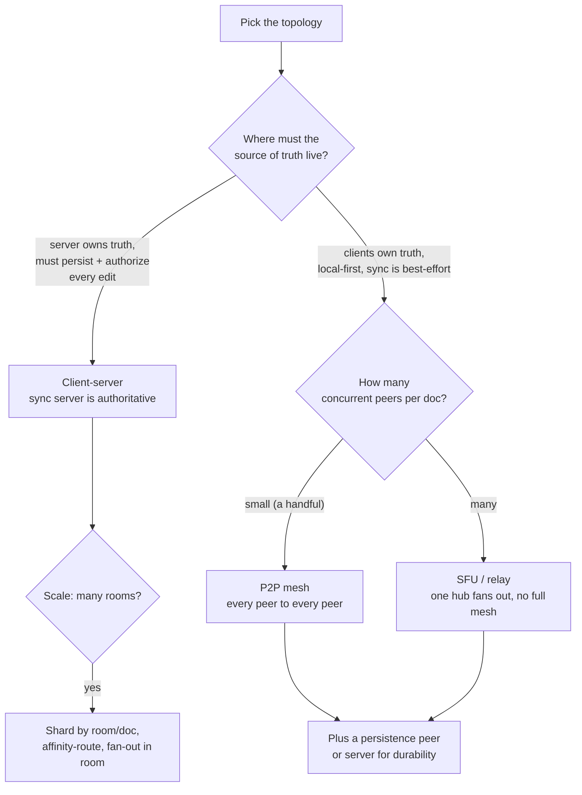

# Realtime Collaboration — Transport & Topology Decision Tree

> Reference decision tree for the `realtime-collaboration-engineering` team. Agents **traverse the relevant tree top-to-bottom before deciding**. Each `## Decision Tree` section is a Mermaid graph plus the rule it encodes.
>
> **Engineering craft, not legal or product advice.** Specific services/protocols are `[verify-at-use]` — confirm against current docs before committing. Durable concepts: [`consistency-and-merge-concepts.md`](consistency-and-merge-concepts.md). Dated services map: [`realtime-collab-tooling-2026.md`](realtime-collab-tooling-2026.md).
>
> _Last reviewed: 2026-06-24 by `claude`._

---

## Decision Tree: which transport?

**Rule:** default to **WebSocket** for client-server data sync — it is simple, firewall-friendly, and lets the server mediate (auth, persistence, ordering). Reach for **WebRTC** only when you need true P2P latency, NAT-traversal between clients, or you are already carrying media — and accept its cost: signaling, STUN/TURN relays, and harder debugging. **Always name the fallback** (TURN when P2P can't connect; WS when WebRTC fails entirely). A transport choice without a fallback is a transport choice that breaks on a corporate network.

---

## Decision Tree: which topology / where does truth live?

**Rule:** topology follows **where the source of truth must live** and **how many peers share a document**. Client-server (authoritative sync server) is the default when the server must persist and authorize edits — it scales by **sharding rooms and fanning out within a room**, with connection affinity routing a room's clients to one node. P2P mesh works only for a handful of peers (mesh connections grow quadratically); beyond that, an SFU/relay fans out from one hub. Local-first/P2P still usually needs **a persistence peer or server** so a document survives when every client is offline — decentralized truth and durable storage are separate concerns.

---

## See also

- [`crdt-vs-ot-decision-tree.md`](crdt-vs-ot-decision-tree.md) — the merge-model decision (drives whether a central order is even required).
- Skills: [`../skills/scale-the-sync-server/SKILL.md`](../skills/scale-the-sync-server/SKILL.md), [`../skills/build-presence-and-awareness/SKILL.md`](../skills/build-presence-and-awareness/SKILL.md).
- Best practices: [`../best-practices/the-server-is-a-relay-and-source-of-truth-decide-which.md`](../best-practices/the-server-is-a-relay-and-source-of-truth-decide-which.md), [`../best-practices/authority-and-access-control-live-at-the-sync-boundary.md`](../best-practices/authority-and-access-control-live-at-the-sync-boundary.md).
