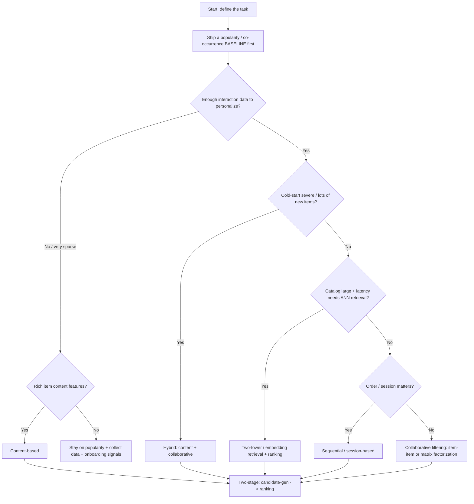

# Knowledge: Recsys Approach Decision Tree

> **Last reviewed:** 2026-07-21 · **Confidence:** high for the approach taxonomy and selection logic (stable domain); specific library/model names are volatile — re-verify at use.
> Source of truth for [`choose-recsys-approach`](../skills/choose-recsys-approach/SKILL.md). Inline priors live on the [`recsys-architect`](../agents/recsys-architect.md); this file is re-read on demand.

Choose from the **data and constraints**, not the newest architecture. Always start from the baseline.

## Decision tree



## The approaches

| Approach | Needs | Strengths | Weaknesses |
|---|---|---|---|
| **Popularity / heuristic** | Almost nothing | Strong baseline; great cold-start default; trivial to serve | No personalization; head-item bias |
| **Content-based** | Item features | Handles item cold-start; interpretable | Over-specializes; needs good features |
| **Collaborative filtering** (item-item, MF) | Dense-ish interactions | Captures latent taste; no feature engineering | Cold-start weak; popularity bias |
| **Hybrid** | Both signals | Best of both; the common production answer | More moving parts |
| **Two-tower / embedding** | Many interactions + ANN serving | Scales to huge catalogs; fast retrieval | Infra heavy; needs data + latency budget |
| **Sequential / session-based** | Ordered interactions | Captures intent/session dynamics | More complex; data-hungry |

## The two-stage pipeline (almost always)

```
Candidate generation (retrieval)  ->  Ranking  ->  Re-ranking
   cheap, high recall,                 expensive,     diversity,
   whole catalog -> ~hundreds          high precision  business rules,
                                       -> ordered      dedupe
```

- **Retrieval** optimizes **recall@k** over the whole catalog (co-occurrence, ANN over embeddings).
- **Ranking** optimizes **nDCG/precision** over the few hundred candidates (GBDT or neural ranker on rich features).
- **Re-ranking** applies diversity, freshness, and business rules the ranker shouldn't learn.

## Rules of thumb

- **Baseline first, always.** Popularity is undefeated more often than expected; it makes every later gain measurable.
- **Match the metric to the stage** (recall@k retrieval, nDCG ranking).
- **Latency is a design input**, not a tuning afterthought — it selects the retrieval architecture.
- **Cold-start is designed in**, not patched on.
- **Diversity/coverage/novelty are guardrails** against an accurate filter bubble.

## Library landscape (retrieval-dated — verify at use)

As of 2026-07, common building blocks: implicit/LightFM/Surprise (classic CF), TensorFlow Recommenders / PyTorch (two-tower, neural rankers), gradient-boosted trees (LightGBM/XGBoost) for ranking, and ANN indexes FAISS / ScaNN / HNSW (hnswlib) for retrieval. Managed options exist on the cloud platforms. Names/versions move; confirm before quoting.

## House opinion

Earn every increment of complexity with a measured, reproducible offline win **and** an online A/B win. A hybrid over a strong baseline solves most production recsys before a two-tower model is justified.
