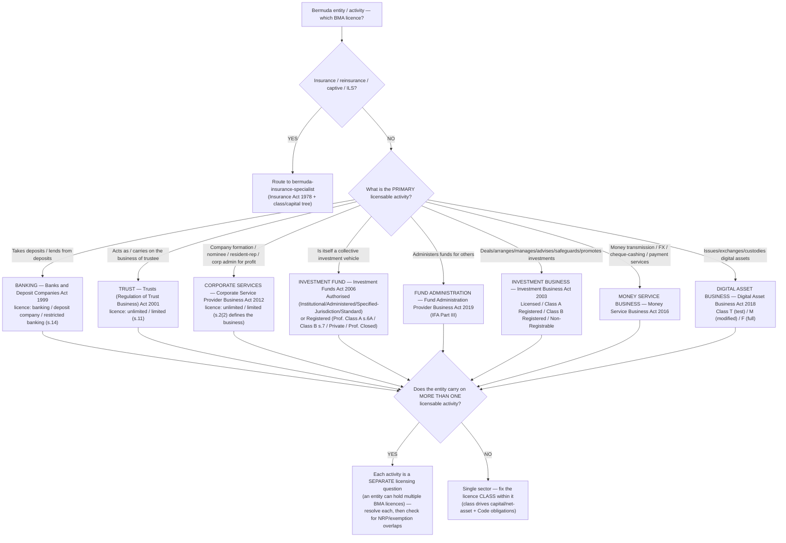
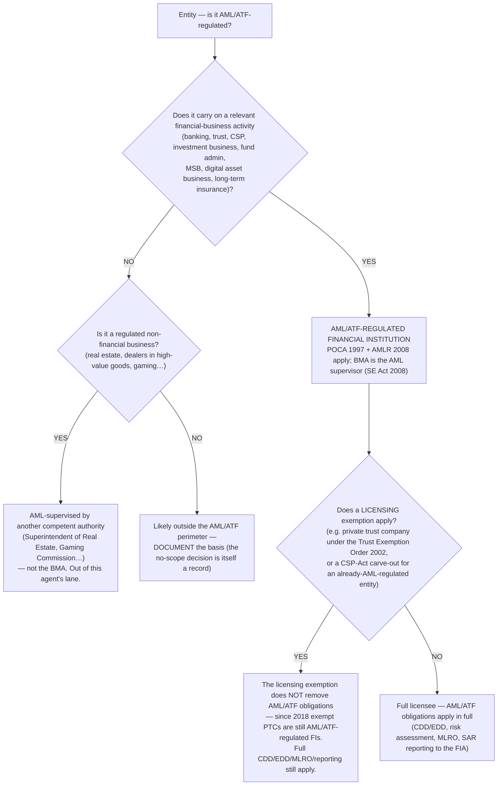

# BMA decision trees — sector/licence classification & the AML-regulated determination

> **Last reviewed:** 2026-06-04. Procedural priors the `bma-financial-institutions-specialist` traverses **before** selecting a method, paired with the BMA sector files in this directory. These are conventions for the model to read, not parsers — see [`../../../../docs/best-practices/decision-trees-in-knowledge-files.md`](../../../../docs/best-practices/decision-trees-in-knowledge-files.md). Companion to the plugin-wide [`../compliance-decision-trees.md`](../compliance-decision-trees.md) (which routes *to* the BMA specialists); this file operates *inside* the BMA perimeter. **Refresh when** a BMA sector Act, licence class, or the beneficial-ownership regime changes, or a `[verify-at-build]`/`[unverified]` marker is resolved.
>
> Every threshold/section marked `[unverified]` here inherits the sourcing caveat from the sector files (BMA primary sites 403 the automated fetch backend) — confirm against the Act PDF before the leaf gates a live decision.

The dominant failure these trees prevent is **wrong-sector-from-the-start** — pattern-matching a keyword ("it's a fund → Investment Funds Act") instead of resolving the actual licensable activity, then carrying the wrong sector's capital/Code/AML obligations through the whole analysis. Traverse top-to-bottom; the first branch that resolves cleanly is the leaf.

---

## Decision Tree: Which BMA sector + licence applies

**When this applies:** a Bermuda entity (or a person operating "in or from within Bermuda") needs its BMA licensing position determined, and the next decision is *which sector Act governs and which licence class within it*. Observable trigger: a new entity, a new business line, a "do we need a BMA licence" question. Do NOT use this for Bermuda **insurance** — that routes to `bermuda-insurance-specialist` and its own class/capital tree. This is the non-insurance perimeter only.

**Last verified:** 2026-06-04 against the BMA sector files in this directory.

**Rationale per leaf:**

- *INSROUTE* — insurance is a different specialist and a different statute; do not try to map an insurance entity onto a non-insurance sector Act.
- *Sector leaves* — the **licensable activity**, not the entity's label, selects the Act. "It's a fund" is a conclusion to test (is it a collective investment vehicle under the IFA?), not a starting assumption. Section pins (s.14, s.11, s.2(2), s.6A/s.7) are confirmed where the sector file says so; otherwise `[unverified]`.
- *STACK* — a single entity can require multiple BMA licences (e.g. a trust company that also provides corporate services). Each licensable activity is its own determination; a Non-Registrable-Person or exemption status under one Act does not transfer to another.
- *ONE* — within the chosen sector, the **licence class** is the load-bearing sub-determination (a deposit company ≠ a full bank; a limited trust licence ≠ unlimited; a Class A Registered Person ≠ a full investment-business licensee). It drives the capital/net-asset floor and the applicable Code of Conduct.

**Tradeoffs summary:**

| Primary activity | Governing Act | Licence axis that drives obligations |
|---|---|---|
| Deposit-taking | Banks and Deposit Companies Act 1999 | banking / deposit company / restricted (s.14) |
| Trustee business | Trusts (Regulation of Trust Business) Act 2001 | unlimited / limited (s.11) |
| Corporate services | Corporate Service Provider Business Act 2012 | unlimited / limited (s.2(2)) |
| Collective investment vehicle | Investment Funds Act 2006 | Authorised class / Registered class |
| Fund administration | Fund Administration Provider Business Act 2019 | licensed administrator |
| Investment business | Investment Business Act 2003 | Licensed / Class A / Class B / NRP |
| Money services | Money Service Business Act 2016 | MSB licence |
| Digital assets | Digital Asset Business Act 2018 | Class T / M / F |

---

## Decision Tree: Is this entity AML/ATF-regulated — and does an exemption help?

**When this applies:** a Bermuda entity's AML/ATF position is in question — typically right after the sector/licence determination, or when someone asserts "we're exempt, so no AML." The next decision is *whether the entity is an AML/ATF-regulated financial institution and what a licensing exemption actually buys.* The dominant failure: treating a **licensing** exemption (e.g. a private trust company) as an **AML** exemption. It is not.

**Last verified:** 2026-06-04 against [`corporate-services.md`](corporate-services.md), [`trust.md`](trust.md), and [`overview.md`](overview.md).

**Rationale per leaf:**

- *REG* — the BMA supervises AML/ATF for the financial sectors it licenses under the **Proceeds of Crime (AML/ATF Supervision and Enforcement) Act 2008**, applying **POCA 1997** + **AMLR 2008**.
- *STILLAML* — **this is the high-value leaf.** A licensing carve-out (a private trust company that need not hold a trust licence; a CSP-Act exemption for an entity already AML-regulated elsewhere) removes the *licence* requirement, not the *AML/ATF* obligations. Since 2018 exempt PTCs are expressly captured as AML/ATF-regulated FIs. "We don't need a licence, so we have no AML obligations" is the error.
- *OTHERSUP* — AML-regulated *non-financial* businesses (real estate, gaming, high-value-goods dealers) are supervised by other Bermuda competent authorities, not the BMA — out of this agent's lane (route per [`overview.md`](overview.md) directory).
- *OUT* — if genuinely outside the perimeter, document *why* — the no-scope determination is a record an examiner can ask for.

**Tradeoffs summary:**

| Situation | AML/ATF obligation | Trap avoided |
|---|---|---|
| Licensed FI (bank/trust/CSP/IB/fund-admin/MSB/DAB) | Full POCA + AMLR 2008 | — |
| Licensing-exempt FI (e.g. exempt PTC) | **Still full AML/ATF** | "Exempt from licence = exempt from AML" |
| Regulated non-financial business | AML, but under another supervisor | Assuming the BMA supervises it |
| Genuinely out of scope | None — but document the basis | An undocumented no-scope call |

---

## How the agent consumes these trees (pre-action traversal prior)

`bma-financial-institutions-specialist` traverses the **sector/licence** tree before quoting any capital, net-asset, or Code obligation (the sector + class fix the yardstick), and the **AML-regulated** tree before any "are we in scope for AML" conclusion. Do NOT pattern-match the entity label to a sector. Where a leaf is gated by an `[unverified]` section or threshold, resolve it against the Act PDF first — confident reasoning on an unverified pin is the failure the accuracy discipline exists to catch.

## See also

- [`banking.md`](banking.md) · [`trust.md`](trust.md) · [`corporate-services.md`](corporate-services.md) · [`fund-administration.md`](fund-administration.md) · [`investment-business.md`](investment-business.md) · [`overview.md`](overview.md)
- [`../compliance-decision-trees.md`](../compliance-decision-trees.md) — the plugin-wide regime-selection tree that routes *to* this specialist
- [`../regulator-finding-severity-triage.md`](../regulator-finding-severity-triage.md) — BMA supervisory-communication severity vocabulary
