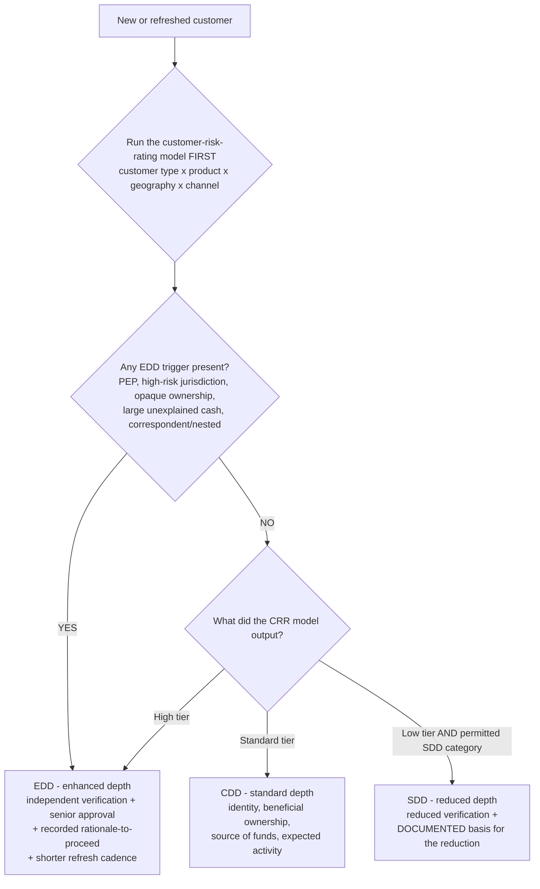
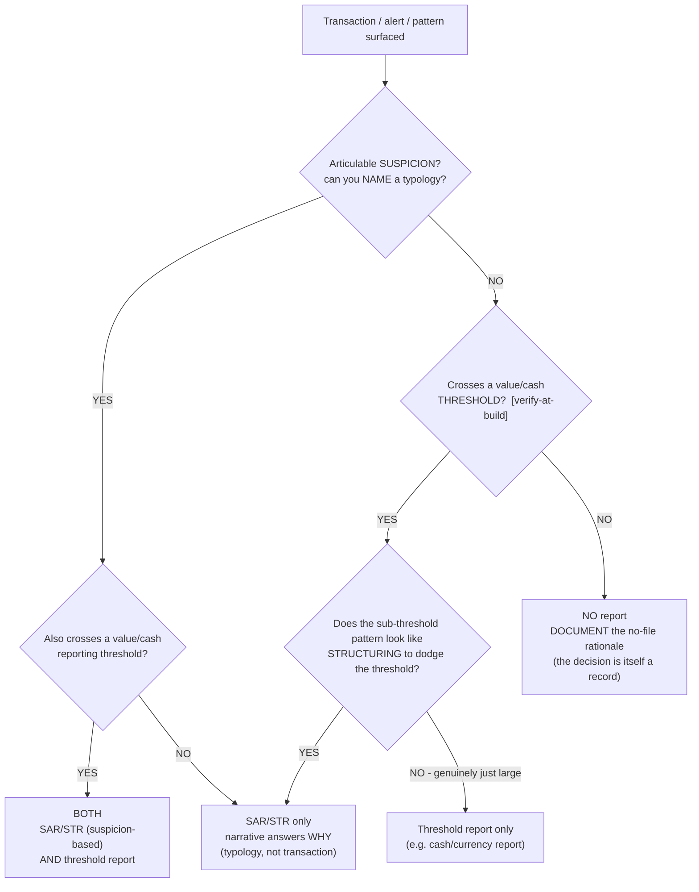
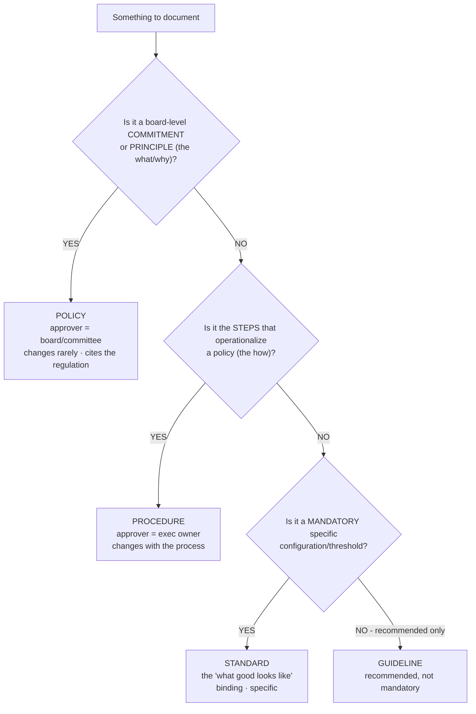
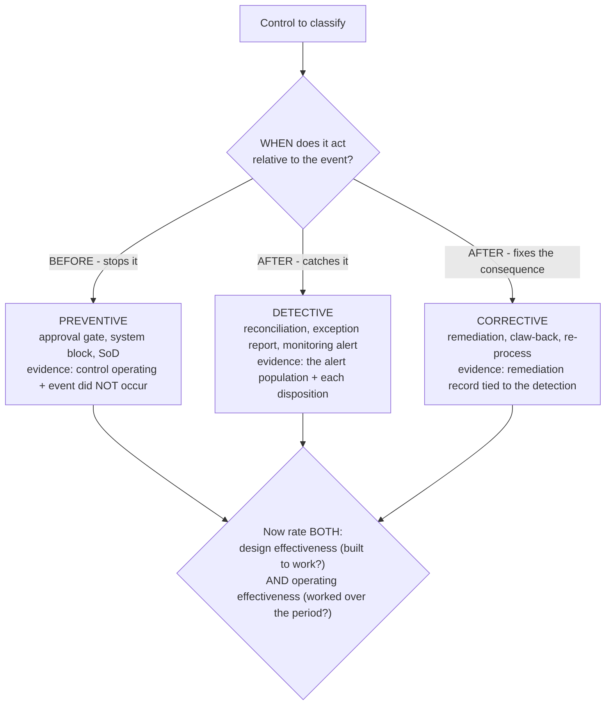
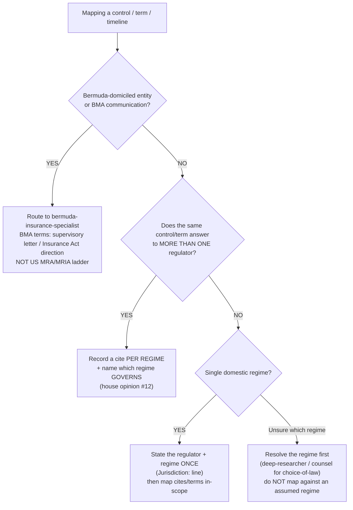
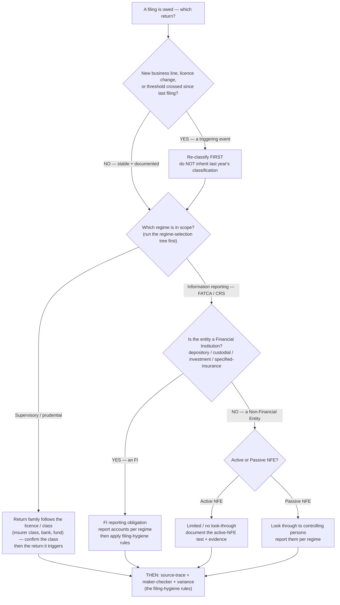
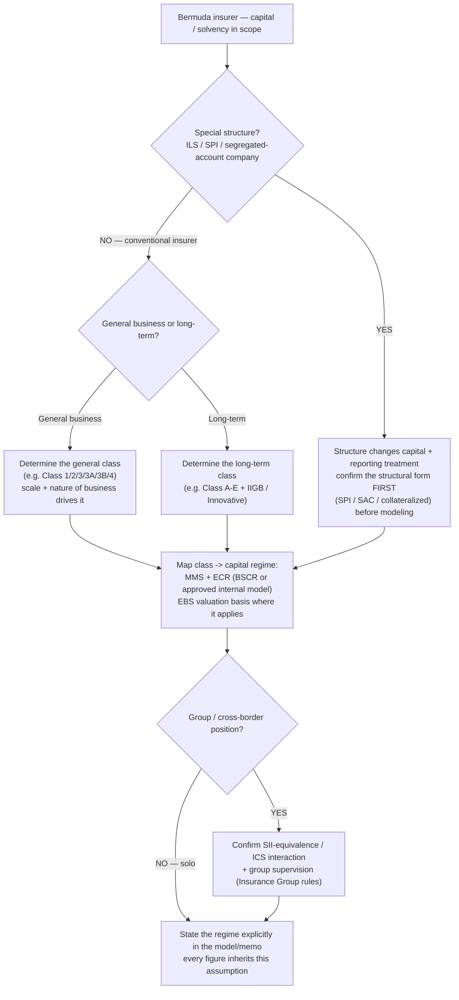

# Compliance decision trees — CDD depth, reportability, document-layer, control type, regime selection, which-return, and Bermuda class/capital

> **Last reviewed:** 2026-05-30. These trees encode procedural priors the compliance agents traverse **before** selecting a method, not after a failure. They are conventions for the model to read, not parsers — see [`../../../docs/best-practices/decision-trees-in-knowledge-files.md`](../../../docs/best-practices/decision-trees-in-knowledge-files.md). **Refresh when** (a) a regime changes a threshold, list, or definition cited here; (b) a sister best-practice under [`../best-practices/`](../best-practices/) is revised; (c) any `[verify-at-build]` marker is resolved against a primary source. Thresholds, list contents, retention periods, and exact statutory minimums are **jurisdiction-specific and volatile** — every such value below is marked `[verify-at-build]` and must be confirmed against the regulator's primary source before it gates a live decision.

This file is the companion to the severity-triage tree in [`./regulator-finding-severity-triage.md`](./regulator-finding-severity-triage.md). Where that file routes a *regulator-issued finding* to a response tier, this file routes the firm-side decisions that come up before a finding ever lands: how deep to go on a customer, whether activity is reportable, which document layer to write, what type a control is, and which regulator/regime even applies.

The dominant failure these trees prevent is **wrong-branch-from-the-start** — picking a method by pattern-matching a keyword in the situation ("it's a corporate, run the full pack"; "it's big, file a SAR") instead of resolving the actual determining condition first. Traverse top-to-bottom; the first branch that resolves cleanly is the leaf.

---

## Decision Tree: CDD vs EDD vs SDD by customer risk

**When this applies:** a customer is being onboarded or periodically refreshed, and the next decision is *how deep the due diligence goes*. Observable trigger: a new relationship, a periodic-review date, or an existing customer crossing into a higher-risk product. Do NOT use this to decide *whether* to report activity (that is the reportability tree) — this is about due-diligence depth only.

**Last verified:** 2026-05-30 against the plugin's own [`../best-practices/aml-risk-rate-before-you-choose-cdd-depth.md`](../best-practices/aml-risk-rate-before-you-choose-cdd-depth.md) and [`../best-practices/edd-is-depth-not-document-count.md`](../best-practices/edd-is-depth-not-document-count.md). Regime-specific SDD eligibility and the high-risk-jurisdiction list are `[verify-at-build]`.

**Rationale per leaf:**

- *EDD* — a high rating **or** any single EDD trigger forces enhanced depth; depth means independent verification + senior-management approval + a recorded rationale-to-proceed, not more documents. A PEP forces this leaf even when every other axis is low. **requires:** named senior approver with authority to sign off the relationship.
- *CDD* — the standard-tier default: identity, beneficial ownership, source of funds, expected activity, on a calendar refresh cadence.
- *SDD* — only when the rating is low **and** the customer sits in a category the regime *permits* to be simplified; the reduction itself needs a documented basis. SDD is reduced DD, never "no DD". `[verify-at-build — permitted SDD categories are regime-specific]`

**The trigger check sits above the tier output deliberately:** a single trigger (PEP, sanctioned-adjacent geography) overrides a low base score. Resolve triggers before reading the tier, or a low score will wrongly route a PEP to CDD.

**Tradeoffs summary:**

| Depth | Verification | Approval gate? | Refresh cadence | Use when |
|---|---|---|---|---|
| SDD | Reduced, documented basis | No (but basis recorded) | Longest permitted | Low tier AND permitted simplified category `[verify-at-build]` |
| CDD | Standard identity + BO + SoF | Standard onboarding sign-off | Calendar, tier-based | Standard tier, no triggers |
| EDD | Independent corroboration | **Senior management, named** | Shortest | High tier OR any EDD trigger |

---

## Decision Tree: Is this reportable — SAR/STR, threshold report, or none

**When this applies:** a transaction, alert, or pattern has surfaced and the next decision is *what reporting obligation (if any) fires*. Observable trigger: a monitoring alert, a referral, an unusual instruction. Decide the **category** before drafting anything — reaching for the wrong instrument is the failure this prevents.

**Last verified:** 2026-05-30 against [`../best-practices/aml-reportability-before-you-file.md`](../best-practices/aml-reportability-before-you-file.md) and [`../best-practices/aml-document-the-no-file-decision.md`](../best-practices/aml-document-the-no-file-decision.md). Threshold amounts and report families are `[verify-at-build]` — confirm the regime's current numbers and forms.

**Rationale per leaf:**

- *SAR/STR only* — suspicion you can articulate as a typology, below any value threshold; the narrative leads with the *why*, not the transaction.
- *BOTH* — suspicious **and** over a threshold are not mutually exclusive; file both, they answer different obligations.
- *Threshold report only* — large but with no nameable suspicion; the threshold report's job, not the SAR's.
- *SAR (via structuring)* — sub-threshold activity engineered to dodge a report is itself suspicious and flips you back to the suspicion branch.
- *NONE* — nothing fires, but the no-file decision is documented (trigger, typology considered, basis, author, date) — a record the examiner may ask for.

**Tradeoffs summary:**

| Outcome | Instrument | Trigger | What survives the exam |
|---|---|---|---|
| SAR/STR | Suspicion-based report | Articulable typology | Narrative answering *why* + sign-off chain |
| Threshold report | Value/cash report `[verify-at-build]` | Amount crossed, no suspicion | The report + the threshold met |
| Both | Both instruments | Suspicion AND amount | Both filings, cross-referenced |
| None | No report | Neither met | Documented no-file rationale |

---

## Decision Tree: Policy vs procedure vs standard vs guideline

**When this applies:** something needs to be written down and the next decision is *which document layer it belongs in*. Observable trigger: a new regulation to implement, a process change, a gap analysis output, a request to "document this." Picking the wrong layer is what guarantees drift — procedure buried in policy, or a mandatory rule written as a guideline.

**Last verified:** 2026-05-30 against [`../best-practices/policy-separate-policy-from-procedure.md`](../best-practices/policy-separate-policy-from-procedure.md).

**Rationale per leaf:**

- *POLICY* — principles and board-level commitments; rare changes, board/committee approval, each clause cites the regulator section it implements. Keep it short.
- *PROCEDURE* — the operational steps; exec-owner approval, changes whenever the process changes. Buried inside policy it causes drift — keep it separate.
- *STANDARD* — a mandatory specific (a required threshold, a required configuration); binding but more granular than policy.
- *GUIDELINE* — recommended practice, not mandatory; the only layer where "should" rather than "must" is correct.

**Every layer carries** a regulator cite for what it implements, a *named* accountable owner, a review cycle + last-reviewed date, and (for policy) an exceptions section. `[verify-at-build — primary-source cites]`

**Tradeoffs summary:**

| Layer | Answers | Approver | Change cadence | Binding? |
|---|---|---|---|---|
| Policy | What / why (principle) | Board / committee | Rare | Yes (principle) |
| Procedure | How (steps) | Exec owner | With the process | Yes (operational) |
| Standard | What-good-looks-like (specific) | Exec / 2nd line | As the spec changes | Yes |
| Guideline | Recommended practice | Owner | As practice evolves | No |

---

## Decision Tree: Control type — preventive vs detective vs corrective

**When this applies:** a control is being designed, mapped, or tested and the next decision is *what type it is* — because the type dictates the evidence that proves it works and how its failure shows up. Observable trigger: building a control matrix, mapping a control to an obligation, scoping a control test. Rating "effective" without classifying type first is the failure this prevents.

**Last verified:** 2026-05-30 against [`../best-practices/controls-classify-the-control-type-before-you-rate-it.md`](../best-practices/controls-classify-the-control-type-before-you-rate-it.md).

**Rationale per leaf:**

- *PREVENTIVE* — acts before the event; evidence is the control operating *and* the absence of the event. Brittle alone — pair with a detective backstop for material risks.
- *DETECTIVE* — acts after the event to catch it; evidence is the alert/exception population and the disposition of each item, not the control's mere existence.
- *CORRECTIVE* — acts after detection to restore the position; evidence is the remediation record linked to the detection that triggered it.
- *RATE (all leaves converge)* — type chosen, rate design and operating effectiveness **separately**; a well-designed control can still fail to operate, and "effective but never tested" is not a rating.

**Tradeoffs summary:**

| Type | Acts | Evidence that proves it | Failure mode | Use when |
|---|---|---|---|---|
| Preventive | Before the event | Operating + event absent | Silent failure (nothing catches it) | You can block the event up front |
| Detective | After, to catch | Alert population + dispositions | Backlog/auto-close hides misses | Prevention impractical or as a backstop |
| Corrective | After detection | Remediation tied to detection | Detection without correction | Consequence must be restored |

---

## Decision Tree: Which regulator / regime applies (scope before you map)

**When this applies:** before mapping a control, classifying a finding, or using a threshold word ("material", "significant", "reportable"), the next decision is *which regulator and regime govern* — because the same word and the same control answer differently across regimes. Observable trigger: any cross-border entity, a Bermuda-domiciled entity, or a term/threshold about to be applied. Carrying a definition or timeline across a jurisdiction boundary is the silent failure this prevents.

**Last verified:** 2026-05-30 against [`../best-practices/scope-the-jurisdiction-before-you-map.md`](../best-practices/scope-the-jurisdiction-before-you-map.md) and the BMA carve-out in [`./regulator-finding-severity-triage.md`](./regulator-finding-severity-triage.md).

**Rationale per leaf:**

- *BMASPEC* — the BMA uses different vocabulary and a different severity/response structure; route to the specialist for the mapping before applying any US-anchored ladder or timeline. **requires:** confirmation the entity is genuinely BMA-regulated.
- *PERREG* — a control answering to two regulators carries a cite per regime, with the governing regime named; that is two clean mappings, not a single universal cite.
- *SCOPE* — single domestic regime still states scope once on the `Jurisdiction:` line so no downstream reader inherits the wrong regime.
- *RESEARCH* — if the governing regime is genuinely unclear, resolve it before mapping; choice-of-law is a counsel question (`Legal-advice gate:` flips), and a regulatory-regime question can route to the deep-researcher.

**Tradeoffs summary:**

| Situation | Action | Who owns it | Trap avoided |
|---|---|---|---|
| Bermuda / BMA | Route to bermuda-insurance-specialist | `bermuda-insurance-specialist` | Applying a US MRA ladder to a BMA letter |
| Cross-jurisdiction control | Cite per regime, name governing | mapping owner + house opinion #12 | One control, one cite, hidden gap |
| Single domestic | State scope once on `Jurisdiction:` | the responsible agent | Silent wrong-regime inheritance |
| Regime unclear | Resolve before mapping | deep-researcher / counsel | Mapping against an assumed regime |

---

## Decision Tree: Which return — classify the entity before you pick the filing

**When this applies:** a filing is owed (or assumed owed) and the next decision is *which return*, which depends on *how the entity is classified*. Observable trigger: a new reporting obligation, a period-end approaching, a new business line / licence change, or a "we filed X last year" assumption about to be reused. Do NOT use this to decide *filing hygiene* (variance, maker-checker, source-trace) — those rules apply *after* this tree picks the return. The dominant failure this prevents is selecting the return from last year's filing instead of from a current classification.

**Last verified:** 2026-06-01 against [`../best-practices/reporting-classify-the-entity-before-you-file.md`](../best-practices/reporting-classify-the-entity-before-you-file.md) and [`../best-practices/scope-the-jurisdiction-before-you-map.md`](../best-practices/scope-the-jurisdiction-before-you-map.md). FATCA/CRS category definitions, thresholds, and supervisory return-family mappings are `[verify-at-build]` against the regulator's primary source.

**Rationale per leaf:**

- *RECLASS* — a triggering event (new line, licence change, threshold crossed) can change what's owed; re-classify before selecting the return rather than inheriting last year's. This is the single highest-value branch — "the return we filed last year" is the classic wrong start.
- *SUP* — for supervisory/prudential returns the entity's licence/class triggers the return family; confirm the class (for insurers this hands to the Bermuda class/capital tree below) before selecting.
- *FIFILE* — an FI's reporting obligation is account-level; classification as an FI is the gate, not a form field.
- *ACTIVE* — an active NFE generally avoids controlling-person look-through, but the active test and its evidence must be documented (an examiner challenges classification first).
- *PASSIVE* — a passive NFE requires look-through to controlling persons; missing this is a reportable defect no matter how clean the account data.
- *HYGIENE* — only once the return is correctly selected do the filing-hygiene rules (source-trace, maker-checker, variance) apply; they assume the right return on the right classification.

**Tradeoffs summary:**

| Entity status | What's owed | Look-through? | Trap avoided |
|---|---|---|---|
| Financial Institution | Account-level FI reporting | n/a | Filing an NFE return as an FI |
| Active NFE | Document the active test | No (generally) | Treating a passive NFE as active |
| Passive NFE | Report controlling persons | **Yes** | Skipping controlling-person look-through |
| Supervisory / prudential | Return family by licence/class | n/a | Filing a class's return the entity doesn't trigger |
| Triggering event since last filing | Re-classify before filing | depends on new status | Inheriting a stale classification |

---

## Decision Tree: Bermuda — fix the insurance class and capital regime before you model

**When this applies:** a Bermuda (re)insurer's capital, solvency, or a capital return is in scope and the next decision is *which capital framework* — which depends on the *registration class*. Observable trigger: any Bermuda-domiciled insurance entity touching solvency, the ECR/MMS, EBS valuation, or a capital return. This is the tree the regime-selection tree's `BMASPEC` leaf and the which-return tree's `SUP` leaf route *into*. The failure it prevents: modeling capital on a generic "insurer" basis before the class fixes the yardstick.

**Last verified:** 2026-06-01 against [`../best-practices/bermuda-state-the-capital-regime-before-you-model.md`](../best-practices/bermuda-state-the-capital-regime-before-you-model.md). Class definitions, capital ratios, EBS valuation rules, and SII-equivalence/ICS status are **BMA-current and version-specific** — `[verify-at-build]` against the BMA Insurance Act + class-specific prudential rules; never quote a Bermuda capital figure from memory.

**Rationale per leaf:**

- *ILS* — ILS / SPI / segregated-account structures have a distinct capital and reporting treatment; the structural form is a prior determination, not a detail — confirm it before any capital modeling.
- *GEN / LT* — general vs long-term business registers under different class systems; the class follows the nature and scale of the business and selects the framework.
- *REGIME* — the class maps to MMS + ECR (BSCR standard formula or an approved internal model) with EBS valuation where it applies; this is the yardstick every capital figure is measured against.
- *GRP* — a group or cross-border position pulls in SII-equivalence / ICS interaction and group supervision; flag it rather than modeling solo-only.
- *STATE* — the regime is stated explicitly up front (it's the first thing the BMA tests and the assumption every figure inherits). Genuine actuarial/legal sign-off remains with qualified counsel/actuaries (house opinion #10).

**Tradeoffs summary:**

| Entity shape | First determination | Capital framework | Trap avoided |
|---|---|---|---|
| ILS / SPI / SAC | Structural form | Structure-specific treatment | Modeling an SPI as a conventional insurer |
| General-business insurer | General class (1–4 / 3A / 3B) | MMS + ECR (BSCR) + EBS | Generic "insurer" capital basis |
| Long-term insurer | Long-term class (A–E / IIGB) | MMS + ECR + EBS (long-term) | Wrong class system applied |
| Group / cross-border | SII-equivalence / ICS | + group supervision | Solo model ignoring group position |

---

## How agents consume these trees (pre-action traversal prior)

These trees are **not** auto-consumed. The relevant agents are primed to traverse before selecting a method:

- `aml-kyc-analyst` — traverse the **CDD-depth** tree before choosing a due-diligence depth, and the **reportability** tree before drafting any report.
- `policy-and-procedure-writer` — traverse the **document-layer** tree before deciding where something is written down.
- `risk-and-controls-specialist` — traverse the **control-type** tree before rating a control's effectiveness.
- `regulatory-reporting-analyst` — traverse the **which-return** tree before selecting any return; classification precedes the filing-hygiene rules.
- `bermuda-insurance-specialist` — traverse the **Bermuda class/capital** tree before modeling any capital, solvency, or capital return; the class fixes the regime every figure inherits.
- Every agent — traverse the **regime-selection** tree before mapping a control, classifying a finding, or using a threshold word; it generalizes house opinion #12.

Do NOT pattern-match on a keyword in the situation description. The first branch where the condition resolves cleanly is the leaf to apply. Where a leaf is gated by a `[verify-at-build]` value (a threshold, a list, an SDD-eligible category, a retention period), resolve that value against the regulator's primary source before the leaf gates a live decision — confident reasoning on an unverified threshold is the failure mode the accuracy discipline exists to catch.

## See also

- [`./regulator-finding-severity-triage.md`](./regulator-finding-severity-triage.md) — the companion tree for *regulator-issued findings* (MRA/MRIA/consent order/SII).
- [`../best-practices/`](../best-practices/) — each tree codifies one or more sibling best-practice docs (linked per tree above).
- [`../../../docs/best-practices/decision-trees-in-knowledge-files.md`](../../../docs/best-practices/decision-trees-in-knowledge-files.md) — the format rule these trees follow.
