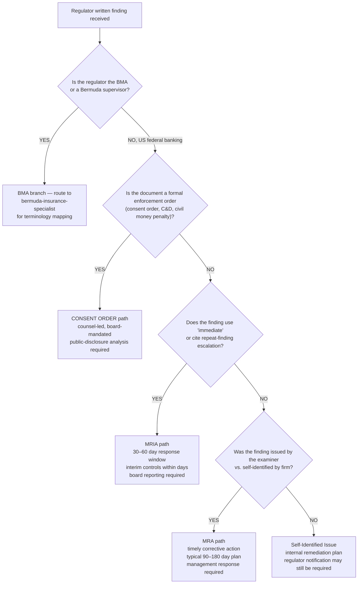

# Regulator finding severity triage — MRA, MRIA, consent order, and self-identified issue

> **Last reviewed:** 2026-05-22. Source: Federal Reserve SR 13-13/CA 13-10 framework, OCC Comptroller's Handbook process for MRAs, and practitioner literature on exam-response timelines. **Refresh when** (a) the 2025 interagency NPR on MRA standards (OCC Bulletin 2025-29) is finalized, withdrawn, or substantially revised; (b) the Federal Reserve updates SR 13-13; (c) the BMA changes its supervisory-communications terminology.

A regulator just delivered a finding. The single most expensive mistake is misreading **severity** before deciding on the response. The vocabulary looks interchangeable from outside formal supervision work, but the response timeline, board-paper requirements, remediation funding, and public-disclosure consequences differ sharply. This file routes the agent to the right severity tier _before_ any remediation playbook fires.

The two most common wrong-first-picks: (a) treating an **MRIA as an MRA**, which produces a non-urgent response posture for what is in fact an immediate-action item, and (b) treating an examiner-issued finding as a **self-identified issue (SII)**, which understates the regulator's stake in the corrective action.

---

## Decision Tree: Regulator finding — severity triage

**When this applies:** a regulator has issued a written finding, communication, or enforcement-related document to the firm (or a subsidiary), and the next decision is _what severity tier this is_ and _which response playbook fires_. Do NOT use this tree for internal audit findings, second-line control-test findings, or self-identified issues raised by the firm itself — those use separate workflows.

**Last verified:** 2026-05-22 against Federal Reserve SR 13-13/CA 13-10 and OCC News Release 2014-150. Note: the 2025 interagency NPR (OCC Bulletin 2025-29) proposes uniform MRA standards but is not finalized as of this date.

**Rationale per leaf:**

- _BMA_ — Bermuda Monetary Authority uses different vocabulary (supervisory letters, directions under the Insurance Act, enforcement notices). Mapping to the US MRA/MRIA tiers requires the Bermuda specialist; do not assume the US severity ladder applies.
- _CONSENT ORDER_ — formal enforcement documents (consent orders, cease-and-desist, civil money penalties) are legal instruments. Counsel leads the response, board approves the response strategy, and securities-law disclosure analysis fires for public companies. This path is NOT a compliance-only workflow.
- _MRIA_ — the Federal Reserve defines MRIAs as matters "of significant importance and urgency" requiring **immediate** action, with criteria including significant safety-and-soundness risk, significant noncompliance with laws/regs, or repeat criticisms that escalated due to prior inaction (SR 13-13/CA 13-10). The response window is compressed (30–60 days for the plan; interim controls within days of the exit conference) and board-level reporting is mandatory.
- _MRA_ — Matters Requiring Attention require "timely and effective corrective action by bank management" (OCC) but do not pose an immediate risk. Typical plan windows are 90–180 days. Management response is required; board awareness is expected; board approval is not always mandatory but is best practice.
- _SII_ — Self-Identified Issues are firm-originated and follow the firm's internal issue-management policy. Regulator notification may still be required depending on materiality, the regulator's expectations regime, and any pre-existing supervisory letters that require proactive disclosure.

**If the symptom matches multiple branches, the leaf with the higher severity is the default.** Escalate to the lower severity only when the higher one is demonstrably ruled out by the document's actual language and the examiner's stated intent. Misclassifying _down_ (treating an MRIA as an MRA) is the dominant failure mode this tree exists to prevent.

**Tradeoffs summary:**

| Tier               | Response window                            | Board involvement      | Counsel required? | Public disclosure?              | Use when                                                              |
| ------------------ | ------------------------------------------ | ---------------------- | ----------------- | ------------------------------- | --------------------------------------------------------------------- |
| Consent order / C&D| Per order terms                            | Approval required      | **YES**           | **YES** for public companies    | Formal enforcement instrument issued                                  |
| MRIA               | 30–60 days plan; interim controls in days  | Reporting + approval   | Recommended       | Case-by-case, materiality test  | "Immediate" language, safety-and-soundness, or repeat finding         |
| MRA                | 90–180 days plan typical                   | Awareness + response   | Not by default    | Rarely                          | Examiner-issued, non-immediate                                        |
| SII                | Per firm policy                            | Per firm policy        | No                | Per firm policy + regulator     | Firm self-identified before examiner did                              |

---

## Jurisdictional carve-out — BMA / Bermuda

The Bermuda Monetary Authority does not use MRA/MRIA terminology. BMA supervisory communications include:

- **Supervisory letters** — written observations and required actions; the closest functional analogue to an MRA but issued under different supervisory authority.
- **Directions under the Insurance Act 1978** — statutory directives; functionally closer to a consent-order tier but issued unilaterally rather than negotiated.
- **Enforcement notices and public censures** — formal enforcement instruments published on the BMA website.

When the regulator is the BMA, route to `bermuda-insurance-specialist` for the mapping before applying any US-based response timeline. Do not assume a BMA supervisory letter automatically equals an MRA — the BMA's expectations on response timing and board involvement are set in the letter itself and in the underlying rule (e.g., BMA Insurance (Group Supervision) Rules 2011 for group-level matters).

---

## When to escalate to the compliance / board risk committee

Escalate immediately, regardless of the tier the tree resolves to:

- Any **MRIA** — board reporting is mandatory; the compliance committee or board risk committee receives the response plan before submission to the regulator.
- Any **consent order or C&D** — board approval of the response strategy is mandatory; counsel leads.
- Any **MRA that is a repeat finding** — even if not formally re-classified as MRIA, repeat findings are the leading indicator of MRIA escalation at the next exam cycle (SR 13-13 explicitly names repeat criticisms as MRIA-qualifying).
- Any finding touching **AML/BSA pillars, sanctions, or fair lending** — these are escalation-by-default at most US federal banking supervisors.

---

## Citations / sources

- Federal Reserve SR 13-13/CA 13-10 — "Supervisory Considerations for the Communication of Supervisory Findings." The MRIA criteria above are sourced via the Bank Policy Institute summary that directly quotes SR 13-13; verify against the SR 13-13 attachment PDF on the Federal Reserve site before relying on the exact wording in a live exam response.
- [Bank Policy Institute — The 3 Letters at the Heart of Bank Supervision Dysfunction](https://bpi.com/the-3-letters-at-the-heart-of-bank-supervision-dysfunction/)
- [OCC News Release 2014-150 — Revised Process for Managing Matters Requiring Attention](https://occ.treas.gov/news-issuances/news-releases/2014/nr-occ-2014-150.html)
- [OCC Bulletin 2025-29 — Interagency NPR on MRA standards](https://www.occ.treas.gov/news-issuances/bulletins/2025/bulletin-2025-29.html) — **NPR only; not finalized as of 2026-05-22.**
- [Federal Register 2025-19711](https://www.federalregister.gov/documents/2025/10/30/2025-19711/) — NPR docket entry.
- BMA Insurance (Group Supervision) Rules 2011 — referenced as the jurisdictional cite anchor for the BMA carve-out branch.
