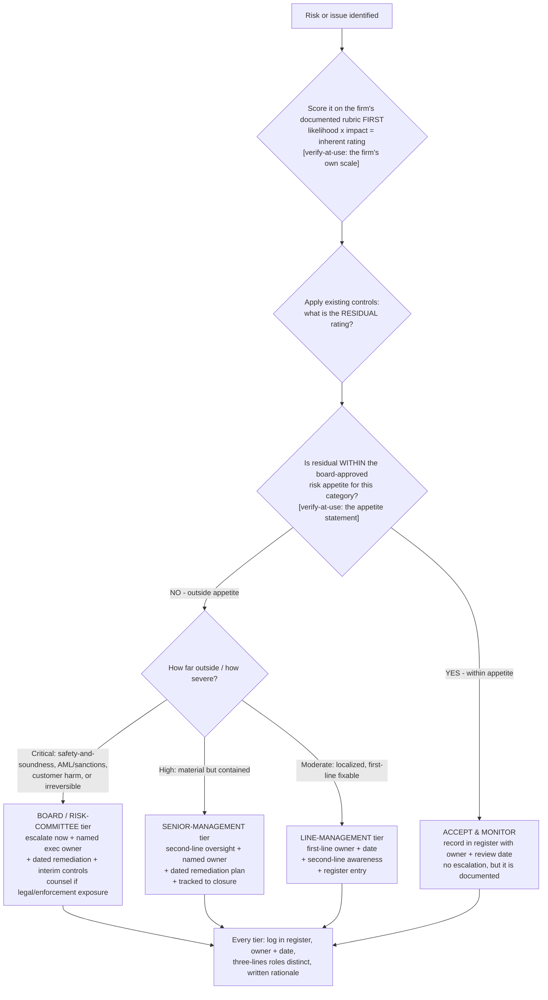

# Risk-rating & escalation decision tree — score the risk, then route it to the right authority

**Last reviewed:** 2026-06-05 · **Confidence:** medium (encodes the plugin's own best-practices + standard enterprise-risk-management practice; the *scoring scale, thresholds, and escalation authorities are firm-specific* and carry inline `[verify-at-use]` markers). This is a **companion** to the broader [`compliance-decision-trees.md`](compliance-decision-trees.md) and the [`regulator-finding-severity-triage.md`](regulator-finding-severity-triage.md) — those route *due-diligence depth*, *reportability*, *control type*, and a *regulator-issued finding*; this one routes a **firm-identified risk or issue** from its rated severity to the right escalation and approval authority.

> Canonical tree for the [`risk-and-controls-specialist`](../agents/risk-and-controls-specialist.md), with input from [`policy-and-procedure-writer`](../agents/policy-and-procedure-writer.md) on the issue-management policy. Traverse top-to-bottom. The decision is **not** "how bad does this feel" — it is *score the inherent/residual risk against the firm's documented rubric, test it against risk appetite, then route to the authority that owns that tier.* This is decision-support; it never substitutes for the firm's board-approved risk-appetite statement or for counsel on a legal question (CLAUDE.md §3 #4, §3 #10).

---

## When this applies

A risk or issue has been identified (a control gap, a near-miss, a KRI breach, a self-identified issue, a new risk event for the register) and the next decision is **what severity tier it is and who must be told / who must approve the response**. Common triggers: a risk-register refresh, a KRI threshold breach, an incident, a control-test finding that the firm raised itself.

Do **not** use this tree for a *regulator-issued* finding — that goes to [`regulator-finding-severity-triage.md`](regulator-finding-severity-triage.md) (MRA/MRIA/consent-order/SII). Do **not** use it to decide *reportability* of a transaction (SAR/STR) — that is the reportability tree in [`compliance-decision-trees.md`](compliance-decision-trees.md).

## The tree

## Rationale per leaf

- **Score before you route (the RATE → RESID gate).** A risk routed by gut feel is over- or under-escalated. Rate inherent (likelihood × impact) on the firm's *documented* rubric, then residual after existing controls — a register row without both ratings is half a row (CLAUDE.md §3 #13; the `controls-inherent-residual-target-are-three-ratings` best practice). The scale itself is firm-specific `[verify-at-use]`.
- **Appetite decides escalation, not severity alone (the APP gate).** A high *inherent* risk that is *within* residual appetite is accepted-and-monitored, not escalated; a moderate one *outside* appetite escalates. **Risk appetite drives the response** (CLAUDE.md §3 #4; the `risk-appetite-statement-gates-the-risk-register` best practice). The appetite thresholds are board-approved and firm-specific `[verify-at-use]`.
- **BOARD / risk-committee tier** — reserved for critical residual risk: safety-and-soundness, AML/sanctions/fair-lending exposure, customer harm, or anything irreversible. These escalate *now* (don't wait for the next committee cycle), get a named executive owner, interim controls, and counsel where there is legal or enforcement exposure. These categories are escalation-by-default — never auto-downgrade them.
- **SENIOR-MANAGEMENT tier** — material but contained residual risk: second-line oversight, a named owner, a dated remediation plan tracked to closure.
- **LINE-MANAGEMENT tier** — localized, first-line-fixable: first-line owner + date, with second-line awareness and a register entry. Still documented — "fixed it informally" is not a record.
- **ACCEPT & MONITOR** — residual within appetite: this is a *decision*, recorded with an owner and a review date, not silence. Accepting a risk is a positive act that must survive an exam.

**If a risk matches multiple branches, route to the higher tier.** Downgrade only when the higher tier is demonstrably ruled out — misclassifying *down* (a board-tier risk handled at line-management) is the dominant failure mode this tree prevents, mirroring the regulator-finding triage logic.

## Tradeoffs summary

| Tier | Who owns the response | Approval / oversight | Remediation posture | Use when |
|---|---|---|---|---|
| Board / risk-committee | Named executive | Board / risk-committee approval | Interim controls now + dated plan + counsel if legal exposure | Critical: safety-and-soundness, AML/sanctions, customer harm, irreversible |
| Senior-management | Named senior owner | Second-line oversight | Dated plan tracked to closure | High: material but contained |
| Line-management | First-line owner | Second-line awareness | Owner + date, register entry | Moderate: localized, first-line fixable |
| Accept & monitor | Risk owner | Recorded acceptance | Review date, no remediation | Residual within board-approved appetite |

## Gotchas

- **Inherent ≠ residual ≠ target — they are three different ratings** (the `controls-inherent-residual-target-are-three-ratings` best practice). Escalation keys off *residual* tested against appetite, not inherent.
- **Appetite is the gate, not the rating.** A scary-looking inherent score that controls bring within appetite does not escalate; don't let the inherent number drive the routing past the appetite test.
- **AML/sanctions/fair-lending are escalation-by-default** regardless of where the score lands — same carve-out as the regulator-finding triage tree.
- **Don't conflate the three lines** (CLAUDE.md §3 #3): the first line owns the risk and the fix, the second provides oversight/challenge, the third assures. The tier names the *response owner*, not a reassignment of line accountability.
- **The scale, thresholds, and named authorities are firm-specific** — every one is `[verify-at-use]` against the firm's board-approved risk-appetite statement and issue-management policy before it gates a live escalation. This tree encodes the *method*, not the firm's numbers.

## Escalation & guardrails

- A *regulator-issued* finding (not a firm-identified risk) → [`regulator-finding-severity-triage.md`](regulator-finding-severity-triage.md).
- Building or refreshing the register the rated risk lands in → [`../skills/risk-register-build/SKILL.md`](../skills/risk-register-build/SKILL.md) + [`../templates/risk-register.md`](../templates/risk-register.md).
- A risk with legal/enforcement exposure → counsel for the legal conclusion; the plugin owns the operational/risk artifact, not the legal opinion (CLAUDE.md §3 #10).
- Anything touching customer PII / SAR-STR content → mandatory `ravenclaude-core` `security-reviewer` (CLAUDE.md §2).

## Sources (retrieved 2026-06-05)

- This tree primarily encodes the plugin's **own** best-practices (`risk-appetite-statement-gates-the-risk-register`, `controls-inherent-residual-target-are-three-ratings`, `three-lines-own-the-line-you-are-on`) and the standard enterprise-risk-management likelihood×impact + risk-appetite pattern. The escalation-severity logic mirrors the regulator-finding triage tree, which is sourced to Federal Reserve SR 13-13/CA 13-10.
- The *scoring scale, appetite thresholds, and escalation authorities are firm-specific and not sourced here* — they are `[verify-at-use]` against the firm's board-approved risk-appetite statement and issue-management policy. This file is a method, not a regulatory citation.
