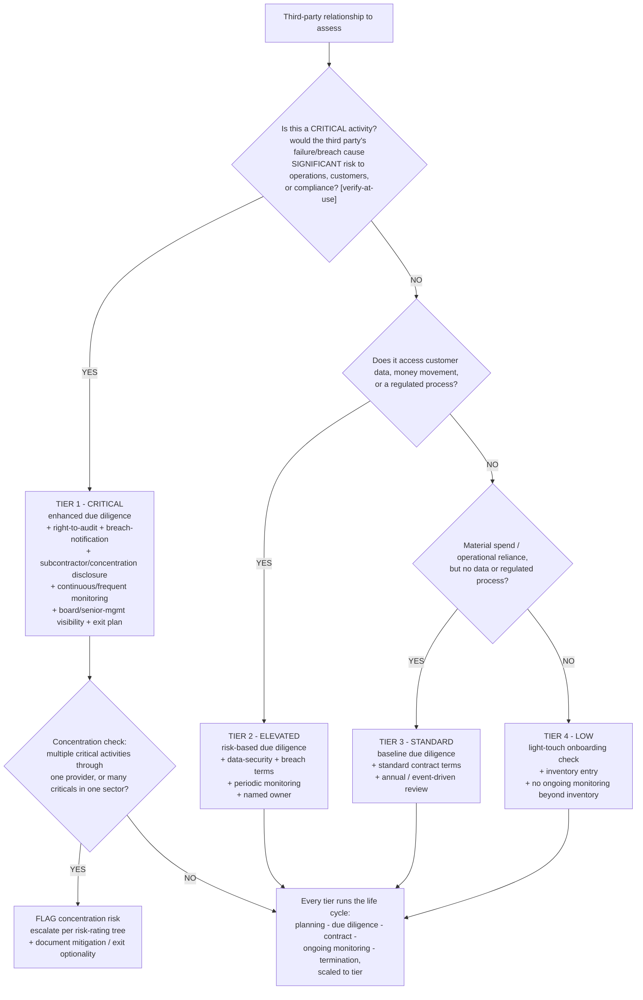

# Third-party / vendor risk-tiering decision tree — tier by criticality, then scale diligence to tier

**Last reviewed:** 2026-06-05 · **Confidence:** medium (anchored on the US **Interagency Guidance on Third-Party Relationships: Risk Management**, final June 6, 2023 — Federal Reserve, FDIC, OCC; web-verified this date). The guidance is **US-banking-specific**; non-US / non-banking firms have their own outsourcing/third-party regime (EBA outsourcing guidelines, EU DORA, local equivalents). The criticality definition, required contract terms, and monitoring cadence are firm- and regime-specific — every such value carries an inline `[verify-at-use]` marker (CLAUDE.md §3 #12).

> Canonical tree for the [`risk-and-controls-specialist`](../agents/risk-and-controls-specialist.md), with input from [`policy-and-procedure-writer`](../agents/policy-and-procedure-writer.md) (the third-party-risk-management policy). Traverse top-to-bottom. The decision is **not** "did we do diligence on this vendor" — it is *tier the relationship by criticality, then scale due diligence + contract terms + ongoing monitoring to the tier.* Proportionality is the supervisory expectation, not uniform depth. This is decision-support; contract terms and liability need counsel before execution (CLAUDE.md §3 #10).

---

## When this applies

A third-party relationship is being onboarded, renewed, or re-assessed and the next decision is **how much due diligence, what contract protections, and what ongoing-monitoring cadence it warrants**. Common triggers: a new vendor, a contract renewal, a periodic vendor-population review, or exam prep on third-party risk.

This complements the firm-side determination trees in [`compliance-decision-trees.md`](compliance-decision-trees.md) (which-regime / which-return / CDD-depth). The customer-due-diligence depth tree (CDD/EDD/SDD) is for *customers*; **this** tree is for *third parties the firm relies on*.

## The tree

## Rationale per leaf

- **Criticality is the first gate, not spend.** The interagency guidance keys depth to **critical activities** — those whose failure could cause significant risk if the third party doesn't perform. A low-spend vendor running a customer-facing regulated process can be Tier 1; a high-spend office vendor is Tier 4. Spend is a *secondary* signal, never the primary one. `[verify-at-use: the firm's own critical-activity definition]`.
- **TIER 1 — CRITICAL** — enhanced due diligence, plus the contract protections that only matter when it matters: **right-to-audit**, breach-notification SLAs, subcontractor and concentration disclosure, and an **exit / contingency plan**. Continuous or frequent ongoing monitoring; board/senior-management visibility. This is where uniform processes under-control, so this is where depth concentrates.
- **TIER 2 — ELEVATED** — touches customer data, money movement, or a regulated process but isn't critical: risk-based due diligence, data-security and breach terms, periodic monitoring, a named owner.
- **TIER 3 — STANDARD** — material operational reliance but no data/regulated-process exposure: baseline diligence, standard terms, annual or event-driven review.
- **TIER 4 — LOW** — no data, no regulated process, low reliance: a light-touch onboarding check and an inventory entry. The point of tiering is to *stop* spending Tier-1 effort here.
- **CONCENTRATION check (Tier 1)** — even correctly-tiered relationships create systemic exposure when many critical activities funnel through one provider, or many criticals cluster in one sector/region. Flag it and route the *concentration* risk through the [`risk-rating-and-escalation-decision-tree.md`](risk-rating-and-escalation-decision-tree.md); document mitigation or exit optionality.
- **The life cycle runs at every tier** — planning → due diligence/selection → contract → ongoing monitoring → termination. Tiering scales *how much* at each stage; it never *skips* a stage for an in-scope relationship.

## Tradeoffs summary

| Tier | Trigger | Due diligence | Contract protections | Ongoing monitoring |
|---|---|---|---|---|
| 1 — Critical | Failure → significant risk `[verify-at-use]` | Enhanced | Right-to-audit, breach SLA, subcontractor/concentration disclosure, exit plan | Continuous / frequent + board visibility |
| 2 — Elevated | Customer data / money / regulated process | Risk-based | Data-security + breach terms | Periodic + named owner |
| 3 — Standard | Material reliance, no data/regulated process | Baseline | Standard terms | Annual / event-driven |
| 4 — Low | No data, no regulated process, low reliance | Light-touch check | Standard onboarding | Inventory only |

## Gotchas

- **Uniform diligence is not adequate diligence.** "We assessed every vendor" is not the supervisory expectation; *proportionate* assessment is. Flat processes simultaneously over-control the trivial and under-control the critical (see the [`scenarios/2026-06-05-third-party-vendor-risk-retiering.md`](../scenarios/2026-06-05-third-party-vendor-risk-retiering.md) scenario).
- **Don't tier by spend.** Criticality (significant-risk-if-they-fail), data/regulated-process exposure, and concentration drive the tier — a cheap vendor can be Tier 1.
- **Concentration is its own risk** — it can be invisible at the per-vendor level and only appear when you look across the population.
- **The regime is jurisdiction- and sector-specific** (CLAUDE.md §3 #12). The June 2023 interagency guidance is **US banking**; an EU financial entity also has **DORA** ICT-third-party rules and the **EBA outsourcing guidelines**; other regulators have their own. Name the applicable one — don't apply the US framework to a non-US firm by default. `[verify-at-use]`.
- **Contract terms need counsel.** Right-to-audit clauses, liability, and breach remedies are legal instruments — the plugin frames *what protections the tier needs*; counsel drafts and approves them (CLAUDE.md §3 #10).

## Escalation & guardrails

- A flagged concentration risk → route through [`risk-rating-and-escalation-decision-tree.md`](risk-rating-and-escalation-decision-tree.md) to the right authority tier.
- The third-party-risk-management policy itself → [`policy-and-procedure-writer`](../agents/policy-and-procedure-writer.md) + [`../templates/policy-template.md`](../templates/policy-template.md).
- Mapping the program's controls to regulatory citations → [`../skills/regulatory-mapping/SKILL.md`](../skills/regulatory-mapping/SKILL.md).
- Contract terms / liability / right-to-audit drafting → counsel (legal-advice gate, CLAUDE.md §3 #10).
- Any third party that processes customer PII → mandatory `ravenclaude-core` `security-reviewer` (CLAUDE.md §2); the data-privacy *engineering* of the relationship → sister `data-governance-privacy` plugin.

## Sources (retrieved 2026-06-05)

- OCC Bulletin 2023-17 — *Third-Party Relationships: Interagency Guidance on Risk Management*: https://www.occ.gov/news-issuances/bulletins/2023/bulletin-2023-17.html
- Federal Register — *Interagency Guidance on Third-Party Relationships: Risk Management* (final, published June 9, 2023; effective June 6, 2023): https://www.federalregister.gov/documents/2023/06/09/2023-12340/interagency-guidance-on-third-party-relationships-risk-management
- FDIC FIL-29-2023 — *Interagency Guidance on Third-Party Relationships: Risk Management*: https://www.fdic.gov/news/financial-institution-letters/2023/fil23029.html

This is the **US banking** interagency guidance. The life-cycle stages (planning / due diligence / contract / ongoing monitoring / termination) and the critical-activities emphasis are sourced above; the firm's specific criticality definition, required contract terms, and monitoring cadences are `[verify-at-use]` against the firm's framework and the applicable regulator's guidance before any deliverable. For non-US/non-banking firms, confirm the applicable regime (DORA, EBA outsourcing guidelines, etc.) — do not assume the US framework applies.
