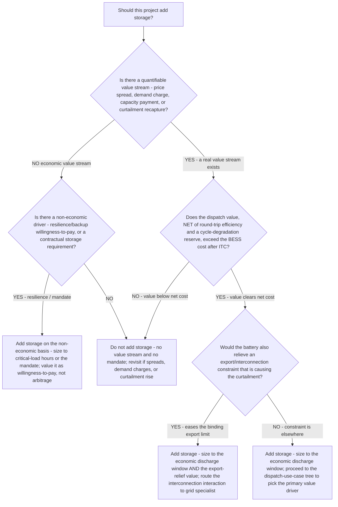

# Renewables storage decision tree — add storage or not (the whether, before the which)

**Last reviewed:** 2026-06-05 · **Confidence:** medium (NREL BESS cost benchmark + CAISO curtailment/dispatch context + standard storage-economics framing, web-verified this date). BESS capital cost, round-trip efficiency, degradation, the ITC rate/window, and market spreads are **technology- and market-specific** and move quarterly — every figure carries an inline `[verify-at-use]` marker and must be validated against the project's market and supplier quotes before any deliverable (CLAUDE.md §3 #7, #8).

> Canonical decision tree for the `energy-finance-analyst` (the economics) with a grid assist from `grid-interconnection-specialist` (export-limit / interconnection interaction). This tree decides **whether** to add storage; once the answer is yes, the existing [`renewables-decision-trees.md`](renewables-decision-trees.md) "Storage Dispatch Use-Case Selection" tree decides **which** dispatch use-case to size to. The load-bearing principle: **value the dispatch, not the kWh** (CLAUDE.md §3 #7) — a battery only pays if there's a price spread (or a demand-charge / capacity / curtailment-recapture value) to dispatch into, net of round-trip efficiency and degradation.

---

## When this applies

A solar (or wind) project — proposed or operating — is weighing adding a co-located or standalone battery. Common triggers: midday curtailment/clipping, a high-spread market, high C&I demand charges, a capacity-market opportunity, or an export-constrained interconnection. Use this **before** the dispatch-use-case tree — it gates the spend; the use-case tree sizes it.

## The tree



## Rationale per leaf

- **No value stream + no mandate → don't add** — storing energy that has nowhere profitable to discharge is **cost, not value**. Absent a spread, a demand charge, a capacity payment, or a curtailment-recapture value, the battery loses money; revisit when market conditions change.
- **Resilience / mandate → add on the non-economic basis** — when economics don't support storage but backup/resilience or a contractual requirement does, the value driver is **willingness-to-pay or compliance**, not arbitrage; size to critical-load hours or the mandate and model it separately from any energy value.
- **Value below net cost → don't add** — the honest test nets the dispatch value of **round-trip efficiency** (~85–95% [verify-at-use]) and a **cycle-degradation reserve**, against the BESS capital **after the ITC** (standalone/co-located BESS is ITC-eligible at ~30% base through the 2033+ tech-neutral window [verify-at-use]; NREL 2025 benchmark ~$334/kWh for 4-hour utility-scale [verify-at-use]). If the netted value doesn't clear the net cost, don't build.
- **Value clears + relieves export limit → add hybrid, size to both** — a co-located battery that also **eases the export/interconnection constraint** causing the curtailment carries two value streams (dispatch + curtailment relief); route the interconnection interaction to [`grid-interconnection-specialist`](../agents/grid-interconnection-specialist.md).
- **Value clears, constraint elsewhere → add, size to the discharge window** — proceed to the dispatch-use-case tree to pick the primary value driver and size to the **economic** discharge window, not to total curtailed volume.

## The load-bearing arithmetic (the net test)

```
net dispatch value = Σ (discharged MWh × capture price)            (per the primary use-case)
                     × round_trip_efficiency
                     − cycle-degradation reserve
net BESS cost      = BESS_capital × (1 − ITC_rate)                 [+ O&M, augmentation]
add storage  ⇔  net dispatch value (PV)  >  net BESS cost
```

Size to the **economic discharge window** (the hours the value actually pays), not to total curtailment — a smaller, spread-sized battery routinely beats a "hold all the curtailed energy" battery on IRR.

## Gotchas

- **"Capture the curtailment" is not a value thesis by itself** — recapture only pays if there's a spread to discharge into; quantify the spread first.
- **Round-trip efficiency and degradation are real haircuts** — model them; don't credit 100% of stored energy at the discharge price.
- **Model the ITC explicitly** — it materially changes net cost; net it before comparing (see [`../best-practices/net-cost-after-incentives-is-the-real-cost-model-it-explicit.md`](../best-practices/net-cost-after-incentives-is-the-real-cost-model-it-explicit.md)).
- **Co-location can ease the constraint that caused the curtailment** — a battery behind a binding export limit has a second value stream; cross-check the interconnection (see [`../best-practices/energy-storage-dispatch-strategy-must-be-modeled-before-sizing.md`](../best-practices/energy-storage-dispatch-strategy-must-be-modeled-before-sizing.md)).

## Escalation & guardrails

- The primary dispatch use-case + sizing → the [`renewables-decision-trees.md`](renewables-decision-trees.md) "Storage Dispatch Use-Case Selection" tree, then [`energy-finance-analyst`](../agents/energy-finance-analyst.md).
- Export-limit / interconnection interaction → [`grid-interconnection-specialist`](../agents/grid-interconnection-specialist.md).
- Every figure entering a deliverable carries a source URL + retrieval date or an `[unverified — training knowledge]` / `[ESTIMATE]` mark (CLAUDE.md §3 #8).

## Sources (retrieved 2026-06-05)

- NREL — *Cost Projections for Utility-Scale Battery Storage, 2025* (~$334/kWh 4-hour benchmark): https://docs.nrel.gov/docs/fy25osti/93281.pdf
- Crux — *The rising popularity of battery energy storage system (BESS) tax credits* (standalone BESS ITC eligibility + window): https://www.cruxclimate.com/insights/battery-energy-storage-system-tax-credits
- CAISO — *2024 Special Report on Battery Storage* (curtailment-recapture / dispatch context): https://www.caiso.com/documents/2024-special-report-on-battery-storage-may-29-2025.pdf
