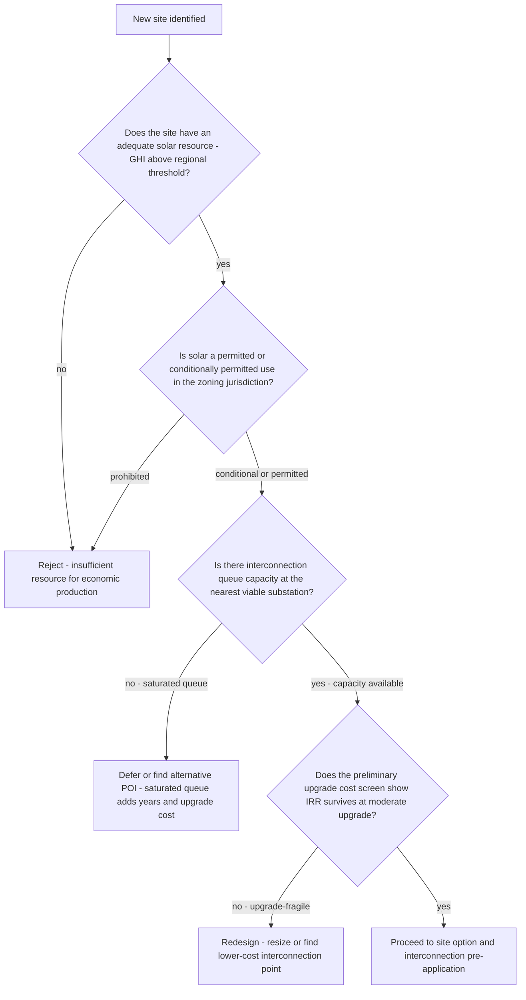
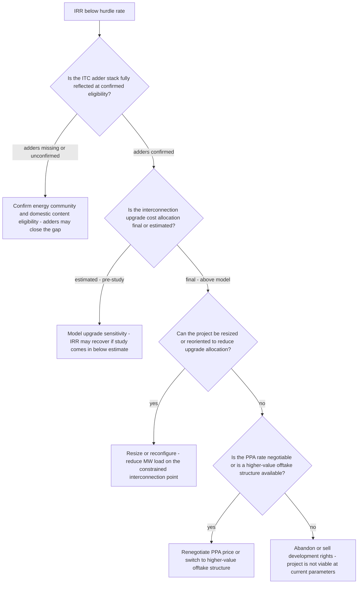
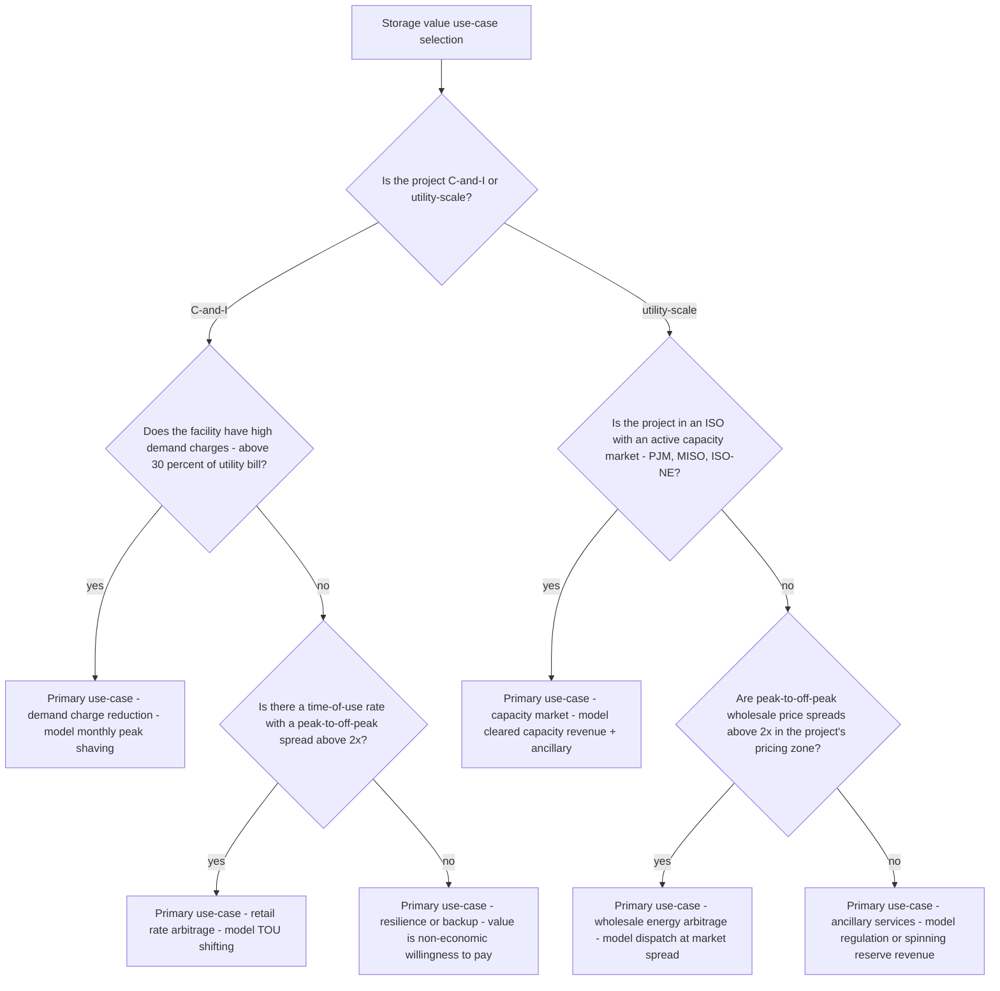

# Renewables decision trees

Which analysis for which question — traverse top-to-bottom before picking a method.

## Decision Tree: Does this project pencil?

1) Model LCOE and IRR on net cost (§3 #1, #4). 2) Size on P90 (§3 #6). 3) Model the interconnection queue (§3 #2). 4) Add the 25-year O&M/degradation (§3 #5).

## Decision Tree: How do we finance post-2025?

1) Identify the live pathway (§3 #3). 2) Choose the ownership model. 3) Net the incentive, dated (§3 #8).

## Decision Tree: Is storage worth it?

1) Define the dispatch use-case (§3 #7). 2) Model the dispatch value. 3) Net against cost and size.

## How to read these trees

Traverse top-to-bottom and stop at the first matching branch — the order encodes the cheap-checks-before-expensive-checks discipline (§3). Each leaf names a skill, a specialist, or a house-opinion to apply. Never skip a higher branch because a lower one looks more interesting; a denominator, seasonal, or definitional artifact masquerades as a finding more often than not.

## Decision Tree: Which skill for which task

- **Model LCOE and project IRR** → use when: Model levelized cost of energy and project IRR together, on net cost after the live incentives, since they answer different questions. ([`../skills/model-lcoe-and-irr/SKILL.md`](../skills/model-lcoe-and-irr/SKILL.md))
- **Model the interconnection queue** → use when: Read the interconnection queue, study sequence, and likely upgrade allocation as the project's schedule and cost risk. ([`../skills/model-the-interconnection-queue/SKILL.md`](../skills/model-the-interconnection-queue/SKILL.md))
- **Structure to the live incentive** → use when: Structure the project around the incentive pathway that's actually available post-2025, with a date, instead of an expired one. ([`../skills/structure-the-incentive/SKILL.md`](../skills/structure-the-incentive/SKILL.md))
- **Read asset performance over life** → use when: Read availability, degradation, and O&M cost over the 25-year asset life so the IRR rests on real operations. ([`../skills/read-asset-performance/SKILL.md`](../skills/read-asset-performance/SKILL.md))
- **Value storage by dispatch** → use when: Value a battery on its dispatch use-case — arbitrage, demand-charge reduction, capacity — not a flat $/kWh. ([`../skills/value-storage-dispatch/SKILL.md`](../skills/value-storage-dispatch/SKILL.md))

## Decision Tree: Which specialist owns this

- **The engagement** → [`renewables-engagement-lead`](../agents/renewables-engagement-lead.md)
- **Development** → [`solar-project-developer`](../agents/solar-project-developer.md)
- **The grid** → [`grid-interconnection-specialist`](../agents/grid-interconnection-specialist.md)
- **The numbers** → [`energy-finance-analyst`](../agents/energy-finance-analyst.md)

When two leaves apply, route to the **lead** first to scope and sequence — overlapping symptoms usually mean two drivers at once, and the lead keeps the analysis from collapsing into a single-cause story.

## Decision Tree: Which house-opinion gates the call

Before picking any method, check whether one of the standing biases (§3) already decides the framing:

1. LCOE and project IRR are different questions — show both — if this is in question, apply §3 #1 before any method.
2. Interconnection is the schedule, and the schedule is the risk — if this is in question, apply §3 #2 before any method.
3. The incentive structure changed in 2025 — design to the live pathway — if this is in question, apply §3 #3 before any method.
4. Net cost after incentives is the real cost — model it explicitly — if this is in question, apply §3 #4 before any method.
5. A solar asset is a 25-year machine — degradation and O&M are first-class — if this is in question, apply §3 #5 before any method.
6. Production estimates are P50/P90, not a single number — if this is in question, apply §3 #6 before any method.
7. Storage changes the economics — value the dispatch, not just the kWh — if this is in question, apply §3 #7 before any method.
8. Cite the source and date for every cost and policy number — if this is in question, apply §3 #8 before any method.

## Escalation & guardrails

- Anything touching client PII / regulated records → stop and route to `ravenclaude-core` `security-reviewer`.
- Any external figure entering a deliverable → carry a source URL + retrieval date, or mark it `[unverified — training knowledge]` / `[ESTIMATE]` (§3, final house opinion).
- A recommendation ships only with an owner, a date, and an expected metric movement.
## Sourcing note

Figures in this file are from the author's domain knowledge and are marked `[unverified — training knowledge]` or `[ESTIMATE]` at point of use. Validate against a primary source before putting any figure in a client deliverable (§3 cite-or-mark rule).

---

## Decision Tree: Renewables — New Site Feasibility Screen

**When this applies:** A potential solar project site has been identified and the developer needs to determine whether to commit development resources (time, site control cost, study fees). The symptom is "we have a site — is it worth pursuing?" This tree gates the development decision before material cost is committed.

**Last verified:** 2026-06-05 against standard solar project development practice.

**Rationale per leaf:**
- *Reject - insufficient resource* — below-threshold GHI makes the project uneconomic without extraordinary incentives; eliminate early before any cost is committed.
- *Reject - zoning prohibited* — a prohibited use cannot be built; eliminate before any site control investment.
- *Defer or find alternative POI* — a saturated queue means multi-year delays and likely high upgrade allocations; the site may have value at a future queue cycle or with a different point of interconnection.
- *Redesign* — upgrade-fragile economics at the current size or POI can sometimes be rescued by resizing or finding a lower-cost connection point.
- *Proceed to site option* — all four gates cleared; the site has minimum viability for the next development stage.

**Tradeoffs summary:**

| Method | Cost / time | Blast radius | Approval gate? | Use when |
|---|---|---|---|---|
| Reject early | None | None | None | Resource, zoning, or queue gate fails |
| Defer to future queue cycle | Opportunity cost | None | Development team | Queue saturated but site is otherwise viable |
| Redesign size or POI | Low / 1-2 weeks | Development timeline | Development team | Economics upgrade-fragile at current config |
| Proceed to option | Option cost / 2-4 weeks | Development budget | Development lead | All four gates cleared |

---

## Decision Tree: Renewables — Project IRR Below Hurdle Rate

**When this applies:** The project pro-forma is showing an IRR below the equity hurdle rate (typically 8–12% unlevered or 12–18% levered for utility-scale [unverified — training knowledge]). The symptom is "the numbers don't work — what do we do?" This tree sequences the interventions before any project restructuring decision.

**Last verified:** 2026-06-05 against standard solar project finance and development practice.

**Rationale per leaf:**
- *Confirm adders* — IRA adders can add 10–30% to the ITC; unconfirmed eligibility that turns out to be valid may rescue the IRR without changing the project.
- *Model upgrade sensitivity* — pre-study estimates are often conservative; waiting for the Phase 1 result before abandoning preserves optionality.
- *Resize or reconfigure* — reducing the project's MW output can reduce its upgrade allocation proportionally; a smaller project with better economics may still be viable.
- *Renegotiate PPA* — if the revenue assumption is the constraint, a higher offtake price may be achievable with a different buyer or a shorter term with renewal options.
- *Abandon or sell* — if all levers are exhausted, the project has negative development value; selling the site control or development rights may recover some cost.

**Tradeoffs summary:**

| Method | Cost / time | Blast radius | Approval gate? | Use when |
|---|---|---|---|---|
| Confirm ITC adders | Low / 1-2 weeks | None | Tax advisor | Adders not yet verified in model |
| Await study results | Study fees / months | Development timeline | Development team | Upgrade estimate is pre-study |
| Resize project | Low / 2-4 weeks | Site control, offtake | Development team | Upgrade allocation is size-proportional |
| Renegotiate PPA | Medium / weeks-months | Offtake relationship | Development + sales | Revenue is the binding constraint |
| Abandon or sell | Low / immediate | Development investment | Development lead | All levers exhausted, IRR still fails |

---

## Decision Tree: Renewables — Storage Dispatch Use-Case Selection

**When this applies:** A battery storage system is being evaluated alongside or independently of a solar project, and the developer or analyst must determine which dispatch use-case to model as the primary value driver. The symptom is "should we add storage, and if so, what's the value?"

**Last verified:** 2026-06-05 against FERC Order 841, ISO market rules, and C&I demand charge management practice.

**Rationale per leaf:**
- *Demand charge reduction* — when demand charges dominate the utility bill, peak shaving delivers the highest $/kWh value for C&I storage.
- *Retail rate arbitrage* — large TOU spreads allow charge-at-off-peak, discharge-at-peak strategies with predictable returns.
- *Resilience* — when economics don't support storage, the customer's willingness to pay for backup power becomes the value driver; model separately as a non-economic benefit.
- *Capacity market* — cleared capacity revenue provides a predictable, contracted revenue stream; pairs well with ancillary services in the same market.
- *Wholesale arbitrage* — high spot-price spreads in the battery's dispatch zone support economic arbitrage; requires accurate price-forecast modeling.
- *Ancillary services* — regulation and spinning reserve markets pay for availability and response speed, not energy throughput; storage is well-suited but market access requires ISO registration.

**Tradeoffs summary:**

| Use-case | Revenue predictability | Market access barrier | Battery sizing driver | Use when |
|---|---|---|---|---|
| Demand charge reduction | High | Low | Peak demand kW | C&I with high demand charges |
| Retail TOU arbitrage | Medium | Low | Daily energy kWh | C&I with large TOU spread |
| Resilience | Non-economic | None | Critical load hours | No economic case, backup needed |
| Capacity market | High | ISO registration | Cleared MW | Utility-scale in PJM/MISO/ISO-NE |
| Wholesale arbitrage | Variable | Market participation | Price spread MWh | High wholesale spread zone |
| Ancillary services | Medium | ISO registration | Response speed kW | Regulation-capable system, ISO access |
