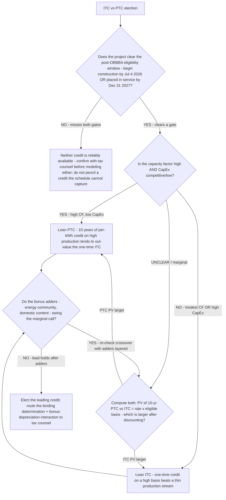

# Renewables tax-credit decision tree — ITC vs. PTC election

**Last reviewed:** 2026-06-05 · **Confidence:** medium (ICF/Crux decision-framing + IRS post-OBBBA guidance, web-verified this date). Credit rates, the capacity-factor/CapEx crossover, bonus-adder values, and the begin-construction / placed-in-service deadlines are **jurisdiction- and year-specific** and were materially reshaped by OBBBA (2025) — every figure carries an inline `[verify-at-use]` marker and the binding determination is tax counsel's, not the team's (CLAUDE.md §2, §3 #3, #8).

> Canonical decision tree for the `energy-finance-analyst` (the numbers) with a development-schedule assist from `solar-project-developer` (begin-construction / placed-in-service milestones). Traverse top-to-bottom **before** assuming a credit. The election is a **per-project, mutually-exclusive** call between the **ITC** (a one-time investment credit, ~30% of eligible basis at full bonus) and the **PTC** (a per-kWh production credit over the first 10 years). This is decision-support; the binding election is made with tax counsel (CLAUDE.md §2 — the team is not a tax advisor).

---

## When this applies

A project is eligible for both the ITC and the PTC and the developer must elect one. Common triggers: building the project pro-forma, a tax-equity term sheet, or a financing decision where the credit value is load-bearing. Do **not** default to the ITC out of habit — the election is a calculation.

## The tree



## Rationale per leaf

- **Ineligible window** — post-OBBBA (2025), solar/wind ITC and PTC eligibility hinges on **begin-construction by July 4, 2026 OR placed-in-service by Dec 31, 2027** [verify-at-use]. A project that clears neither gate cannot reliably capture either credit; confirm with tax counsel before modeling a credit the schedule can't deliver. (Storage/other tech-neutral technologies have a different, longer phase-out window through 2033+ [verify-at-use].)
- **Lean PTC (high CF, low CapEx)** — the PTC pays per kWh over the first 10 years, so **more production per installed dollar** (high capacity factor, low CapEx) raises the PTC's lifetime value above the one-time, basis-pegged ITC. ICF's framing: in regions with higher capacity factor and lower CapEx, the PTC tends to win.
- **Lean ITC (modest CF or high CapEx)** — the ITC is **~30% of eligible basis** (at full prevailing-wage/apprenticeship compliance for >1 MW; small projects ≤1 MW reach 30% without it [verify-at-use]). A high CapEx or a modest resource means the basis-pegged credit beats a thin production stream.
- **Compute both (marginal)** — when the call isn't obvious, the only honest method is the explicit, discounted side-by-side: `ITC = credit_rate × eligible_basis` vs `PTC PV = Σ (per-kWh rate × degraded annual production)` over 10 years, each discounted to present value. The [`../scripts/renewables_calc.py`](../scripts/renewables_calc.py) `itc-vs-ptc` mode does this arithmetic.
- **Adders swing the marginal call** — energy-community and domestic-content adders, and bonus depreciation, interact with both credits and can flip a close election; layer them **before** finalizing, then re-run the crossover.
- **Elect + route to counsel** — the team frames the election; the **binding** determination (and the bonus-depreciation tax-basis interaction) is tax counsel's (CLAUDE.md §2).

## The load-bearing arithmetic (the crossover)

```
ITC value     = credit_rate × eligible_basis                  (one-time, at COD)
PTC value (PV) = Σ_{y=1..10} [ ptc_per_kwh × annual_kWh × (1−deg)^(y−1) ] / (1+r)^y
```

The election turns on which present value is larger. **Capacity factor** and **CapEx** are the variables that move it: high CF / low CapEx → more kWh per dollar → PTC; high CapEx / modest CF → ITC. [`../scripts/renewables_calc.py`](../scripts/renewables_calc.py) `itc-vs-ptc` computes both and prints the verdict + the margin.

## Gotchas

- **Don't default to the ITC out of habit** — it's a per-project calculation; the PTC can leave 10–20%+ of value on the table or capture it, depending on the site.
- **The election is mutually exclusive and (generally) irrevocable** — model both *before* electing, not after.
- **Bonus adders and bonus depreciation interact with the basis** — model the tax basis explicitly; an adder can flip a marginal call (see [`../best-practices/bonus-depreciation-and-itc-interact-model-the-tax-basis-explicitly.md`](../best-practices/bonus-depreciation-and-itc-interact-model-the-tax-basis-explicitly.md) and [`../best-practices/adder-stacking-under-ira-is-a-site-specific-calculation-not-a-generic-bonus.md`](../best-practices/adder-stacking-under-ira-is-a-site-specific-calculation-not-a-generic-bonus.md)).
- **The policy window moved in 2025 (OBBBA)** — a pre-OBBBA model may assume a credit timeline that no longer exists; re-verify the begin-construction / placed-in-service dates every time (§3 #3).

## Escalation & guardrails

- The binding tax-credit election, eligibility opinion, and bonus-depreciation interaction → **tax counsel** (the team is decision-support, not a tax advisor — CLAUDE.md §2).
- Development-schedule feasibility of hitting the begin-construction / placed-in-service gate → [`solar-project-developer`](../agents/solar-project-developer.md).
- Every figure entering a deliverable carries a source URL + retrieval date or an `[unverified — training knowledge]` / `[ESTIMATE]` mark (CLAUDE.md §3 #8).

## Sources (retrieved 2026-06-05)

- ICF — *Solar Economics: The PTC vs. ITC Decision* (high capacity factor + low CapEx favors PTC): https://www.icf.com/insights/energy/solar-economics-ptc-vs-itc
- Crux — *ITC vs PTC Credits: What's the Difference?*: https://www.cruxclimate.com/insights/itc-vs-ptc
- Crux — *§48E and §45Y tech-neutral tax credits: Guide + FAQs*: https://www.cruxclimate.com/insights/tech-neutral-tax-credits
- IRS — *Notice 2025-42, §§45Y/48E Beginning of Construction* (post-OBBBA timing): https://www.irs.gov/pub/irs-drop/n-25-42.pdf
- Novogradac — *OBBBA and the Clean Energy Race Against the Clock* (begin-construction / placed-in-service deadlines): https://www.novoco.com/periodicals/articles/obbba-and-the-clean-energy-race-against-the-clock
