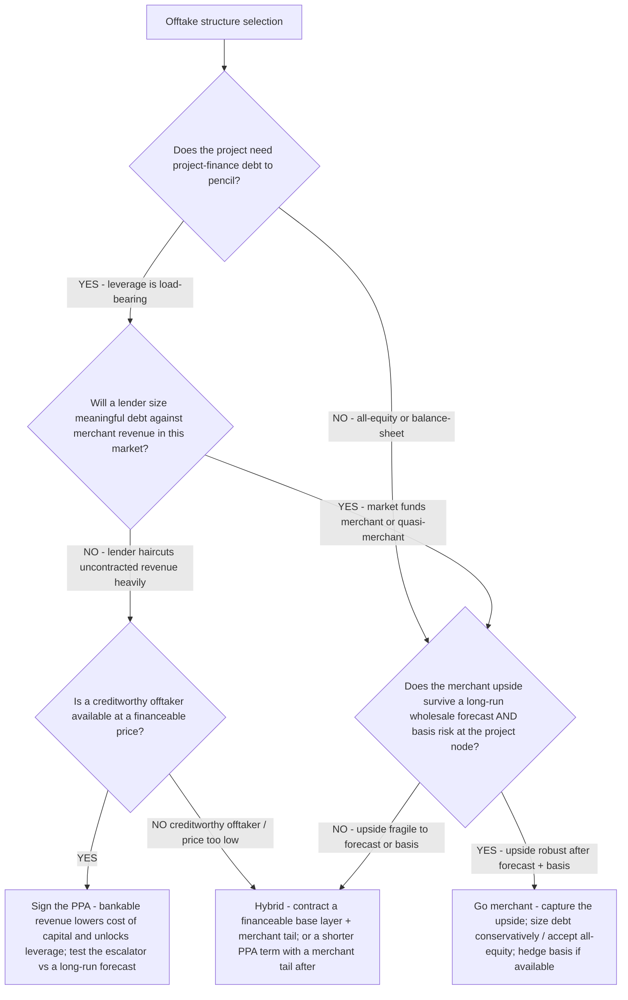

# Renewables offtake decision tree — PPA vs. merchant (vs. hybrid)

**Last reviewed:** 2026-06-05 · **Confidence:** medium (LevelTen PPA-index price level + standard project-finance framing, web-verified this date). PPA price levels, regional basis, and merchant spreads are **zone- and quarter-specific** and rose ~9% YoY through 2025 — every figure carries an inline `[verify-at-use]` marker and must be validated against the project's actual ISO zone and a current index before any deliverable (CLAUDE.md §3 #8).

> Canonical decision tree for the `energy-finance-analyst` (the numbers) with a development assist from `solar-project-developer` (offtake counterparty / contracting). Traverse top-to-bottom **before** modeling revenue. The load-bearing principle: **offtake structure determines financing eligibility before the pro-forma** — the structure sets the cost of capital and the achievable leverage, which usually swamp the headline price delta. The right answer is often a **hybrid** (a contracted base + a merchant tail), not a pure choice.

---

## When this applies

A project must choose how to sell its output: a fixed-price (or indexed) **PPA**, fully **merchant** (wholesale spot), or a **hybrid** (partial contracting / shorter PPA term + merchant tail). Common triggers: building the revenue line of the pro-forma, a lender's debt-sizing conversation, or an offtaker term sheet. Do **not** compare a merchant P50 revenue against a PPA contract price — that ignores the cost-of-capital and leverage difference the two structures command.

## The tree



## Rationale per leaf

- **Sign the PPA** — a fixed-price PPA makes revenue **bankable**, which lowers the cost of capital and unlocks leverage; the price-per-MWh is the headline but the *financing* benefit is usually the bigger lever. Test the **escalator against a long-run wholesale price forecast** — an escalator that out-runs the forward curve looks good on paper but the offtaker won't sign it; one that under-runs leaves value behind. Recent national solar PPA prints ran ~$61.67/MWh (LevelTen Q4 2025) with wide regional spread (~$35–45/MWh ERCOT to ~$70–85/MWh CAISO) [verify-at-use].
- **Go merchant** — full merchant captures the upside but carries **price + basis risk** and supports **less leverage** (lenders haircut uncontracted revenue heavily), so it demands a higher equity discount rate. Only choose it when the upside **survives a long-run forecast and basis risk** and the capital structure can absorb the volatility. Compare it risk-adjusted, not against a PPA contract price.
- **Hybrid (the usual answer)** — contract a financeable base layer (enough to size the debt) and keep a **merchant tail** on the balance, or sign a shorter PPA term with a merchant tail after. This is frequently the structure the lender will actually fund while preserving some upside. Most projects that "want merchant" but "need debt" land here.

## The load-bearing comparison (risk-adjusted, after-financing)

Compare structures on an **after-financing, risk-adjusted** basis — not contract-price vs. P50 revenue:

```
PPA case      : bankable revenue → higher leverage, lower cost of capital → equity IRR at low discount rate
Merchant case : volatile revenue → lower leverage, higher cost of capital → equity IRR at high discount rate
                (net of basis risk and a long-run price forecast, not the optimistic spot)
```

The merchant "upside" routinely shrinks once the higher cost of capital and thinner debt are applied. **Financeability is the gate; price is the tiebreaker** (see [`../best-practices/offtake-structure-determines-financing-eligibility-before-the-pro-forma.md`](../best-practices/offtake-structure-determines-financing-eligibility-before-the-pro-forma.md)).

## Gotchas

- **Don't compare merchant P50 to a PPA contract price** — they sit at different discount rates and leverage; the comparison must be after-financing and risk-adjusted.
- **Basis (nodal-vs-hub) risk** can erase a merchant thesis priced off the hub — check the project node, not the trading hub.
- **Test the PPA escalator against a long-run forecast** — see [`../best-practices/ppa-price-escalators-must-be-tested-against-long-run-wholesale-price-forecasts.md`](../best-practices/ppa-price-escalators-must-be-tested-against-long-run-wholesale-price-forecasts.md).
- **Offtaker creditworthiness** is part of financeability — a cheap PPA from a weak counterparty may not be bankable.

## Escalation & guardrails

- Debt-sizing / lender term-sheet specifics → [`energy-finance-analyst`](../agents/energy-finance-analyst.md) frames it; the binding credit decision is the lender's.
- Offtaker contracting / counterparty selection → [`solar-project-developer`](../agents/solar-project-developer.md).
- Every figure entering a deliverable carries a source URL + retrieval date or an `[unverified — training knowledge]` / `[ESTIMATE]` mark (CLAUDE.md §3 #8).

## Sources (retrieved 2026-06-05)

- LevelTen Energy — *North America PPA Price Index* (solar PPA price level + regional spread): https://www.leveltenenergy.com/ppa
- pv-tech — *North American solar PPA prices climb to US$61.67/MWh* (Q4 2025): https://www.pv-tech.org/north-american-solar-ppa-prices-climb-us61-67-mwh-european-prices-continue-fall/
- LevelTen Energy — *North America PPA Price Index, Q4 2025* (quarterly trend, regional zones): https://www.leveltenenergy.com/post/levelten-q4-2025-north-american-ppa-price-index-solar-prices-rise-while-wind-experiences-a-slight-decline
