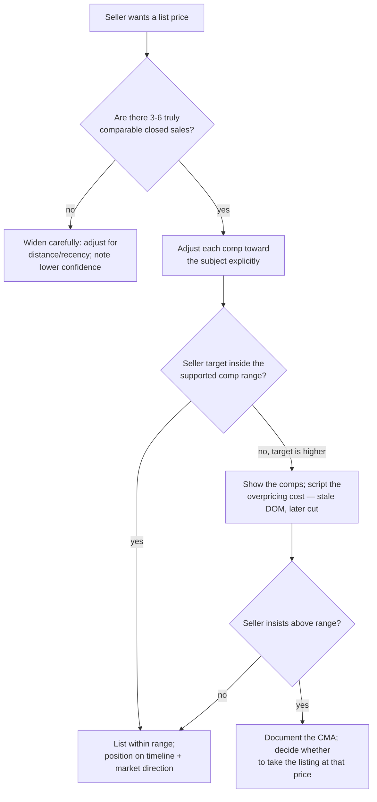
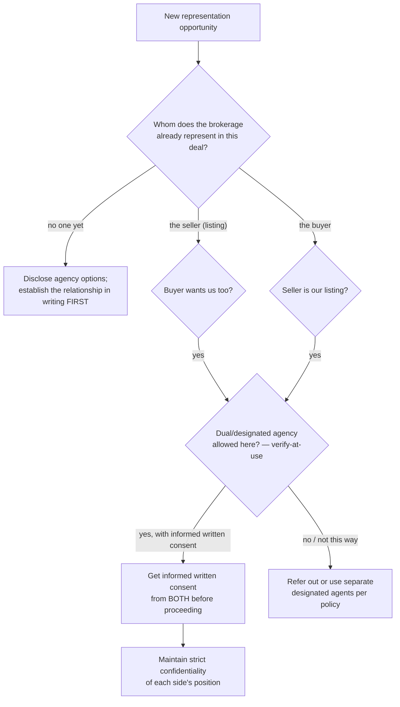
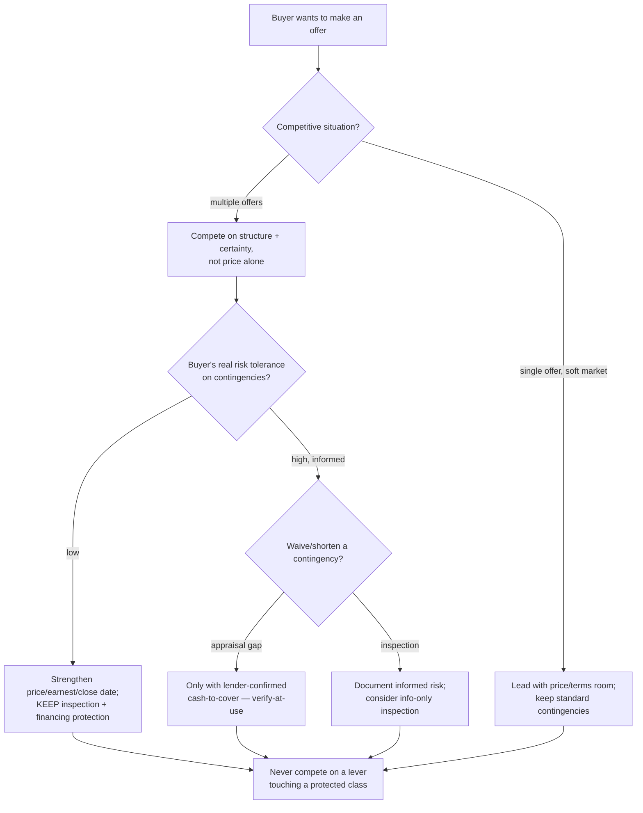
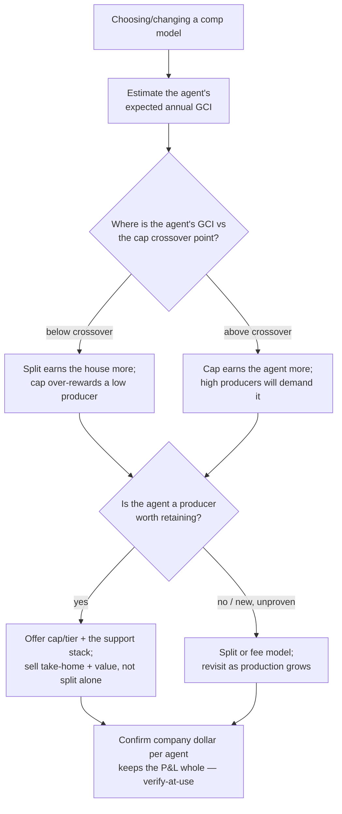

# Residential Real-Estate Brokerage — Decision Trees

> Reference decision trees for the `residential-real-estate-brokerage` team. Agents **traverse the relevant tree top-to-bottom before deciding** (the proactive complement to the Capability Grounding Protocol). Each `## Decision Tree` section is a Mermaid graph plus the rule it encodes.
>
> **Advisory operations knowledge, not legal, financial, or real-estate-license advice.** This domain is **fair-housing sensitive**: anything touching protected classes, agency disclosure, commission rates, or contingency periods is `[verify-at-use]` — confirm against current law, the contract, and the brokerage's own agreements before acting. No client PII.
>
> _Last reviewed: 2026-07-02 by `claude`. Principles are durable; dated benchmarks and norms live in [`residential-brokerage-reference-2026.md`](residential-brokerage-reference-2026.md)._

---

## Decision Tree: price this listing (CMA)

**Rule:** the price is a **supported range from adjusted comparables**, positioned by the seller's timeline and market direction — never set to the seller's target to win the appointment. Overpricing costs a stale listing and a later drop below a right first price. Local figures are `[verify-at-use]`.

---

## Decision Tree: represent buyer vs seller / dual-agency conflict

**Rule:** the agency relationship is **disclosed and established in writing before you represent**. A dual/designated-agency situation proceeds only where allowed and only with informed written consent from both sides — otherwise refer out. Never let a commission drive an undisclosed conflict. Agency rules are `[verify-at-use]` by jurisdiction and brokerage policy.

---

## Decision Tree: offer & counter strategy

**Rule:** win on **structure, financing strength, and certainty** matched to the buyer's informed risk tolerance — not on price alone, and never on any lever touching a protected class. A contingency waiver is advised only when the buyer understands and can absorb the risk (appraisal gaps need lender-confirmed funds). Terms are `[verify-at-use]`.

---

## Decision Tree: commission split-vs-cap model

**Rule:** model on **company dollar per agent at expected GCI** and the **cap crossover**, then choose by production tier and retention value — recruit and retain on the whole value stack, not the headline split. Rates, caps, and fees are `[verify-at-use]` against the brokerage's agreements.

---

## See also

- [`residential-brokerage-reference-2026.md`](residential-brokerage-reference-2026.md) — dated norms + benchmarks (verify-at-use).
- Skills: [`../skills/cma-and-pricing-strategy/SKILL.md`](../skills/cma-and-pricing-strategy/SKILL.md), [`../skills/transaction-timeline-management/SKILL.md`](../skills/transaction-timeline-management/SKILL.md), [`../skills/commission-split-and-cap-economics/SKILL.md`](../skills/commission-split-and-cap-economics/SKILL.md), [`../skills/listing-launch-and-marketing/SKILL.md`](../skills/listing-launch-and-marketing/SKILL.md).
